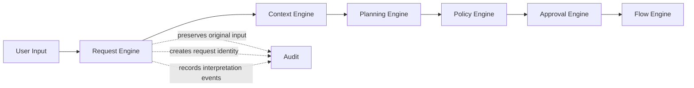
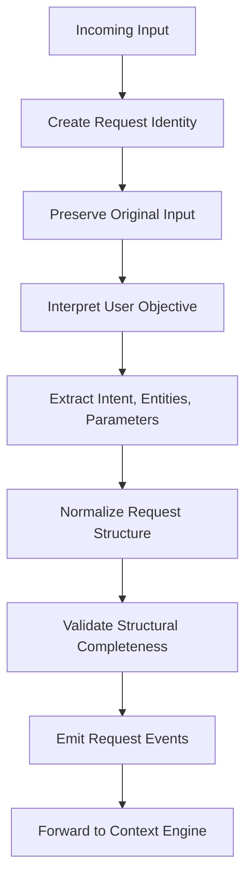
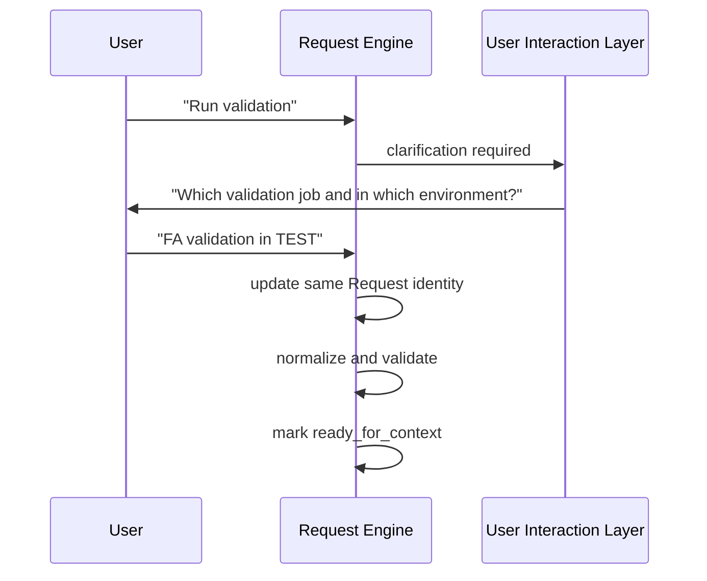

# Request Engine

> **STATIS Intelligence Layer (SIL)**  
> **Request Engine**

**Document:** `10_Request_Engine.md`  
**Version:** 0.1 (Draft)  
**Status:** Core Architecture  
**Owner:** SIL Core  
**Audience:** Software architects, backend developers, plugin developers, AI engineers, future contributors

## Purpose

The Request Engine is the entry point of the SIL processing pipeline.

Its role is to transform incoming user input into a structured **Request** that the rest of the platform can process deterministically.

This makes the Request Engine one of the most important components in the whole architecture. If the Request is weak, ambiguous, unstable or malformed, every later step becomes harder. If the Request is clear, explicit and traceable, the rest of SIL can remain deterministic, governable and explainable.

The Request Engine exists to answer a small set of foundational questions:

- What is the user trying to achieve?
- Which business entities are being referenced?
- Which parameters are already known?
- Which parts are still ambiguous, missing or unresolved?
- What exactly did the user say, and how was that interpreted?

The Request Engine does **not** decide how execution will happen. It does **not** select Flows. It does **not** invoke Tools. It does **not** execute business operations. It creates the business object that makes all of that possible.

This document defines the architectural role, boundaries, behaviours and expected outputs of the Request Engine.

### Table of contents

- [Purpose](#purpose)
- [Responsibilities and boundaries](#responsibilities-and-boundaries)
- [Processing model](#processing-model)
- [Request definition](#request-definition)
- [Behavioural rules](#behavioural-rules)
- [Examples](#examples)
- [Architecture decisions](#architecture-decisions)
- [Future evolution and related documents](#future-evolution-and-related-documents)

## Responsibilities and Boundaries

The Request Engine is responsible for turning incoming interaction into a usable Request object.

At a high level, it performs five architectural responsibilities.

First, it preserves the original user input. SIL must always be able to refer back to what the user actually asked. This is essential for explainability, audit and future re-interpretation.

Second, it creates a **Request identity**. From the moment the user interacts with SIL, the request needs a stable identifier that follows it through the entire platform lifecycle.

Third, it performs initial understanding. This includes extracting or proposing:

- intent,
- referenced entities,
- explicit parameters,
- user-visible ambiguities,
- confidence or resolution state where relevant.

Fourth, it normalizes the result into a consistent Request structure. Other engines must not need to interpret free-form user language again.

Fifth, it records the beginning of the Request lifecycle as a sequence of auditable events.

These responsibilities are intentionally narrow.

The Request Engine is **not** responsible for context enrichment. That belongs to the [Context Engine](11_Context_Engine.md).

It is **not** responsible for Flow selection. That belongs to the [Planning Engine](12_Planning_Engine.md).

It is **not** responsible for governance, authorization or approval. Those belong to the [Policy Engine](13_Policy_Engine.md) and [Approval Engine](14_Approval_Engine.md).

It is **not** responsible for execution. That belongs to the [Flow Engine](15_Flow_Engine.md).

It is also not an AI assistant that “does the task directly”. As defined in [00_Principles](00_Principles.md), AI may help SIL understand the request, but SIL remains responsible for control, governance and execution.

The boundary can be summarized like this:



The most important architectural rule is simple:

> The Request Engine produces a Request.  
> It does not produce execution.

### What enters the Request Engine

The engine may receive input from multiple channels, including:

- chat-style natural language,
- structured UI form submission,
- API call,
- future voice or assistant interfaces.

Regardless of channel, SIL should convert the interaction into a common Request model.

This allows the platform to remain channel-independent. A user may say “Run FA validation in TEST”, click a button labeled “Run”, or invoke an API endpoint with structured parameters. These inputs are different at the interface layer, but they may still produce the same logical Request.

### What leaves the Request Engine

The output of the Request Engine is a Request object that is:

- identifiable,
- auditable,
- structurally valid,
- explicit about what is known,
- explicit about what is missing or ambiguous,
- suitable for enrichment by downstream engines.

This means the Request Engine does not need perfect certainty in every situation. It does need structural honesty.

If the request is ambiguous, the Request should say so.

If an entity is unresolved, the Request should say so.

If the user omitted a required parameter, the Request should say so.

The architecture must prefer **explicit incompleteness** over hidden guesses.

## Processing Model

The Request Engine follows a staged model. This is not an implementation algorithm. It is the conceptual architecture that every implementation must preserve.



Each stage enriches the same Request object.

The Request itself remains the central business object throughout this process, in accordance with [01_Vision](01_Vision.md) and [03_Core_Concepts](03_Core_Concepts.md).

### Request creation

The first architectural step is the creation of a Request identity.

At minimum, each Request requires:

- a stable request identifier,
- creation timestamp,
- source channel,
- original input payload.

This is important because the Request may later be:

- re-evaluated,
- paused for approval,
- resumed,
- audited,
- explained to a user,
- used as evidence for governance decisions.

Without stable identity, none of those activities can be reliably performed.

### Interpretation

Interpretation is the point where user language becomes business meaning.

This is the place where AI may assist SIL. The Request Engine may use an AI model or similar reasoning component to help derive likely intent, entities and parameters from free-form input. However, the architectural output of this stage must still be a deterministic Request structure.

That distinction matters.

The understanding process may be probabilistic.

The resulting Request must be explicit.

For example, if the user says:

> Run FA validation in test and explain the result

the Request Engine may derive:

- intent: `run_job`
- entity: `job = FA validation`
- parameter: `environment = TEST`
- secondary expectation: explanation of outcome

The Request Engine must then represent this understanding clearly enough that later engines can act without re-reading human language.

### Normalization

Normalization converts raw interpretation into a common SIL structure.

This includes harmonizing differences such as:

- language variants,
- capitalization,
- synonymous phrases,
- channel-specific input styles,
- structured versus unstructured user expressions.

For example, all of the following may normalize to the same business intent:

- “Run FA validation”
- “Execute FA validation”
- “Start the FA validation job”
- clicking an application button that means the same action

Normalization does not remove the original input. It adds a stable, machine-usable representation alongside it.

### Structural validation

Before leaving the Request Engine, the Request should be structurally valid.

Structural validation is not the same as business validation.

The Request Engine can validate things like:

- required top-level Request fields exist,
- input format is acceptable,
- extracted values can be represented in the expected Request structure,
- obviously malformed requests are marked as such.

It should not validate domain rules that belong to applications.

For example:

- whether a Pipeline job is allowed to run in PROD is not a Request Engine concern,
- whether a Sudreg company identifier exists is not a Request Engine concern,
- whether the user is allowed to access some environment is not a Request Engine concern.

Those concerns belong downstream.

### Event emission

The Request Engine should emit the first lifecycle events for every Request.

This is required by the principle that a Request evolves through events.

Typical events include:

- `request.created`
- `request.input.preserved`
- `request.interpreted`
- `request.normalized`
- `request.validated`
- `request.forwarded_to_context`

These event names are illustrative rather than normative. What matters architecturally is that the Request lifecycle is observable and durable from the first moment of interaction.

## Request Definition

The Request is the central business object of SIL. The Request Engine is therefore the component that establishes its initial shape.

The exact code representation may vary by implementation language, but the logical model should remain stable.

A Request should contain the following conceptual parts:

```yaml
request:
  id:
  created_at:
  source:
  original_input:
  normalized_input:
  intent:
  entities:
  parameters:
  ambiguities:
  status:
  events:
  audit_ref:
```

This is a conceptual model, not a schema contract. The purpose is to define what the Request must be able to express.

### Core fields

The following fields should exist in some form in every Request.

| Field | Purpose |
|---|---|
| `id` | Stable identity of the Request |
| `created_at` | Time the Request entered SIL |
| `source` | Channel or origin of the Request |
| `original_input` | Exact user input as received |
| `normalized_input` | Normalized representation of the input |
| `intent` | Interpreted user objective |
| `entities` | Referenced business objects |
| `parameters` | Structured execution-relevant values |
| `ambiguities` | Unresolved interpretation issues |
| `status` | Current Request processing status |
| `events` | Lifecycle history of the Request |
| `audit_ref` | Link or reference to audit trail |

### Original input versus normalized input

These two parts should never be confused.

`original_input` preserves what the user actually provided.

`normalized_input` expresses how SIL has chosen to represent it for downstream processing.

Both are required.

If SIL stores only the normalized form, it loses evidence.

If SIL stores only the original form, later engines must repeatedly reinterpret it.

The architecture therefore requires both.

Example:

```yaml
original_input:
  text: "pls run FA validation in test and explain if it fails"

normalized_input:
  text: "run FA validation in TEST and explain the result if the run fails"
```

The normalized version should remain semantically faithful to the user intent, but cleaner, more explicit and ready for downstream processing.

### Intent

Intent represents the primary business objective of the Request.

This should use SIL’s shared business vocabulary rather than technical verbs.

Correct examples:

- `run_job`
- `explain_job`
- `diagnose_failed_run`
- `compare_runs`
- `explain_company`

Incorrect examples:

- `POST_pipeline_run`
- `call_rest_endpoint`
- `invoke_mcp_tool`

The Request Engine should prefer stable, business-oriented intent names because they survive changes in transport protocols and application interfaces.

### Entities

Entities capture the business objects referenced by the user.

Examples:

```yaml
entities:
  - type: job
    value: "FA validation"

  - type: company
    value: "Ericsson Nikola Tesla"
```

At the Request Engine level, these entities may still be unresolved textual references.

That is acceptable.

The Request Engine does not need to know the final internal identifier of a Pipeline job or Sudreg company. It only needs to preserve the user’s business reference in structured form so that later engines can resolve it.

### Parameters

Parameters are structured values that influence execution.

Examples:

```yaml
parameters:
  environment: TEST
  period: "2026-Q2"
  workspace: "Regulatory Reporting"
```

Parameters may come directly from the user or from structured input channels.

Further parameters may be added later by the Context Engine or Planning Engine, but the Request Engine is responsible for capturing those already present in the original interaction.

### Ambiguities

Not every request can be fully resolved at intake time.

That is expected in a natural-language architecture.

The Request must therefore be able to express ambiguity explicitly.

Example:

```yaml
ambiguities:
  - type: entity_resolution
    field: job
    message: "Multiple jobs may match 'validation'."
```

Another example:

```yaml
ambiguities:
  - type: missing_parameter
    field: environment
    message: "Environment was not specified."
```

This prevents the system from hiding uncertainty behind false determinism.

Deterministic execution does not mean pretending everything is known.  
It means handling known uncertainty in a controlled and visible way.

### Status

The Request should have a status that reflects its current lifecycle stage.

Illustrative statuses may include:

- `created`
- `interpreted`
- `normalized`
- `needs_clarification`
- `ready_for_context`
- `rejected`

The exact status vocabulary may be refined later, but the architecture requires a visible lifecycle state.

### Events

A Request evolves through events.

Each event represents a meaningful transition in its lifecycle.

Example:

```yaml
events:
  - type: request.created
    at: "2026-06-30T10:15:00Z"

  - type: request.interpreted
    at: "2026-06-30T10:15:01Z"

  - type: request.normalized
    at: "2026-06-30T10:15:01Z"

  - type: request.forwarded_to_context
    at: "2026-06-30T10:15:02Z"
```

The event model is particularly important because it allows SIL to explain how a Request evolved over time rather than merely showing its current state.

## Behavioural Rules

The following behavioural rules define how the Request Engine should behave regardless of implementation details.

### Preserve user intent without hiding uncertainty

The architecture should always prefer a truthful Request over an overconfident Request.

If the system knows that a value is missing, the Request should say that it is missing.

If the system knows that multiple interpretations remain plausible, the Request should say that it is ambiguous.

If the system knows only a broad business objective but not the final entity identifier, the Request should preserve the business reference without inventing a resolved one.

This protects the platform from silent errors at the earliest stage.

### Separate understanding from control

The Request Engine may use AI or language understanding mechanisms. However, the results of those mechanisms must be converted into a controlled SIL structure before any later engine consumes them.

This preserves the architecture defined in [00_Principles](00_Principles.md):

- AI understands,
- SIL controls,
- Applications execute.

The Request Engine is therefore a boundary component between human language and disciplined system execution.

### Never allow technical leakage into the Request vocabulary

The Request should describe what the user wants in business language.

It should not collapse into transport-level terms such as:

- endpoint,
- topic,
- SQL statement,
- client method,
- connector call.

This rule matters because the Request is meant to outlive technical implementation choices.

A Flow may later use a Capability.  
A Capability may later be implemented by a Tool.  
A Tool may later use REST, MCP, SDK or something else.

The Request should remain stable while those lower layers evolve.

### Be channel-independent

A logically identical business request should be representable in the same way, even if it originates from different channels.

Example:

- a chat message,
- a web form,
- an API call,
- a future voice interface,

should all be able to produce the same Request if they express the same business goal.

This is important because SIL is a platform, not a chat feature.

### Do not perform downstream work early

The Request Engine must resist the temptation to do work that belongs elsewhere.

It should not:

- enrich context that belongs to the Context Engine,
- select a Flow that belongs to the Planning Engine,
- evaluate approval rules that belong to the Policy Engine,
- resolve Tool implementations,
- execute application actions.

Architecturally, early convenience creates later coupling.

The Request Engine stays clean by staying narrow.

### Fail explicitly

Some incoming input will be invalid, unsupported or impossible to interpret.

When that happens, the Request Engine should fail in a way that is:

- explicit,
- explainable,
- auditable,
- non-destructive.

Typical situations include:

- empty input,
- unsupported channel payload,
- structurally malformed message,
- no plausible business intent,
- contradictory structured parameters.

The Request Engine should not silently substitute guesses in these cases.

It should produce a rejected or clarification-required Request state that downstream components or user-facing layers can handle appropriately.

### Support clarification without losing identity

When a Request needs clarification, SIL should not treat the follow-up as an unrelated action by default.

Architecturally, a clarification may be part of the same user objective.

For example:

1. User: “Run validation.”
2. SIL: “Which validation job do you mean?”
3. User: “FA validation in TEST.”

This interaction should be able to evolve the same Request identity if the conversation model supports it.

That requirement matters for audit, explainability and user experience.

### Emit auditable interpretation history

The Request Engine should make its interpretation steps visible.

At minimum, SIL should be able to answer:

- what the user said,
- what intent was derived,
- which entities were extracted,
- which values remained ambiguous,
- whether clarification was required,
- when the Request was considered ready for the next engine.

This is essential both for debugging and for institutional trust.

A governed enterprise platform cannot rely on hidden interpretation.

## Examples

The following examples illustrate the type of Request object the Request Engine should produce. These are examples, not normative schemas.

### Example of a simple execution request

User input:

```text
Run FA validation in TEST
```

Possible Request representation:

```yaml
request:
  id: req_01J123ABCXYZ
  created_at: "2026-06-30T10:15:00Z"
  source:
    type: chat
    channel: job_monitor
  original_input:
    text: "Run FA validation in TEST"
  normalized_input:
    text: "run FA validation in TEST"
  intent: run_job
  entities:
    - type: job
      value: "FA validation"
  parameters:
    environment: TEST
  ambiguities: []
  status: ready_for_context
  events:
    - type: request.created
      at: "2026-06-30T10:15:00Z"
    - type: request.interpreted
      at: "2026-06-30T10:15:01Z"
    - type: request.normalized
      at: "2026-06-30T10:15:01Z"
    - type: request.forwarded_to_context
      at: "2026-06-30T10:15:02Z"
```

This Request is already useful to downstream engines. The Context Engine may still add workspace, user roles or environment constraints, but the original business objective is already explicit.

### Example of a request with explanation intent

User input:

```text
Explain what job FA validation does
```

Possible Request representation:

```yaml
request:
  id: req_01J123DEFUVW
  created_at: "2026-06-30T10:17:00Z"
  source:
    type: chat
    channel: job_monitor
  original_input:
    text: "Explain what job FA validation does"
  normalized_input:
    text: "explain job FA validation"
  intent: explain_job
  entities:
    - type: job
      value: "FA validation"
  parameters: {}
  ambiguities: []
  status: ready_for_context
  events:
    - type: request.created
      at: "2026-06-30T10:17:00Z"
    - type: request.interpreted
      at: "2026-06-30T10:17:01Z"
    - type: request.normalized
      at: "2026-06-30T10:17:01Z"
```

This shows that the Request Engine is not specific to execution commands. It is equally relevant for explanatory and analytical Requests.

### Example of a request with ambiguity

User input:

```text
Run validation
```

Possible Request representation:

```yaml
request:
  id: req_01J123GHIJKL
  created_at: "2026-06-30T10:19:00Z"
  source:
    type: chat
    channel: job_monitor
  original_input:
    text: "Run validation"
  normalized_input:
    text: "run validation"
  intent: run_job
  entities:
    - type: job
      value: "validation"
  parameters: {}
  ambiguities:
    - type: entity_resolution
      field: job
      message: "The referenced job is not specific enough."
    - type: missing_parameter
      field: environment
      message: "Environment was not specified."
  status: needs_clarification
  events:
    - type: request.created
      at: "2026-06-30T10:19:00Z"
    - type: request.interpreted
      at: "2026-06-30T10:19:01Z"
    - type: request.normalized
      at: "2026-06-30T10:19:01Z"
    - type: request.marked_for_clarification
      at: "2026-06-30T10:19:02Z"
```

This is a good Request because it is honest.

It does not pretend that “validation” is already a resolved job identifier.  
It does not pretend to know the environment.  
It exposes the exact reasons why downstream execution cannot begin yet.

### Example of a non-Pipeline request

User input:

```text
Explain company Ericsson Nikola Tesla
```

Possible Request representation:

```yaml
request:
  id: req_01J123MNOPQR
  created_at: "2026-06-30T10:22:00Z"
  source:
    type: chat
    channel: portal
  original_input:
    text: "Explain company Ericsson Nikola Tesla"
  normalized_input:
    text: "explain company Ericsson Nikola Tesla"
  intent: explain_company
  entities:
    - type: company
      value: "Ericsson Nikola Tesla"
  parameters: {}
  ambiguities: []
  status: ready_for_context
  events:
    - type: request.created
      at: "2026-06-30T10:22:00Z"
    - type: request.interpreted
      at: "2026-06-30T10:22:01Z"
    - type: request.normalized
      at: "2026-06-30T10:22:01Z"
```

This example is important because it demonstrates that the Request Engine is platform-level architecture, not a Pipeline-specific intake layer.

### Example of clarification within the same Request lifecycle

An architecture-friendly clarification flow may look like this:



This pattern allows SIL to maintain continuity of intent while still behaving honestly about missing information.

## Architecture Decisions

### AD-1001

The Request Engine is the only SIL component responsible for creating the initial Request object.

### AD-1002

The original user input must always be preserved alongside the normalized Request representation.

### AD-1003

The Request Engine may use AI for understanding, but it must output a deterministic and explicit Request structure.

### AD-1004

The Request Engine must represent ambiguity explicitly rather than hiding it through implicit assumptions.

### AD-1005

The Request Engine uses business vocabulary such as intents, entities and parameters; it must not leak Tool or transport concepts into the Request model.

### AD-1006

A Request evolves through auditable lifecycle events from the moment it enters the platform.

### AD-1007

The Request Engine stops at Request formation and must not perform context enrichment, planning, policy evaluation or execution.

### AD-1008

Clarification may continue the lifecycle of the same Request identity when the interaction clearly belongs to the same user objective.

## Future Evolution and Related Documents

The Request Engine defined in this document is intentionally stable at the architectural level, but several implementation-level topics may evolve over time.

Expected areas of future refinement include:

- formal Request schema definition,
- status vocabulary standardization,
- event naming conventions,
- confidence and explanation metadata,
- multilingual normalization strategies,
- clarification dialogue model,
- structured channel adapters,
- partial request persistence and resume semantics.

These topics should evolve without changing the core role of the Request Engine.

The architectural centre of gravity should remain the same:

- preserve original user intent,
- create a stable Request identity,
- normalize what is known,
- expose what is not known,
- forward a trustworthy Request to the next engine.

### Related documents

- [00_Principles](00_Principles.md)
- [01_Vision](01_Vision.md)
- [02_Architecture](02_Architecture.md)
- [03_Core_Concepts](03_Core_Concepts.md)
- [11_Context_Engine](11_Context_Engine.md)
- [12_Planning_Engine](12_Planning_Engine.md)
- [13_Policy_Engine](13_Policy_Engine.md)

> **A strong Request Engine does not guess the world. It gives the platform a trustworthy starting point.**