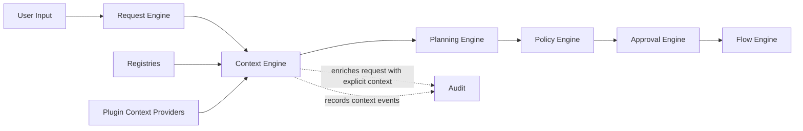
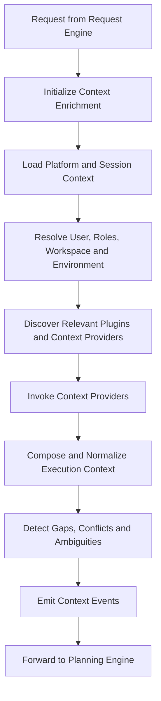
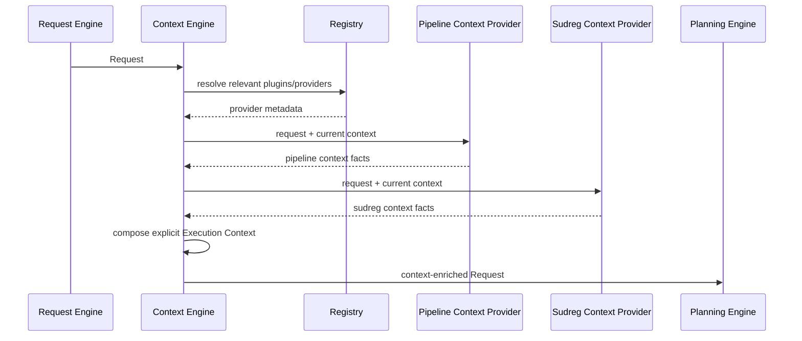

# Context Engine

> **STATIS Intelligence Layer (SIL)**  
> **Context Engine**

**Document:** `11_Context_Engine.md`  
**Version:** 0.1 (Draft)  
**Status:** Core Architecture  
**Owner:** SIL Core  
**Audience:** Software architects, backend developers, plugin developers, AI engineers, future contributors

## Table of contents

- [Purpose](#purpose)
- [Responsibilities and boundaries](#responsibilities-and-boundaries)
- [Processing model](#processing-model)
- [Execution Context definition](#execution-context-definition)
- [Behavioural rules](#behavioural-rules)
- [Examples](#examples)
- [Architecture decisions](#architecture-decisions)
- [Future evolution and related documents](#future-evolution-and-related-documents)

## Purpose

The Context Engine is the second engine in the SIL processing pipeline.

Its role is to enrich a structured **Request** with the explicit **Execution Context** required for deterministic planning.

If the Request Engine answers the question *what is the user asking for*, the Context Engine answers the question *under which surrounding conditions should SIL interpret and plan that Request*. fileciteturn0file0 fileciteturn0file1 fileciteturn0file2 fileciteturn0file4

This makes the Context Engine a foundational architectural component.

SIL is built on the principle that context must be explicit. The platform must not rely on hidden assumptions such as the current workspace, the active environment, the authenticated user, the available Plugins or application-specific runtime facts that happen to exist outside the Request. If these facts influence planning or execution, they belong in the Request as explicit Execution Context. fileciteturn0file1 fileciteturn0file2 fileciteturn0file4

The Context Engine exists to answer a small set of architectural questions:

- Who is acting?
- From which channel, workspace or application surface does the Request originate?
- Which roles, execution scopes or environment assumptions are already active?
- Which Plugins and Context Providers are relevant to this Request?
- Which additional parameters can be derived from explicit context rather than guessed from language?
- Which contextual facts remain missing, conflicting or ambiguous?

These questions are essential because deterministic planning is only possible when execution-relevant facts are explicit. A Planning Engine should not have to discover the user’s runtime situation while also selecting a Flow. A Policy Engine should not have to assemble missing execution facts before it can evaluate governance. A Flow Engine should never discover context at execution time that should have been known earlier. fileciteturn0file2 fileciteturn0file4

The Context Engine does **not** reinterpret the user’s objective. That belongs to the [Request Engine](10_Request_Engine.md).

It does **not** select a Flow. That belongs to the [Planning Engine](12_Planning_Engine.md).

It does **not** evaluate allow, deny or approval outcomes. That belongs to the [Policy Engine](13_Policy_Engine.md).

It does **not** execute business operations. That belongs to the [Flow Engine](15_Flow_Engine.md).

Its responsibility is narrower and more important: it makes execution conditions explicit before planning begins. fileciteturn0file0 fileciteturn0file2 fileciteturn0file4

A useful way to state the architectural intent is this:

> The Request Engine produces a Request.  
> The Context Engine produces explicit Execution Context for that Request.  
> It does not produce execution.

## Responsibilities and Boundaries

The Context Engine is responsible for the controlled enrichment of a Request with execution-relevant facts.

At a high level, it performs five architectural responsibilities.

First, it collects platform context that already exists outside the Request but must become explicit inside it. This includes facts such as authenticated user identity, active roles, source channel, execution surface and other runtime information that may influence planning. fileciteturn0file1 fileciteturn0file2 fileciteturn0file4

Second, it resolves operating context that is not part of the user’s original language but is necessary for execution. Typical examples include workspace, environment, application scope, available Plugins and similar surrounding facts. These are not reinterpretations of user intent. They are execution conditions. fileciteturn0file1 fileciteturn0file2

Third, it invokes **Context Providers** contributed through Plugins when application-specific context is required. The plugin architecture explicitly allows Plugins to contribute Context Providers, and the Context Engine is the architectural owner of their composition. This keeps application-specific context enrichment extensible without moving contextual responsibility into SIL Core business logic. fileciteturn0file2 fileciteturn0file4

Fourth, it normalizes the result into a common **Execution Context** structure attached to the Request. Downstream engines should not have to consult scattered session state, registry internals or channel-specific metadata to understand the operating conditions of a Request. They should consume one explicit context model. fileciteturn0file1 fileciteturn0file2

Fifth, it records an auditable history of context enrichment. SIL requires explainability and end-to-end auditability. The platform must therefore be able to answer not only what context existed, but also how that context was collected, derived or left unresolved. fileciteturn0file2 fileciteturn0file4

These responsibilities are intentionally limited.

The Context Engine is **not** responsible for understanding free-form user language. That is already handled by the Request Engine, which preserves original input, derives intent, extracts entities and captures initial parameters and ambiguities. If the Context Engine were to repeat that work, the platform would weaken the separation between understanding and control. fileciteturn0file0 fileciteturn0file4

It is **not** responsible for business validation owned by applications. A Plugin Context Provider may expose facts from an application, but the application still owns business rules and domain truth. The Context Engine may discover that a workspace is active or that a user is associated with an application surface. It does not decide business validity of the requested operation itself. fileciteturn0file2 fileciteturn0file3 fileciteturn0file4

It is **not** responsible for Flow selection. Planning should consume explicit context, not build it. If Planning were forced to discover context while selecting Flows, deterministic behaviour would become harder to explain and reproduce. Context therefore belongs upstream of planning. fileciteturn0file1 fileciteturn0file2

It is **not** responsible for policy decisions. Policy outcomes depend on explicit facts. The Policy Engine should evaluate a Request and its Execution Context, not fetch missing context and evaluate policy in the same step. This separation keeps governance deterministic and auditable. fileciteturn0file2 fileciteturn0file4

It is also **not** responsible for execution. The Context Engine does not call business operations, does not choose Tools and does not bypass any layer in the architecture. SIL explicitly forbids layers from skipping adjacent layers. Context enrichment must therefore stop at context formation and hand off to the next engine. fileciteturn0file2 fileciteturn0file4

The boundary can be summarized like this:



### What enters the Context Engine

The Context Engine consumes more than the Request alone.

Its architectural inputs typically include:

| Input | Why it matters |
|---|---|
| Structured Request from the Request Engine | Provides intent, entities, parameters and current ambiguity state |
| Authenticated user/session information | Provides identity, roles and channel-level runtime facts |
| Source channel metadata | Preserves where the Request originated and under which interaction surface |
| Registry state | Determines which Plugins and Context Providers are available |
| Plugin Context Providers | Contribute application-specific contextual facts |
| Existing Request lifecycle state | Allows context enrichment to remain part of one continuous Request history |

This list illustrates an important boundary: context is assembled from explicit sources of truth. It is not invented by downstream engines, and it is not left as an implicit assumption hidden in the UI, session or adapter layer. fileciteturn0file0 fileciteturn0file1 fileciteturn0file2 fileciteturn0file4

### What leaves the Context Engine

The output of the Context Engine is the same Request, enriched with explicit Execution Context.

A context-enriched Request should be:

- still identifiable as the same Request,
- explicit about user, workspace, environment and relevant runtime scope,
- explicit about context-derived parameters and their origin,
- explicit about remaining contextual ambiguities or conflicts,
- ready for deterministic planning or clearly marked as not ready.

This mirrors the same architectural honesty required by the Request Engine. The Request Engine should express what is known and what is not known about user intent. The Context Engine should express what is known and what is not known about the execution situation surrounding that intent. fileciteturn0file0 fileciteturn0file1 fileciteturn0file4

### Why the Context Engine exists as a separate engine

The separation of the Context Engine from neighbouring components is not accidental. It protects the architecture.

If Request formation and context enrichment were collapsed together, user-language understanding would become coupled to runtime platform state. That would make Requests less portable, less explainable and harder to reason about across multiple channels. Request formation should remain focused on the user objective. fileciteturn0file0 fileciteturn0file2

If context enrichment were moved into Planning, the planner would need to fetch and resolve missing contextual facts while also choosing a Flow. That would blur the line between fact collection and deterministic planning. SIL instead requires context to be explicit before planning begins. fileciteturn0file1 fileciteturn0file2

If context enrichment were moved into Plugins, the platform would lose a common context model and a common audit point. Plugins may contribute application-specific facts through Context Providers, but the composition of Execution Context remains a SIL Core concern. The platform must own the final contextual shape of the Request. fileciteturn0file2 fileciteturn0file4

## Processing Model

The Context Engine follows a staged processing model.

This is not an implementation algorithm. It is the conceptual architecture every implementation should preserve.



Each stage enriches the same Request object.

This is consistent with the SIL execution model in which a Request remains the central business object while its knowledge increases through explicit lifecycle events. Context is therefore not a side object and not a temporary helper structure. It is part of the evolving Request. fileciteturn0file1 fileciteturn0file2 fileciteturn0file4

### Initialization

The Context Engine begins with a Request that is already structurally formed.

At this point the Request should already contain original input, normalized input, intent, entities, parameters and any ambiguities detected by the Request Engine. The Context Engine does not rebuild those parts. It begins from them. fileciteturn0file0

This sequencing matters.

Context enrichment is meaningful only after SIL has an explicit Request to enrich. The platform is request-first. Context is attached to a Request, not created in isolation. fileciteturn0file2 fileciteturn0file3 fileciteturn0file4

### Base context collection

The first contextual stage is collection of platform-owned facts.

These typically include:

- authenticated user identity,
- active roles,
- source channel,
- interaction surface,
- tenant or platform scope where relevant,
- currently available Plugins from registry state.

These facts may exist in authentication systems, adapter layers or registries, but they are still part of Execution Context once they influence planning or execution. The architectural rule is simple: if a fact affects what SIL may plan or execute, that fact must become explicit in the Request context. fileciteturn0file1 fileciteturn0file2 fileciteturn0file4

### Operating context resolution

After platform-owned facts are collected, the Context Engine resolves the operating conditions most relevant to the Request.

Typical examples are:

- active workspace,
- active application scope,
- current environment,
- execution-relevant defaults,
- request-adjacent session state.

This is the point where the engine turns surrounding runtime information into explicit Request knowledge. For instance, a user may not have said which workspace is active because the UI already makes that clear. SIL still needs that fact represented explicitly before planning. Otherwise the planner would be relying on hidden assumptions outside the Request. fileciteturn0file1 fileciteturn0file2 fileciteturn0file4

### Plugin-driven enrichment

SIL is a plugin-based platform, and the architecture explicitly allows Plugins to contribute **Context Providers**.

The Context Engine is therefore responsible for discovering which providers are relevant and invoking them in a controlled manner. This keeps application-specific context extensible while preserving a single architectural owner for composition, normalization and audit. fileciteturn0file2 fileciteturn0file4

A Context Provider may contribute facts such as application scope, active workspace semantics, execution defaults, application-specific context values or other explicit runtime information needed before planning. It does not choose Flows, perform business operations or decide policy outcomes. It contributes context, not execution. fileciteturn0file1 fileciteturn0file2

Provider execution order should be deterministic when order matters. SIL already establishes that registries are the source of truth and that deterministic execution is mandatory. Context enrichment must therefore be reproducible under the same Request, the same provider set and the same surrounding runtime conditions. fileciteturn0file4

### Context composition and normalization

Provider outputs and platform-owned facts are not yet a usable Execution Context until they are composed into a common model.

The Context Engine performs that composition.

This includes:

- merging platform and provider facts,
- attaching them to the Request in a predictable structure,
- normalizing naming and representation,
- recording provenance where relevant,
- exposing ambiguities instead of hiding them.

Without this step, downstream engines would need to understand the internal output shapes of individual Plugins or adapters. That would violate SIL’s goal of keeping the core processing pipeline architecturally clean and plugin-extensible. fileciteturn0file2 fileciteturn0file4

### Gap and conflict detection

The Context Engine does not need to produce perfect completeness in every situation.

It does need to produce structural honesty.

If the context is missing a fact required for planning, the Request should say so.

If multiple contextual values are plausible, the Request should say so.

If a context-derived default conflicts with an explicit user-supplied parameter, the conflict should be visible rather than silently resolved by guesswork. fileciteturn0file0 fileciteturn0file4

This behaviour is critical to deterministic execution.

Determinism does not mean pretending context is always complete. It means incomplete or conflicting context is handled explicitly, predictably and audibly. fileciteturn0file4

### Event emission and forwarding

Like the Request Engine, the Context Engine should emit meaningful lifecycle events.

Illustrative events may include:

- `context.enrichment.started`
- `context.platform_collected`
- `context.providers_invoked`
- `context.composed`
- `context.marked_for_clarification`
- `request.forwarded_to_planning`

These names are illustrative rather than normative. What matters architecturally is that context enrichment becomes a visible part of Request history and that the enriched Request is forwarded to the Planning Engine only after context formation is complete or explicitly blocked by missing context. fileciteturn0file0 fileciteturn0file2 fileciteturn0file4

## Execution Context Definition

The **Execution Context** is the explicit representation of the conditions surrounding a Request.

It is important to state this precisely.

Execution Context is not the user’s original objective.

It is not the Execution Plan.

It is not Policy.

It is the surrounding factual state that influences how SIL may plan and govern fulfilment of the Request. Core concepts already establish that context includes facts such as authenticated user, active workspace, environment, user roles and available Plugins, and that this context influences planning without changing the original Request. fileciteturn0file1

A context-enriched Request should therefore be able to express the following conceptual structure:

```yaml
request:
  id:
  created_at:
  source:
  original_input:
  normalized_input:
  intent:
  entities:
  parameters:
  context:
    user:
    roles:
    channel:
    workspace:
    environment:
    available_plugins:
    provider_outputs:
    derived_parameters:
    ambiguities:
    status:
    events:
  status:
  events:
  audit_ref:
```

This is a conceptual model, not a schema contract.

Its purpose is to define what the Request must be able to express after context enrichment. The exact code representation may vary, but the architectural meaning should remain stable. fileciteturn0file0 fileciteturn0file1

### Core context fields

The following fields should exist in some form in every explicit Execution Context.

| Field | Purpose |
|---|---|
| `user` | Identifies the acting principal for the Request |
| `roles` | Captures execution-relevant roles or authorities already known |
| `channel` | Describes the interaction surface through which the Request arrived |
| `workspace` | Captures active workspace or business surface where relevant |
| `environment` | Captures explicit execution environment or active default context |
| `available_plugins` | Makes relevant plugin scope explicit to downstream engines |
| `provider_outputs` | Preserves application-specific context contributed by Context Providers |
| `derived_parameters` | Captures parameters obtained from explicit context rather than direct user input |
| `ambiguities` | Exposes missing, conflicting or unresolved contextual facts |
| `status` | Reflects whether context is complete enough for planning |
| `events` | Preserves context-enrichment lifecycle history |

These fields are not a miscellaneous bag of metadata. They express the minimum architectural idea that context must be explicit, structured and explainable. If contextual knowledge is left informal, the rest of the pipeline inherits hidden coupling. fileciteturn0file1 fileciteturn0file2 fileciteturn0file4

### User and role context

The acting user is part of Execution Context, not merely a transport detail.

This is because user identity and roles influence planning, policy and approval decisions. A Request that has an intent and parameters but no explicit acting principal is not ready for governed enterprise execution. fileciteturn0file1 fileciteturn0file2 fileciteturn0file4

The Context Engine should therefore make the acting user explicit and attach already-known roles or execution authorities relevant to later processing. These facts are not policy outcomes. They are contextual facts on which policy will later reason. fileciteturn0file1 fileciteturn0file4

### Workspace and environment context

Workspace and environment are among the most common contextual dimensions in enterprise platforms.

Users often operate inside a selected workspace, a current application surface or an active environment even when they do not mention it in the Request text. SIL cannot rely on that information remaining hidden in the UI or session. If it matters to planning or governance, it must be attached to the Request explicitly. fileciteturn0file1 fileciteturn0file2

This is also where context and parameters meet.

A user may state an environment directly in the Request.

A workspace may imply an environment default.

A channel may carry a preselected application scope.

The Context Engine should represent these facts explicitly and preserve where they came from. The platform should remain able to distinguish user-supplied values from context-derived values. fileciteturn0file0 fileciteturn0file1

### Available Plugins and provider outputs

SIL is explicitly plugin-based, and Context Providers are one of the extension points Plugins may contribute.

Execution Context should therefore make relevant plugin availability visible where it influences later processing. This does not mean the Request becomes a technical plugin manifest. It means the platform remains explicit about which application integrations and contextual contributions were in scope for this Request at planning time. fileciteturn0file2 fileciteturn0file4

Provider outputs should likewise remain explicit.

If an application-specific Context Provider contributed a workspace binding, execution default or similar context, downstream engines and audit records should be able to see that such context existed and where it came from. This is important for explainability, especially in a multi-application platform where context may come from more than one Plugin. fileciteturn0file2 fileciteturn0file4

### Derived parameters and provenance

Core concepts already allow parameters to originate from user input, defaults, execution context or previous processing stages.

The Context Engine is therefore allowed to add parameters derived from explicit context. However, it should do so in a way that preserves provenance. A downstream engine should be able to distinguish between a parameter the user directly requested and a parameter the platform derived from explicit context. fileciteturn0file1

This distinction matters for three reasons.

First, it protects the original Request as evidence of what the user actually asked for.

Second, it prevents context enrichment from silently rewriting intent.

Third, it makes later explanation more reliable because SIL can say whether a value came from the user, the channel, a default, or a Context Provider. fileciteturn0file0 fileciteturn0file4

### Context ambiguity

Execution Context must be able to represent incompleteness explicitly.

Examples include:

- active workspace is unknown,
- multiple workspaces are plausible,
- environment default conflicts with an explicit Request parameter,
- required plugin context could not be resolved,
- provider outputs are incomplete for deterministic planning.

A platform that hides such ambiguity does not become deterministic. It becomes opaque. SIL instead requires explicit uncertainty wherever execution-relevant context is incomplete or conflicting. fileciteturn0file0 fileciteturn0file4

## Behavioural Rules

The following rules define how the Context Engine should behave regardless of implementation details.

### Make context explicit

If a fact influences planning, policy, approval or execution, it should be represented in the Request as explicit Execution Context.

This is the core rule of the component and a direct consequence of the principle that context must be explicit. Hidden assumptions in adapters, session state or application UIs are not acceptable substitutes for architectural context. fileciteturn0file1 fileciteturn0file2 fileciteturn0file4

### Enrich the Request without rewriting it

The Context Engine enriches the Request. It does not replace it.

It should not change the original input, reinterpret the user’s intent or silently rewrite user-provided entities and parameters. Context exists to surround the Request with execution conditions, not to retroactively alter what the user asked for. fileciteturn0file0 fileciteturn0file1

### Preserve precedence of explicit user input

When a user explicitly provides a parameter, that value should not be silently overridden by contextual defaults.

For example, if the user explicitly requests `environment = TEST`, an active workspace default of `DEV` should not simply replace it. The conflict should either be made explicit or resolved by a deterministic rule that preserves the primacy of explicit user input. Hidden substitution weakens explainability. fileciteturn0file0 fileciteturn0file1 fileciteturn0file4

### Allow context to fill gaps

The Context Engine may supply missing parameters or execution facts when they come from explicit context.

This is not guesswork.

If the environment is omitted in the Request but explicitly known from the active workspace or a provider contribution, the Context Engine may attach that value as derived context. This is precisely why core concepts distinguish between parameters originating from user input and parameters originating from execution context. fileciteturn0file1

### Keep Context Providers within their boundary

Context Providers contribute context. They do not perform planning, policy evaluation or execution.

A provider may expose application-specific facts needed for deterministic planning. It must not decide which Flow to run, invoke business operations or bypass the Capability and Tool layers. This preserves plugin extensibility without compromising layered execution. fileciteturn0file2 fileciteturn0file4

### Prefer truthful incompleteness over hidden assumptions

If required context cannot be resolved, the Request should remain explicit about that incompleteness.

The Context Engine should prefer a context-enriched Request marked for clarification over a seemingly complete Request built on hidden assumptions. This mirrors the same honesty required in Request formation and protects the rest of the pipeline from silent contextual errors. fileciteturn0file0 fileciteturn0file4

### Remain deterministic

The same Request under the same contextual conditions should produce the same contextual result.

This does not mean all context sources are static. It means the Context Engine must behave predictably given the same Request, the same available Plugins, the same provider outputs and the same surrounding runtime state. Deterministic context formation is a prerequisite for deterministic planning. fileciteturn0file2 fileciteturn0file4

### Emit auditable context history

The platform should always be able to explain how the current Execution Context was formed.

At minimum, SIL should be able to answer:

- which contextual sources were consulted,
- which providers contributed,
- which values were derived from explicit context,
- which values were omitted or unresolved,
- whether clarification was required,
- when the Request became ready for planning.

A governed orchestration platform should not have hidden context assembly. fileciteturn0file2 fileciteturn0file4

### Stop before planning

The Context Engine must remain narrow enough to stay clean.

It should not:

- select Flows,
- resolve Tools,
- evaluate policy results,
- request approval,
- execute application behaviour.

Architecturally, context ends where planning begins. This boundary is what keeps the overall processing pipeline understandable and layer-safe. fileciteturn0file2 fileciteturn0file4

## Examples

The following examples illustrate the kind of Execution Context the Context Engine should produce. These are examples, not normative schemas. They are intended to clarify architectural behaviour rather than prescribe a specific implementation structure. fileciteturn0file0 fileciteturn0file1 fileciteturn0file2

### Example of a Request enriched with workspace and role context

Request entering the Context Engine:

```yaml
request:
  id: req_01J123ABCXYZ
  created_at: "2026-06-30T10:15:00Z"
  source:
    type: chat
    channel: job_monitor
  original_input:
    text: "Run FA validation in TEST"
  normalized_input:
    text: "run FA validation in TEST"
  intent: run_job
  entities:
    - type: job
      value: "FA validation"
  parameters:
    environment: TEST
  ambiguities: []
  status: ready_for_context
  events:
    - type: request.created
      at: "2026-06-30T10:15:00Z"
    - type: request.interpreted
      at: "2026-06-30T10:15:01Z"
    - type: request.normalized
      at: "2026-06-30T10:15:01Z"
    - type: request.forwarded_to_context
      at: "2026-06-30T10:15:02Z"
```

Possible Request representation after context enrichment:

```yaml
request:
  id: req_01J123ABCXYZ
  created_at: "2026-06-30T10:15:00Z"
  source:
    type: chat
    channel: job_monitor
  original_input:
    text: "Run FA validation in TEST"
  normalized_input:
    text: "run FA validation in TEST"
  intent: run_job
  entities:
    - type: job
      value: "FA validation"
  parameters:
    environment: TEST
  context:
    user:
      id: usr_7842
      username: "ggruic"
    roles:
      - pipeline.operator
      - reporting.user
    channel:
      type: chat
      name: job_monitor
    workspace:
      application: Pipeline
      name: "Regulatory Reporting"
    environment:
      active: TEST
      source: request.parameters.environment
    available_plugins:
      - pipeline
      - sudreg
    provider_outputs:
      pipeline:
        active_workspace_id: "ws_reg_reporting"
        visible_environments:
          - TEST
          - UAT
    derived_parameters:
      workspace: "Regulatory Reporting"
    ambiguities: []
    status: ready_for_planning
    events:
      - type: context.enrichment.started
        at: "2026-06-30T10:15:02Z"
      - type: context.platform_collected
        at: "2026-06-30T10:15:02Z"
      - type: context.providers_invoked
        at: "2026-06-30T10:15:03Z"
      - type: context.composed
        at: "2026-06-30T10:15:03Z"
  status: ready_for_planning
  events:
    - type: request.created
      at: "2026-06-30T10:15:00Z"
    - type: request.interpreted
      at: "2026-06-30T10:15:01Z"
    - type: request.normalized
      at: "2026-06-30T10:15:01Z"
    - type: request.forwarded_to_context
      at: "2026-06-30T10:15:02Z"
    - type: request.forwarded_to_planning
      at: "2026-06-30T10:15:04Z"
```

This example shows the intended division of responsibilities.

The Request itself still expresses the business objective.

The Context Engine does not replace that objective. It adds the facts required to plan it deterministically: who is acting, from which workspace, with which roles, under which environment and through which Plugin scope. fileciteturn0file1 fileciteturn0file2 fileciteturn0file4

### Example of context supplying a missing parameter

User input:

```text
Run FA validation
```

Possible Request entering the Context Engine:

```yaml
request:
  id: req_01J123QWEASD
  created_at: "2026-06-30T10:20:00Z"
  source:
    type: chat
    channel: job_monitor
  original_input:
    text: "Run FA validation"
  normalized_input:
    text: "run FA validation"
  intent: run_job
  entities:
    - type: job
      value: "FA validation"
  parameters: {}
  ambiguities: []
  status: ready_for_context
```

Possible context-enriched Request:

```yaml
request:
  id: req_01J123QWEASD
  created_at: "2026-06-30T10:20:00Z"
  source:
    type: chat
    channel: job_monitor
  original_input:
    text: "Run FA validation"
  normalized_input:
    text: "run FA validation"
  intent: run_job
  entities:
    - type: job
      value: "FA validation"
  parameters: {}
  context:
    user:
      id: usr_7842
    roles:
      - pipeline.operator
    channel:
      type: chat
      name: job_monitor
    workspace:
      application: Pipeline
      name: "Regulatory Reporting"
    environment:
      active: TEST
      source: context.provider.pipeline.default_environment
    available_plugins:
      - pipeline
    provider_outputs:
      pipeline:
        default_environment: TEST
        active_workspace_id: "ws_reg_reporting"
    derived_parameters:
      environment: TEST
      workspace: "Regulatory Reporting"
    ambiguities: []
    status: ready_for_planning
  status: ready_for_planning
```

This is a legitimate use of context enrichment.

The environment was not guessed from language. It was derived from explicit operating context. The resulting value should remain identifiable as context-derived rather than user-supplied. That distinction is architecturally important for later explanation and audit. fileciteturn0file1 fileciteturn0file4

### Example of conflicting context

User input:

```text
Run FA validation in PROD
```

Possible contextual situation:

- the Request explicitly asks for `environment = PROD`,
- the active workspace default is `TEST`,
- a relevant Context Provider reports only `TEST` and `UAT` as visible environments for the current workspace.

Possible Request representation after context enrichment:

```yaml
request:
  id: req_01J123ZXCVBN
  created_at: "2026-06-30T10:24:00Z"
  source:
    type: chat
    channel: job_monitor
  original_input:
    text: "Run FA validation in PROD"
  normalized_input:
    text: "run FA validation in PROD"
  intent: run_job
  entities:
    - type: job
      value: "FA validation"
  parameters:
    environment: PROD
  context:
    user:
      id: usr_7842
    roles:
      - pipeline.operator
    workspace:
      application: Pipeline
      name: "Regulatory Reporting"
    environment:
      active: TEST
      source: context.provider.pipeline.default_environment
    available_plugins:
      - pipeline
    provider_outputs:
      pipeline:
        visible_environments:
          - TEST
          - UAT
    derived_parameters:
      workspace: "Regulatory Reporting"
    ambiguities:
      - type: context_conflict
        field: environment
        message: "Request explicitly specifies PROD, but current workspace context exposes TEST and UAT."
    status: needs_clarification
  status: needs_clarification
```

This is a good contextual outcome because it is honest.

The Context Engine does not silently replace `PROD` with `TEST`.

It does not silently ignore the contextual conflict either.

It preserves the Request, exposes the contextual contradiction and allows the next architectural step to handle it deterministically. fileciteturn0file0 fileciteturn0file1 fileciteturn0file4

### Example of provider-based enrichment across the pipeline

The provider interaction may look like this:



This example shows why Context Providers belong to Plugins while context composition belongs to SIL Core.

Plugins contribute application knowledge.

The Context Engine composes that knowledge into one explicit Request context that downstream engines can trust. fileciteturn0file2 fileciteturn0file4

## Architecture Decisions

### AD-1101

The Context Engine is the only SIL component responsible for composing explicit Execution Context for a Request. fileciteturn0file1 fileciteturn0file2

### AD-1102

Context enrichment occurs after Request formation and before planning. fileciteturn0file0 fileciteturn0file2

### AD-1103

Execution Context must be attached to the Request as an explicit, auditable part of Request state rather than remain hidden in session, adapter or UI state. fileciteturn0file1 fileciteturn0file2 fileciteturn0file4

### AD-1104

Application-specific context enrichment is contributed through Plugin-based Context Providers, while context composition and normalization remain responsibilities of SIL Core. fileciteturn0file2 fileciteturn0file4

### AD-1105

The Context Engine may derive parameters from explicit context, but it must preserve the original Request and the distinction between user-supplied and context-derived values. fileciteturn0file0 fileciteturn0file1

### AD-1106

Contextual gaps, conflicts and ambiguities must be represented explicitly rather than hidden through implicit assumptions or silent overrides. fileciteturn0file0 fileciteturn0file4

### AD-1107

The Context Engine collects and normalizes facts. It does not select Flows, evaluate policy outcomes, request approvals or execute business operations. fileciteturn0file2 fileciteturn0file4

### AD-1108

Context enrichment is part of the Request lifecycle and must therefore emit auditable events before forwarding the Request to the Planning Engine. fileciteturn0file0 fileciteturn0file2 fileciteturn0file4

## Future Evolution and Related Documents

The Context Engine defined in this document is intended to remain stable at the architectural level, but several implementation-oriented areas may evolve over time.

Expected areas of future refinement include:

- formal Execution Context schema definition,
- provider contract and registration metadata,
- provenance representation for context-derived parameters,
- context caching and freshness semantics,
- partial context refresh for resumed or long-running Requests,
- standard clarification behaviour for missing contextual facts,
- deterministic ordering and failure semantics for Context Providers,
- multi-application context composition strategies.

These topics should evolve without changing the architectural centre of gravity of the component:

- make execution conditions explicit,
- keep context separate from intent,
- preserve request integrity,
- compose plugin-contributed context through SIL Core,
- feed deterministic planning with explicit facts rather than hidden assumptions. fileciteturn0file1 fileciteturn0file2 fileciteturn0file4

### Related documents

- [00_Principles](00_Principles.md)
- [01_Vision](01_Vision.md)
- [02_Architecture](02_Architecture.md)
- [03_Core_Concepts](03_Core_Concepts.md)
- [10_Request_Engine](10_Request_Engine.md)
- [12_Planning_Engine](12_Planning_Engine.md)
- [13_Policy_Engine](13_Policy_Engine.md)
- [14_Approval_Engine](14_Approval_Engine.md)
- [15_Flow_Engine](15_Flow_Engine.md)

> **A strong Context Engine does not invent meaning. It makes execution conditions explicit so that planning can remain deterministic, governed and explainable.**