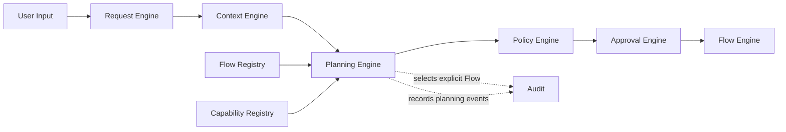
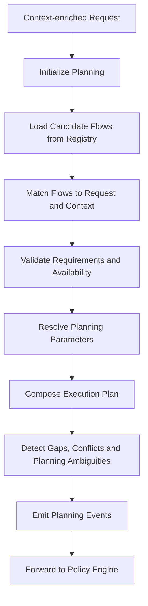
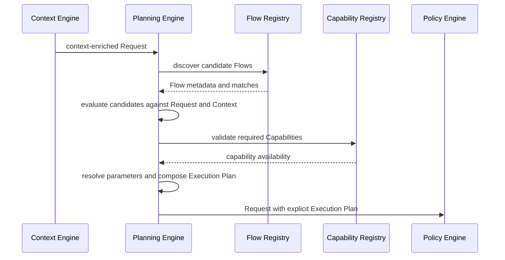

# Planning Engine

> **STATIS Intelligence Layer (SIL)**  
> **Planning Engine**

**Document:** `12_Planning_Engine.md`  
**Version:** 0.1 (Draft)  
**Status:** Core Architecture  
**Owner:** SIL Core  
**Audience:** Software architects, backend developers, plugin developers, AI engineers, future contributors

## Table of contents

- [Purpose](#purpose)
- [Responsibilities and boundaries](#responsibilities-and-boundaries)
- [Processing model](#processing-model)
- [Execution Plan definition](#execution-plan-definition)
- [Behavioural rules](#behavioural-rules)
- [Examples](#examples)
- [Architecture decisions](#architecture-decisions)
- [Future evolution and related documents](#future-evolution-and-related-documents)

## Purpose

The Planning Engine is the third engine in the SIL processing pipeline.

Its role is to transform a structured **Request** and its explicit **Execution Context** into a deterministic **Execution Plan**.

If the Request Engine answers the question *what is the user asking for*, and the Context Engine answers the question *under which surrounding conditions should SIL interpret and plan that Request*, the Planning Engine answers the question *which registered Flow should fulfill that Request, and with which explicit planning inputs*. fileciteturn0file1 fileciteturn0file0 fileciteturn0file7 fileciteturn0file9

This makes the Planning Engine the architectural bridge between understanding and governed execution.

SIL is built on a layered execution model in which the Request captures the user objective, the Flow describes orchestration, the Capability describes the business operation, the Tool implements that Capability, and the Application owns business logic. Planning exists precisely because a Request is not yet a Flow, and a context-enriched Request is still not yet executable. A governed platform needs an explicit component whose responsibility is to select the correct Flow and prepare an explicit Execution Plan before policy evaluation and execution begin. fileciteturn0file9 fileciteturn0file10 fileciteturn0file12

The Planning Engine therefore exists to answer a small set of architectural questions.

Which Flows registered in SIL are capable of satisfying this Request. Which of those candidates remain valid under the current Execution Context. Whether the Request already contains enough information to plan deterministically. Which parameters can be resolved from the Request, from explicit context or from Flow defaults. Which Flow should be selected as the one authoritative orchestration path for this Request. Which planning facts must be made explicit for downstream policy evaluation and execution. fileciteturn0file3 fileciteturn0file7 fileciteturn0file9 fileciteturn0file12

These questions are essential because deterministic execution requires deterministic planning.

The Flow Engine must not discover at execution time which Flow should probably have been selected. The Policy Engine must not infer which orchestration path SIL intends to execute. The Approval Engine must not be asked to authorize an operation whose orchestration plan is still ambiguous. Planning therefore belongs after Request formation and context enrichment, and before policy, approval and execution. fileciteturn0file0 fileciteturn0file4 fileciteturn0file5 fileciteturn0file6 fileciteturn0file10

The Planning Engine does **not** reinterpret free-form language. That belongs to the [Request Engine](10_Request_Engine.md).

It does **not** assemble missing runtime facts such as user, workspace, environment or plugin-contributed operating context. That belongs to the [Context Engine](11_Context_Engine.md).

It does **not** decide whether execution is allowed, denied or subject to approval. That belongs to the [Policy Engine](13_Policy_Engine.md).

It does **not** manage human authorization. That belongs to the [Approval Engine](14_Approval_Engine.md).

It does **not** execute business operations, resolve Tools or communicate with Applications. That belongs to the [Flow Engine](15_Flow_Engine.md). fileciteturn0file0 fileciteturn0file1 fileciteturn0file4 fileciteturn0file5 fileciteturn0file6 fileciteturn0file7 fileciteturn0file10

A useful way to state the architectural intent is this:

> The Request Engine produces a Request.  
> The Context Engine produces explicit Execution Context for that Request.  
> The Planning Engine produces an explicit Execution Plan for that Request.  
> It does not produce authorization and it does not produce execution. fileciteturn0file0 fileciteturn0file1 fileciteturn0file4 fileciteturn0file6 fileciteturn0file7

## Responsibilities and boundaries

The Planning Engine is responsible for the controlled transformation of a context-enriched Request into an explicit Execution Plan.

At a high level, it performs five architectural responsibilities.

First, it discovers candidate Flows from the authoritative Flow registry using registered metadata rather than ad hoc reasoning. SIL already establishes that registries are the source of truth and that Flow matching is part of planning rather than execution. The Planning Engine is therefore the component that turns registered Flow metadata into candidate orchestration paths for one specific Request. fileciteturn0file3 fileciteturn0file7 fileciteturn0file12

Second, it evaluates those candidates against the Request and the current Execution Context. A Flow may match a broad business intent in the abstract and still be unsuitable for the actual Request because the entity shape is wrong, the application scope is different, the current plugin set does not support it or the context makes its use invalid. The Planning Engine exists to make that distinction explicitly. fileciteturn0file0 fileciteturn0file3 fileciteturn0file7

Third, it validates planning-time requirements. This includes verifying that required Capabilities declared by the selected Flow are available in the registered system and that the Flow is materially usable under the current platform state. This is not Tool resolution and not execution. It is architectural validation that the chosen orchestration path is real, registered and plan-worthy. fileciteturn0file3 fileciteturn0file4 fileciteturn0file7 fileciteturn0file12

Fourth, it resolves planning inputs into an explicit Execution Plan. This includes selected Flow identity, application scope where relevant, resolved parameters, unresolved planning gaps, declared Capability requirements from the Flow and output expectations that downstream engines will later use. In other words, Planning turns “a Request that could be fulfilled in several possible ways” into “the one explicit orchestration contract SIL intends to govern and execute.” fileciteturn0file3 fileciteturn0file7 fileciteturn0file9

Fifth, it records an auditable planning history. SIL requires explainability by design. The platform must therefore be able to explain not only which Flow was selected, but also why it was selected, which candidates were excluded, which parameters were resolved from context or defaults, and whether clarification was required before planning could complete. fileciteturn0file6 fileciteturn0file7 fileciteturn0file12

These responsibilities are intentionally narrow.

The Planning Engine is **not** responsible for understanding human language. Request interpretation may use AI and belongs upstream in the Request Engine. Planning consumes the resulting structured Request rather than free-form input. If Planning were allowed to reinterpret language, SIL would blur the boundary between probabilistic understanding and deterministic control. fileciteturn0file1 fileciteturn0file7 fileciteturn0file12

It is **not** responsible for collecting or composing Execution Context. Context includes authenticated user, workspace, environment, roles and plugin-contributed operating facts. Those facts influence planning, but they are not created by planning. If Planning were required to assemble them itself, the architecture would lose the explicit separation between contextual fact collection and orchestration selection. fileciteturn0file0 fileciteturn0file9 fileciteturn0file12

It is **not** responsible for policy outcomes. The Planning Engine may produce the Flow and parameters that policy will later evaluate, but it does not decide allow, deny or approval required. This distinction is important because “how SIL would fulfill the Request” and “whether SIL may fulfill the Request” are deliberately different questions in the architecture. fileciteturn0file6 fileciteturn0file7 fileciteturn0file11

It is **not** responsible for approval. Even if a selected Flow will later prove to require approval under policy, that requirement is determined downstream. Planning remains focused on orchestration shape, not authorization outcome. fileciteturn0file5 fileciteturn0file6

It is **not** responsible for execution. The Planning Engine must not invoke Capabilities, resolve Tools, contact Applications or run Agents. SIL explicitly forbids layers from skipping adjacent layers. Planning ends at explicit plan formation. Flow execution begins later and elsewhere. fileciteturn0file3 fileciteturn0file4 fileciteturn0file10 fileciteturn0file12

The boundary can be summarized like this:



What enters the Planning Engine is broader than the Request alone, but every input is still explicit and architecturally bounded.

| Input | Why it matters |
|---|---|
| Structured Request from the Request Engine | Provides intent, entities, parameters and ambiguity state |
| Explicit Execution Context from the Context Engine | Provides user, roles, workspace, environment, plugin scope and contextual defaults |
| Flow registry metadata | Provides the authoritative set of candidate Flows and their matching rules |
| Capability availability metadata | Allows planning-time validation that declared Flow requirements are satisfiable |
| Current registry and plugin state | Determines which Flows and Capabilities are actually available to this Request |
| Existing Request lifecycle state | Keeps planning part of one continuous Request history |

This input model reflects a core SIL principle: discovery is metadata-driven and explicit. Planning does not invent orchestration. It selects from registered, declared and auditable orchestration options. fileciteturn0file3 fileciteturn0file7 fileciteturn0file10 fileciteturn0file12

What leaves the Planning Engine is the same Request, enriched with an explicit Execution Plan when planning succeeds, or enriched with explicit planning gaps when it does not.

A well-planned Request should still be recognizable as the same Request, should remain explicit about selected Flow and resolved parameters, should preserve any unresolved planning ambiguity rather than hiding it, and should be ready for policy evaluation or clearly marked as not ready. This mirrors the architectural honesty already established by the Request Engine and the Context Engine. fileciteturn0file0 fileciteturn0file1 fileciteturn0file7

The separation of the Planning Engine from neighbouring components is not accidental. It protects the architecture.

If Flow selection were collapsed into AI interpretation, orchestration would become less stable, less explainable and less auditable because planning outcomes would depend on reasoning that is not anchored in authoritative registry metadata. If Planning were absorbed into Context, the platform would blur the distinction between discovering surrounding conditions and selecting orchestration. If Planning were absorbed into Flow execution, SIL would begin execution before it had produced an explicit plan. Each alternative weakens Request-first architecture and deterministic control. fileciteturn0file0 fileciteturn0file1 fileciteturn0file4 fileciteturn0file7 fileciteturn0file12

## Processing model

The Planning Engine follows a staged processing model.

This is not an implementation algorithm. It is the conceptual architecture every implementation should preserve.



Each stage enriches the same Request object.

This is consistent with the SIL execution model in which the Request remains the central business object while its knowledge grows through explicit lifecycle events. The Execution Plan is not an unrelated object created beside the Request. It is an explicit planning artifact attached to that same Request. fileciteturn0file1 fileciteturn0file9 fileciteturn0file10 fileciteturn0file12

Planning begins only after Request formation and context enrichment have already completed.

At this moment the Request should already contain original input, normalized input, intent, entities, parameters and any Request-level ambiguities, as well as explicit Execution Context such as user, roles, workspace, environment and relevant plugin scope. The Planning Engine does not rebuild those parts. It begins from them. fileciteturn0file0 fileciteturn0file1

The first planning stage is candidate Flow discovery.

The Flow DSL explicitly defines a `matches` section and states that matching is used by the Planning Engine rather than the Flow Engine. Planning therefore consults the authoritative registry of registered Flows and discovers the subset whose declared metadata makes them plausible candidates for the Request. This is a metadata-driven activity, not an execution activity and not a model-prompting activity. fileciteturn0file3 fileciteturn0file7 fileciteturn0file12

The next stage is candidate evaluation against Request and Context.

This is where the Planning Engine answers questions such as whether the Request intent aligns with the Flow’s declared intents, whether the entity shape aligns with the Flow’s declared entities, whether the active application scope makes the Flow relevant, and whether the current Execution Context narrows or widens the eligible candidate set. A Flow that is broadly valid in the registry may still be wrong for the current Request. Planning is the place where that distinction is made explicit. fileciteturn0file0 fileciteturn0file3 fileciteturn0file7

The following stage is validation of requirements and availability.

The Flow DSL defines a `requires` section that declares required Capabilities. The Planning Engine should validate that those declared Capabilities exist in the current registered system and that the surrounding plugin state makes the Flow selectable at all. This is not yet technical Tool resolution. It is planning-time verification that the selected orchestration path is grounded in registered platform capabilities rather than wishful metadata. fileciteturn0file3 fileciteturn0file4 fileciteturn0file7

Parameter resolution is the next architectural stage.

The Flow DSL identifies parameters as information required by the Flow and states that parameters may originate from user input, execution context, defaults or previous step outputs. The Planning Engine is responsible only for pre-execution resolution. It may therefore resolve parameters from the structured Request, from explicit Execution Context and from Flow defaults where applicable. Parameters that are intentionally produced by previous Flow steps remain part of the Flow’s later execution semantics and do not need to be materialized during planning. This distinction keeps Planning clean and prevents it from doing execution work early. fileciteturn0file0 fileciteturn0file3 fileciteturn0file7 fileciteturn0file9

Execution Plan composition follows once the selected Flow and planning inputs are known.

At this point the Planning Engine turns candidate reasoning into one explicit plan structure. That structure should make visible at least the selected Flow, the application scope where relevant, the parameters resolved before execution, the required Capabilities declared by the Flow, and the planning status of the Request. The purpose of this step is not merely convenience. It is the architectural moment when one possible orchestration path becomes the official path that downstream governance and execution will consume. fileciteturn0file3 fileciteturn0file4 fileciteturn0file7 fileciteturn0file9

The Planning Engine must also detect planning gaps, conflicts and ambiguities.

If no Flow matches the Request, that fact should be explicit. If several Flows remain equally plausible and the architecture has no deterministic tie-break outcome, that fact should be explicit. If the selected Flow requires a parameter that is still missing after Request and Context resolution, that fact should be explicit. Determinism does not mean pretending that planning always succeeds. It means incomplete planning is handled visibly, reproducibly and audibly. fileciteturn0file0 fileciteturn0file1 fileciteturn0file7 fileciteturn0file12

Like other engines in SIL, the Planning Engine should emit meaningful lifecycle events.

Illustrative events may include `planning.started`, `planning.candidates.discovered`, `planning.flow.selected`, `planning.parameters.resolved`, `planning.marked_for_clarification`, `planning.plan.created` and `request.forwarded_to_policy`. These names are illustrative rather than normative. What matters architecturally is that planning becomes an auditable part of Request history and that the Request is forwarded to the Policy Engine only after planning is complete or explicitly blocked. fileciteturn0file1 fileciteturn0file6 fileciteturn0file7 fileciteturn0file12

## Execution Plan definition

The **Execution Plan** is the explicit representation of how SIL intends to fulfill a Request.

It is important to state this precisely.

The Execution Plan is not the Request itself. It is not the Execution Context. It is not Policy. It is not Approval. It is not execution output. It is the deterministic plan produced by the Planning Engine that specifies the selected Flow and the explicit planning inputs required for downstream governance and execution. fileciteturn0file6 fileciteturn0file7 fileciteturn0file9

A planned Request should therefore be able to express the following conceptual structure:

```yaml
request:
  id:
  created_at:
  source:
  original_input:
  normalized_input:
  intent:
  entities:
  parameters:
  context:
  execution_plan:
    flow:
      id:
      version:
    application:
    matched_by:
      intent:
      entities:
      context:
    resolved_parameters:
    unresolved_parameters:
    required_capabilities:
    output:
    status:
    events:
  status:
  events:
  audit_ref:
```

This is a conceptual model, not a schema contract.

Its purpose is to define what the Request must be able to express after planning completes. The concrete code representation may evolve, but the architectural meaning should remain stable: planning must become explicit and durable inside the Request lifecycle. fileciteturn0file1 fileciteturn0file7 fileciteturn0file9 fileciteturn0file12

The following fields should exist in some form in every explicit Execution Plan.

| Field | Purpose |
|---|---|
| `flow` | Identifies the selected Flow that will orchestrate fulfillment |
| `application` | Captures the primary application or business scope where relevant |
| `matched_by` | Preserves the planning basis by which the Flow was selected |
| `resolved_parameters` | Captures planning-time parameters resolved from Request, Context or defaults |
| `unresolved_parameters` | Exposes planning gaps that still block deterministic execution |
| `required_capabilities` | Makes the selected Flow’s declared business dependencies explicit |
| `output` | Describes the expected response shape or Flow output contract |
| `status` | Reflects whether planning has completed or requires clarification |
| `events` | Preserves the lifecycle history of planning itself |

These fields are not a miscellaneous planning cache. They express the architectural idea that orchestration selection must be explicit, reproducible and explainable. If downstream policy or execution must rediscover basic planning facts, the platform has already lost architectural clarity. fileciteturn0file3 fileciteturn0file4 fileciteturn0file6 fileciteturn0file7

The selected Flow is the centre of gravity of the plan.

A Flow describes how a Request is fulfilled and always operates through Capabilities rather than Tools or direct application calls. The Planning Engine therefore does not choose a REST endpoint, an SDK method or a Tool implementation. It chooses one registered Flow whose declared orchestration semantics fit the Request. That distinction is critical because it keeps planning business-oriented and resilient to technical changes below the Capability layer. fileciteturn0file3 fileciteturn0file9 fileciteturn0file12

The `matched_by` portion of the plan is important for explainability.

SIL should remain able to say not only that a Flow was selected, but why it was selected. Typical reasons include intent match, entity alignment, application match and contextual fitness. This does not require the plan to become a verbose debug object, but it does require that the platform preserve enough planning basis to explain the choice later to auditors, developers or users when appropriate. fileciteturn0file6 fileciteturn0file7 fileciteturn0file12

Resolved parameters require special care.

Core concepts already establish that parameters may originate from user input, execution context, defaults or previous processing stages. The Planning Engine may therefore materialize parameters required for the selected Flow by combining existing Request parameters, explicit context-derived values and Flow defaults. However, it should preserve the distinction between what the user explicitly said and what the platform resolved during planning. This protects the original Request, keeps explanations truthful and prevents planning from silently rewriting user intent. fileciteturn0file0 fileciteturn0file3 fileciteturn0file9

Required Capabilities belong in the plan because they are part of the declared Flow contract, but technical Tool resolution does not.

This is a subtle but important boundary. The Planning Engine may expose that a selected Flow requires Capabilities such as `pipeline.job.find` or `pipeline.job.run`, because those are business-level dependencies declared in the Flow definition. It must not select a REST client, SDK adapter or concrete Tool implementation to satisfy them. That work belongs to the Flow Engine and the lower layers of the execution model. fileciteturn0file3 fileciteturn0file4 fileciteturn0file9 fileciteturn0file12

The plan must also be able to represent incompleteness explicitly.

Examples include a missing required parameter after context enrichment, several equally plausible Flows with no deterministic resolution, or a selected Flow whose declared requirements cannot be satisfied by the current registry state. A platform that hides such planning incompleteness does not become deterministic. It becomes opaque. SIL instead requires truthful explicitness wherever planning cannot complete safely. fileciteturn0file0 fileciteturn0file1 fileciteturn0file7 fileciteturn0file12

## Behavioural rules

The following rules define how the Planning Engine should behave regardless of implementation details.

### Plan from explicit metadata

Candidate discovery and Flow selection should be based on registered Flow metadata, declared requirements and explicit Request and Context facts.

This is the architectural heart of deterministic planning. The Planning Engine may consume artifacts originally authored by humans, contributed by Plugins or stored in registries, but its selection logic must remain anchored in explicit and inspectable metadata rather than improvisational AI reasoning. fileciteturn0file3 fileciteturn0file7 fileciteturn0file12

### Select one authoritative Flow

When planning succeeds, SIL should produce one explicit Flow selection for the Request.

The platform should not hand several equally valid orchestration choices downstream and expect later engines to decide. The reason the Planning Engine exists is to collapse candidate possibility into one deterministic orchestration decision before governance and execution begin. fileciteturn0file4 fileciteturn0file6 fileciteturn0file7

### Never guess missing business data

If the selected Flow requires information that is still missing after Request and Context processing, the Planning Engine should prefer clarification over unsupported assumption.

This rule is especially important because planning sits at the boundary where the architecture becomes operational. Guessing at this stage no longer distorts only interpretation. It distorts orchestration itself. SIL therefore prefers explicit incompleteness over hidden planning guesses. fileciteturn0file0 fileciteturn0file1 fileciteturn0file7

### Respect the precedence of explicit user input

When a user explicitly provides a parameter, planning should not silently replace it with a Flow default.

A Flow default may legitimately fill a gap. It should not silently override an explicit instruction from the Request. If an explicit user value and a default are in tension, that tension should be made explicit or resolved by a deterministic rule that preserves explainability. fileciteturn0file0 fileciteturn0file1 fileciteturn0file3

### Allow explicit context to complete planning

The Planning Engine may use explicit Execution Context to resolve planning inputs required by the selected Flow.

This is not guesswork. If a Flow needs an environment and the Context Engine has already attached an explicit active environment or workspace-derived default, planning may use that fact. The key is that the value must already be explicit in the Request context rather than smuggled in as a hidden runtime assumption. fileciteturn0file0 fileciteturn0file3 fileciteturn0file9 fileciteturn0file12

### Validate declared requirements before emitting a plan

A Flow cannot be meaningfully selected if its declared Capability requirements are unavailable in the current registered platform state.

The Planning Engine should therefore validate the declared `requires` contract before marking a Request as ready for policy. This keeps planning honest and prevents downstream components from receiving a plan that is architecturally invalid from the moment it is created. fileciteturn0file3 fileciteturn0file7 fileciteturn0file12

### Keep planning separate from policy

Planning should never treat “selected” as equivalent to “allowed.”

A Request may be perfectly understandable, fully contextualized and cleanly planned, and still be denied or routed through approval by policy. Preserving this boundary keeps governance explicit and prevents orchestration choice from being confused with organizational authorization. fileciteturn0file5 fileciteturn0file6 fileciteturn0file7

### Keep planning separate from execution

The Planning Engine must not invoke Capabilities, Agents, Tools or Applications.

It prepares execution. It does not perform execution. This rule matters not only for purity of architecture but also for auditability. A platform should be able to point to a clear moment where planning ended and execution began. fileciteturn0file3 fileciteturn0file4 fileciteturn0file7 fileciteturn0file12

### Remain deterministic and auditable

The same Request under the same contextual and registry conditions should produce the same planning result.

This does not require implementations to use the same internal code path every time. It does require that planning outcomes be reproducible from explicit inputs and that SIL can later explain candidate discovery, selection, rejection and clarification outcomes in audit-friendly terms. fileciteturn0file6 fileciteturn0file7 fileciteturn0file12

## Examples

The following examples illustrate the kind of Execution Plan the Planning Engine should produce. These are examples, not normative schemas. They exist to clarify architectural behaviour rather than prescribe a concrete implementation class model. fileciteturn0file3 fileciteturn0file7 fileciteturn0file9

A useful way to understand planning is to start with candidate evaluation.

For a context-enriched Request such as “Run FA validation in TEST” in Pipeline scope, the Planning Engine may discover several registered Flows but only one of them should emerge as the correct orchestration path.

| Candidate Flow | Why it is considered | Why it is selected or rejected |
|---|---|---|
| `pipeline.job.run_and_summarize` | Matches `run_job`, expects `job`, fits Pipeline application scope | Selected because it aligns with intent, entity and available context |
| `pipeline.job.explain` | Matches the same domain entity `job` | Rejected because the Request intent is execution rather than explanation |
| `pipeline.run.diagnose_failed` | Relevant to Pipeline runs | Rejected because the Request does not ask to diagnose an existing failed run |

This kind of table matters because it shows that planning is not mystical. It is a disciplined reduction from a candidate set to one explicit Flow selection. fileciteturn0file3 fileciteturn0file7

### Example of a Request planned for execution

Possible Request representation after planning:

```yaml
request:
  id: req_01J123ABCXYZ
  created_at: "2026-06-30T10:15:00Z"
  source:
    type: chat
    channel: job_monitor
  original_input:
    text: "Run FA validation in TEST"
  normalized_input:
    text: "run FA validation in TEST"
  intent: run_job
  entities:
    - type: job
      value: "FA validation"
  parameters:
    environment: TEST
  context:
    user:
      id: usr_7842
      username: "ggruic"
    roles:
      - pipeline.operator
    workspace:
      application: Pipeline
      name: "Regulatory Reporting"
    environment:
      active: TEST
      source: request.parameters.environment
    available_plugins:
      - pipeline
    derived_parameters:
      workspace: "Regulatory Reporting"
    status: ready_for_planning
  execution_plan:
    flow:
      id: pipeline.job.run_and_summarize
      version: 0.1
    application: pipeline
    matched_by:
      intent: run_job
      entities:
        - job
      context:
        application: Pipeline
    resolved_parameters:
      job: "FA validation"
      environment:
        value: TEST
        source: request.parameters.environment
      workspace:
        value: "Regulatory Reporting"
        source: context.derived_parameters.workspace
    unresolved_parameters: []
    required_capabilities:
      - pipeline.job.find
      - pipeline.job.run
      - pipeline.run.status
      - pipeline.run.logs.read
    output:
      type: markdown
    status: ready_for_policy
    events:
      - type: planning.started
        at: "2026-06-30T10:15:04Z"
      - type: planning.candidates.discovered
        at: "2026-06-30T10:15:04Z"
      - type: planning.flow.selected
        at: "2026-06-30T10:15:05Z"
      - type: planning.plan.created
        at: "2026-06-30T10:15:05Z"
  status: ready_for_policy
  events:
    - type: request.created
      at: "2026-06-30T10:15:00Z"
    - type: request.interpreted
      at: "2026-06-30T10:15:01Z"
    - type: request.forwarded_to_context
      at: "2026-06-30T10:15:02Z"
    - type: request.forwarded_to_planning
      at: "2026-06-30T10:15:04Z"
    - type: request.forwarded_to_policy
      at: "2026-06-30T10:15:06Z"
```

This example shows the intended division of responsibilities.

The Request still expresses the business objective. The Context still expresses the execution conditions. The Planning Engine does not execute the job and it does not decide whether the job is allowed to run. It makes the orchestration path explicit by selecting a Flow and preparing the planning contract that policy and execution will consume next. fileciteturn0file0 fileciteturn0file4 fileciteturn0file6 fileciteturn0file7

### Example of a Request planned for explanation rather than execution

User input may look superficially similar while requiring a completely different Flow.

```yaml
request:
  id: req_01J123DEFUVW
  created_at: "2026-06-30T10:17:00Z"
  source:
    type: chat
    channel: job_monitor
  original_input:
    text: "Explain what job FA validation does"
  normalized_input:
    text: "explain job FA validation"
  intent: explain_job
  entities:
    - type: job
      value: "FA validation"
  parameters: {}
  context:
    user:
      id: usr_7842
    roles:
      - reporting.user
    workspace:
      application: Pipeline
      name: "Regulatory Reporting"
    available_plugins:
      - pipeline
    status: ready_for_planning
  execution_plan:
    flow:
      id: pipeline.job.explain
      version: 0.1
    application: pipeline
    matched_by:
      intent: explain_job
      entities:
        - job
      context:
        application: Pipeline
    resolved_parameters:
      job: "FA validation"
    unresolved_parameters: []
    required_capabilities:
      - pipeline.job.find
      - pipeline.job.read
      - pipeline.job.files.read
    output:
      type: markdown
    status: ready_for_policy
  status: ready_for_policy
```

This matters architecturally because it shows that planning is not just “find something in Pipeline.” It is the stage that distinguishes explanatory orchestration from operational orchestration, even when the same business entity appears in both Requests. fileciteturn0file1 fileciteturn0file3 fileciteturn0file7

### Example of planning blocked by missing information

User input:

```text
Run validation
```

Possible context-enriched Request entering the Planning Engine:

```yaml
request:
  id: req_01J123GHIJKL
  created_at: "2026-06-30T10:19:00Z"
  source:
    type: chat
    channel: job_monitor
  original_input:
    text: "Run validation"
  normalized_input:
    text: "run validation"
  intent: run_job
  entities:
    - type: job
      value: "validation"
  parameters: {}
  ambiguities:
    - type: entity_resolution
      field: job
      message: "The referenced job is not specific enough."
  context:
    user:
      id: usr_7842
    roles:
      - pipeline.operator
    workspace:
      application: Pipeline
      name: "Regulatory Reporting"
    environment:
      active: TEST
      source: context.provider.pipeline.default_environment
    available_plugins:
      - pipeline
    status: ready_for_planning
```

Possible Request representation after planning detects that deterministic plan formation is still impossible:

```yaml
request:
  id: req_01J123GHIJKL
  execution_plan:
    flow: null
    application: pipeline
    matched_by:
      intent: run_job
      entities:
        - job
    resolved_parameters:
      environment:
        value: TEST
        source: context.environment.active
    unresolved_parameters:
      - job
    required_capabilities: []
    output: null
    status: needs_clarification
    events:
      - type: planning.started
        at: "2026-06-30T10:19:03Z"
      - type: planning.candidates.discovered
        at: "2026-06-30T10:19:03Z"
      - type: planning.marked_for_clarification
        at: "2026-06-30T10:19:04Z"
  status: needs_clarification
```

This is a good planning outcome because it is honest.

The Planning Engine does not pretend that “validation” is already a sufficiently specific job reference. It also does not ignore the fact that context has supplied a usable environment. It preserves what is known, exposes what is missing and stops before producing a false plan. fileciteturn0file0 fileciteturn0file1 fileciteturn0file7

### Example of planning interaction across the pipeline



This interaction shows why the Planning Engine belongs where it does in the pipeline.

It depends on explicit context from upstream, on metadata from registries, and on no direct contact with applications. It produces a plan that policy can evaluate before any execution occurs. fileciteturn0file0 fileciteturn0file3 fileciteturn0file6 fileciteturn0file7 fileciteturn0file10

## Architecture decisions

### AD-1201

The Planning Engine is the only SIL component responsible for producing the explicit Execution Plan for a Request. fileciteturn0file7 fileciteturn0file9

### AD-1202

Planning occurs after Request formation and context enrichment, and before policy evaluation and execution. fileciteturn0file0 fileciteturn0file1 fileciteturn0file6 fileciteturn0file10

### AD-1203

Candidate Flow discovery and Flow selection are metadata-driven activities based on registered Flow definitions rather than AI-generated execution reasoning. fileciteturn0file3 fileciteturn0file7 fileciteturn0file12

### AD-1204

The Planning Engine may resolve parameters from structured Request data, explicit Execution Context and Flow defaults, but it must preserve the distinction between user-supplied and platform-resolved values. fileciteturn0file0 fileciteturn0file3 fileciteturn0file9

### AD-1205

The Planning Engine validates declared Flow requirements at planning time, but it does not resolve concrete Tools and it does not communicate directly with Applications. fileciteturn0file3 fileciteturn0file4 fileciteturn0file12

### AD-1206

Planning must represent missing information, unsatisfied requirements and ambiguous candidate outcomes explicitly rather than hiding them through unsupported assumptions. fileciteturn0file0 fileciteturn0file1 fileciteturn0file7

### AD-1207

The Execution Plan must be attached to the Request as an explicit and auditable part of Request state rather than remain an implicit internal planner artifact. fileciteturn0file6 fileciteturn0file9 fileciteturn0file10 fileciteturn0file12

### AD-1208

Planning selects orchestration. Policy determines authorization. Approval manages human authorization. Flow execution performs business operations. These responsibilities must remain separate. fileciteturn0file4 fileciteturn0file5 fileciteturn0file6 fileciteturn0file7

## Future evolution and related documents

The Planning Engine defined in this document is intended to remain stable at the architectural level, but several implementation-oriented areas may evolve over time.

Expected areas of future refinement include formal Execution Plan schema definition, Flow ranking and tie-breaking strategy, Flow version selection rules, richer planning explanation metadata, planning-time performance optimization, partial re-planning for resumed Requests, plan serialization and persistence semantics, and observability conventions for planning metrics and events. These topics should evolve without changing the architectural centre of gravity of the component: select one explicit Flow from registered metadata, resolve planning inputs honestly, preserve Request integrity, and hand a deterministic plan to downstream governance and execution. fileciteturn0file3 fileciteturn0file7 fileciteturn0file10 fileciteturn0file12

### Related documents

- [00_Principles](00_Principles.md)
- [01_Vision](01_Vision.md)
- [02_Architecture](02_Architecture.md)
- [03_Core_Concepts](03_Core_Concepts.md)
- [10_Request_Engine](10_Request_Engine.md)
- [11_Context_Engine](11_Context_Engine.md)
- [13_Policy_Engine](13_Policy_Engine.md)
- [14_Approval_Engine](14_Approval_Engine.md)
- [15_Flow_Engine](15_Flow_Engine.md)
- [16_Flow_DSL](16_Flow_DSL.md)

> **A strong Planning Engine does not improvise execution. It turns an explicit Request and explicit Context into one explicit orchestration decision.**