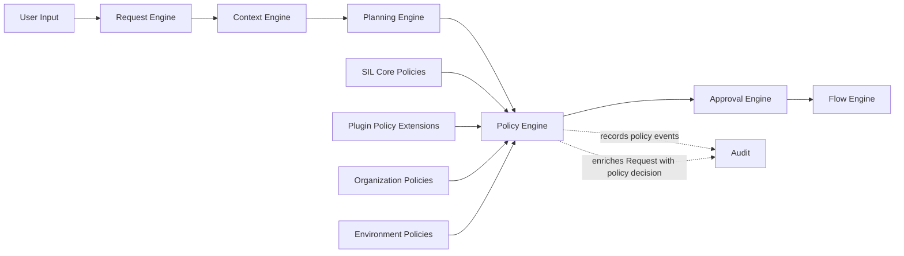
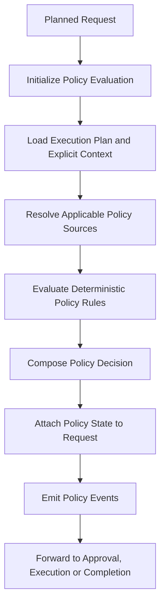
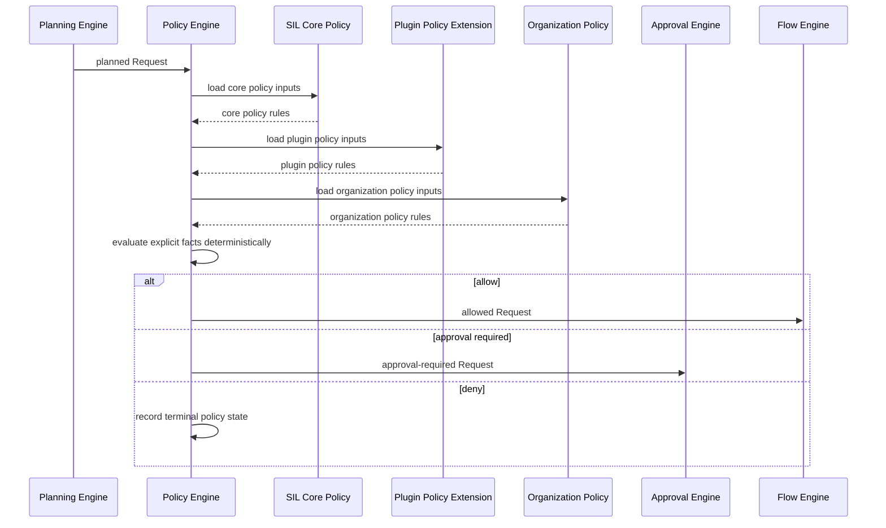

# Policy Engine

> **STATIS Intelligence Layer (SIL)**  
> **Policy Engine**

**Document:** `13_Policy_Engine.md`  
**Version:** 0.1 (Draft)  
**Status:** Core Architecture  
**Owner:** SIL Core  
**Audience:** Software architects, backend developers, plugin developers, AI engineers, future contributors

**Table of contents**

- [Purpose](#purpose)
- [Responsibilities and Boundaries](#responsibilities-and-boundaries)
- [Processing Model](#processing-model)
- [Policy Decision Definition](#policy-decision-definition)
- [Behavioural Rules](#behavioural-rules)
- [Examples](#examples)
- [Architecture Decisions](#architecture-decisions)
- [Future Evolution and Related Documents](#future-evolution-and-related-documents)

## Purpose

The Policy Engine is the fourth engine in the SIL processing pipeline.

Its role is to determine whether a planned Request may continue toward execution under SIL governance.

If the Request Engine answers the question *what is the user asking for*, the Context Engine answers the question *under which surrounding conditions should SIL interpret and plan that Request*, and the Planning Engine answers the question *which Flow should fulfill that Request and with which explicit planning inputs*, the Policy Engine answers the question *whether SIL may continue with that planned Request under explicit organizational control*. fileciteturn0file13 fileciteturn0file12 fileciteturn0file2 fileciteturn0file1 fileciteturn0file0 fileciteturn0file9

This makes the Policy Engine the architectural boundary between planning and governed continuation.

SIL is built on the principle that understanding is not authorization. A Request may be well-formed. Its Execution Context may be explicit. Its Execution Plan may be deterministic. The requested operation may still be forbidden, may require human approval, or may be allowed only under specific organizational conditions. Policy exists to make that distinction explicit before any business operation is executed. fileciteturn0file15 fileciteturn0file14 fileciteturn0file13 fileciteturn0file9

The Policy Engine exists to answer a small set of architectural questions.

Whether the authenticated user, roles and execution context permit the selected Flow to continue. Whether the current application, environment and workspace satisfy organizational governance rules. Whether the planned operation is allowed immediately, denied outright, or allowed only after explicit Approval. Which policy source or rule explains that outcome. How that decision becomes part of the Request in a deterministic and auditable form. fileciteturn0file12 fileciteturn0file1 fileciteturn0file9 fileciteturn0file8

These questions are essential because deterministic execution without deterministic authorization would still be architecturally unsafe.

The Flow Engine must not begin execution and discover only afterward that the selected Flow should have been denied. The Approval Engine must not be asked to collect approval for a Request whose governance status is still unknown. Applications should continue enforcing their own domain permissions, but SIL must enforce orchestration policy before it hands execution to any downstream engine. Policy therefore belongs after planning and before approval or execution. fileciteturn0file15 fileciteturn0file13 fileciteturn0file9 fileciteturn0file8 fileciteturn0file7

The Policy Engine does **not** reinterpret free-form language. That belongs to the [Request Engine](10_Request_Engine.md).

It does **not** collect missing runtime facts such as user, roles, workspace or environment. That belongs to the [Context Engine](11_Context_Engine.md).

It does **not** select a Flow. That belongs to the [Planning Engine](12_Planning_Engine.md).

It does **not** collect human authorization. That belongs to the [Approval Engine](14_Approval_Engine.md).

It does **not** invoke Capabilities, resolve Tools or communicate with Applications. That belongs to the [Flow Engine](15_Flow_Engine.md). fileciteturn0file2 fileciteturn0file1 fileciteturn0file0 fileciteturn0file8 fileciteturn0file7

A useful way to state the architectural intent is this:

> The Request Engine produces a Request.  
> The Context Engine produces explicit Execution Context for that Request.  
> The Planning Engine produces an explicit Execution Plan for that Request.  
> The Policy Engine produces an explicit policy decision for that Request.  
> It does not produce approval and it does not produce execution. fileciteturn0file2 fileciteturn0file1 fileciteturn0file0 fileciteturn0file9 fileciteturn0file8

## Responsibilities and Boundaries

The Policy Engine is responsible for the controlled evaluation of a planned Request against explicit governance rules.

At a high level, it performs five architectural responsibilities.

First, it evaluates the selected Execution Plan against explicit policy inputs. Old and new SIL documents already establish that policy evaluation happens after planning and that the typical policy input set includes authenticated user, roles, application, Flow, requested Capability, environment, workspace and organizational rules. The Policy Engine is therefore the component that turns those explicit inputs into one authoritative governance outcome for the Request. fileciteturn0file9 fileciteturn0file13 fileciteturn0file12 fileciteturn0file0

Second, it resolves applicable policy sources into one deterministic policy view. SIL already states that policies may originate from SIL Core, Plugin Policies, Organization Policies and Environment Policies, and that Plugins may contribute Policy Extensions. The Policy Engine exists to consume those sources as one unified evaluation model rather than leaving governance fragmented across runtime layers. fileciteturn0file9 fileciteturn0file13 fileciteturn0file15 fileciteturn0file12

Third, it decides whether the Request is **allow**, **approval_required** or **deny**. Those are not incidental statuses. They are the policy outcomes defined in the policy concept itself and in the existing Policy Engine chapter. The Policy Engine therefore does not invent nuanced governance outcomes on the fly. It produces one of the explicit platform outcomes already established by SIL. fileciteturn0file12 fileciteturn0file9

Fourth, it records an explainable policy basis. SIL requires explainability by design. A policy decision must therefore be able to say not only *what* the outcome was, but *why* that outcome was reached, which policy identified the operation as sensitive or forbidden, and whether the decision originated from SIL Core, a Plugin, the organization or the active environment. Policy that cannot be explained weakens governance even when it is technically correct. fileciteturn0file15 fileciteturn0file9 fileciteturn0file13

Fifth, it enriches the Request with auditable policy state. Existing SIL documents consistently treat the Request as the central business object that evolves through explicit lifecycle stages. The Policy Engine therefore attaches its decision to the same Request rather than producing a disconnected authorization side-object. This preserves continuity for audit, Approval and execution. fileciteturn0file15 fileciteturn0file14 fileciteturn0file13 fileciteturn0file9

These responsibilities are intentionally narrow.

The Policy Engine is **not** responsible for understanding user language. The Request Engine already transforms user interaction into intents, Entities, Parameters and explicit Request ambiguity. If Policy were allowed to reinterpret language, governance would become entangled with probabilistic understanding instead of consuming explicit Request structure. fileciteturn0file2 fileciteturn0file15

It is **not** responsible for creating Execution Context. Context must already be explicit by the time policy starts. If Policy had to collect user, roles, workspace or environment while also making governance decisions, the platform would blur the line between fact formation and authorization. The Context Engine exists precisely to prevent that. fileciteturn0file1 fileciteturn0file15

It is **not** responsible for choosing a Flow or composing an Execution Plan. Planning decides *how the Request would be fulfilled*. Policy decides *whether that planned fulfillment may continue*. SIL already treats those as different architectural questions, and collapsing them would weaken both explainability and determinism. fileciteturn0file0 fileciteturn0file9 fileciteturn0file13

It is **not** responsible for managing human approval. The Policy Engine may determine that approval is required, but it never authenticates approvers, collects decisions or manages approval lifetime. That responsibility begins only once the Request crosses into the [Approval Engine](14_Approval_Engine.md). fileciteturn0file9 fileciteturn0file8

It is **not** responsible for execution. The Policy Engine must not invoke Capabilities, Agents, Tools or Applications. SIL explicitly forbids layers from skipping layers, and policy is part of governance rather than execution. Once policy has decided the Request may continue, downstream execution remains the responsibility of later engines. fileciteturn0file15 fileciteturn0file13 fileciteturn0file7

The boundary can be summarized like this:



### What enters the Policy Engine

The Policy Engine consumes more than the Execution Plan alone.

Its architectural inputs typically include:

| Input | Why it matters |
|---|---|
| Planned Request from the Planning Engine | Preserves one continuous Request lifecycle and the selected Execution Plan |
| Explicit Execution Context | Provides user, roles, workspace, environment and plugin scope for governance evaluation |
| Execution Plan | Provides the selected Flow, plan status, resolved parameters and required Capability requirements |
| Policy sources | Provide SIL Core, Plugin, organization and environment rules |
| Registry and plugin state | Determine which policy contributions are in effect for this Request |
| Existing Request lifecycle state | Keeps policy evaluation auditable as part of one evolving Request |

This input model reflects a core SIL principle: authorization is evaluated from explicit facts, not hidden runtime assumptions. Policy should never need to infer the acting user, invent missing context or reinterpret the Flow that Planning already selected. fileciteturn0file15 fileciteturn0file1 fileciteturn0file0 fileciteturn0file9

A subtle but important point is that policy consumes plan facts without taking ownership of planning.

For example, a selected Flow may declare required Capabilities, application scope and resolved parameters. Those facts are relevant to policy because they describe the operation SIL is about to orchestrate. But the Policy Engine does not re-rank candidate Flows, refine matching rules or repair plan incompleteness. It governs the selected plan rather than redesigning it. fileciteturn0file6 fileciteturn0file0 fileciteturn0file9

### What leaves the Policy Engine

The output of the Policy Engine is the same Request, enriched with explicit policy state.

A policy-evaluated Request should be:

- still identifiable as the same Request,
- explicit about the policy decision,
- explicit about the reason and policy source behind that decision,
- explicit about whether Approval is required,
- explicit about denial when continuation is forbidden,
- ready for Approval or execution only when the policy outcome allows it.

This mirrors the same architectural honesty required upstream. The Request Engine should express what is known and not known about user objective. The Context Engine should express what is known and not known about execution conditions. The Planning Engine should express what is known and not known about orchestration. The Policy Engine should express what is known and not known about authorization. fileciteturn0file2 fileciteturn0file1 fileciteturn0file0 fileciteturn0file9

The Policy Engine does not modify the Execution Plan when it evaluates it.

This boundary is important. A policy decision may prevent execution, require approval or allow continuation, but it should not rewrite the selected Flow, silently remove required steps or substitute lower-impact parameters. The plan remains the plan. Policy governs whether the plan may continue. Existing SIL documents already state that the Execution Plan remains unchanged by policy and that Request enrichment happens beside the plan rather than by mutating it into something else. fileciteturn0file9 fileciteturn0file8

### Why the Policy Engine exists as a separate engine

The separation of the Policy Engine from neighbouring components is not accidental. It protects the architecture.

If policy evaluation were collapsed into Planning, the selected Flow and the governance decision would become entangled. SIL would lose the ability to distinguish *how the Request would be fulfilled* from *whether that fulfillment is authorized*. That would weaken explainability and make Approval semantics less clear, because approval is a policy outcome rather than a planning feature. fileciteturn0file0 fileciteturn0file9 fileciteturn0file8

If policy evaluation were moved into the Approval Engine, the system would ask humans to approve operations before it had first determined whether those operations even qualified for approval rather than outright denial or immediate allow. SIL instead requires Policy to determine when approval is required and the Approval Engine to manage the resulting human decision. fileciteturn0file9 fileciteturn0file8

If policy evaluation were moved into Applications, SIL would lose a common orchestration governance layer. Applications would continue enforcing their own business permissions, but the cross-application orchestration platform would no longer own authorization over Flows, Capabilities and execution paths. Existing architecture explicitly rejects that model by separating application autonomy from SIL governance. fileciteturn0file15 fileciteturn0file14 fileciteturn0file13 fileciteturn0file9

## Processing Model

The Policy Engine follows a staged processing model.

This is not an implementation algorithm. It is the conceptual architecture every implementation should preserve. fileciteturn0file13 fileciteturn0file1 fileciteturn0file0



Each stage enriches the same Request object.

This is consistent with the SIL execution model in which the Request remains the central business object while its knowledge grows through explicit lifecycle events. Policy state is therefore part of Request history rather than a detached authorization artifact. fileciteturn0file15 fileciteturn0file13 fileciteturn0file12

### Initialization

The Policy Engine begins with a Request that is already planned.

At this point the Request should already contain original input, normalized input, intent, Entities, Parameters, explicit Execution Context and an explicit Execution Plan produced by the Planning Engine. The Policy Engine does not rebuild any of those parts. It begins from them. fileciteturn0file2 fileciteturn0file1 fileciteturn0file0

This sequencing matters.

Policy is meaningful only once SIL knows what operation it intends to orchestrate. Request formation alone is too early because the selected Flow is not yet explicit. Context enrichment alone is too early because execution conditions are present but orchestration is not yet selected. Planning makes the intended path explicit. Policy then governs that path. fileciteturn0file13 fileciteturn0file1 fileciteturn0file0

### Policy input assembly

The first policy stage is assembly of the evaluation inputs that already exist in explicit Request state.

These typically include the acting user, roles, workspace, environment, selected application scope, selected Flow, required Capabilities declared by the Flow, resolved parameters and current Request status. Old and new SIL documents describe these as the typical inputs to policy evaluation. The architectural rule is simple: if a fact influences authorization, that fact must already be explicit enough for Policy to consume it deterministically. fileciteturn0file9 fileciteturn0file12 fileciteturn0file1 fileciteturn0file0

This stage is also where Policy preserves the distinction between business intent and policy-relevant operation shape.

For example, the Request intent may be `run_job`, but the policy input is not only that abstract intent. It is the explicit combination of the selected Flow, its application scope, the environment and the acting principal under which the operation would execute. Policy operates on that planned shape rather than on free-form user meaning alone. fileciteturn0file12 fileciteturn0file0 fileciteturn0file9

### Policy source resolution

Policies may originate from several architectural sources.

Existing documents already identify SIL Core, Plugin Policies, Organization Policies and Environment Policies as sources, and the plugin architecture explicitly allows Plugins to contribute Policy Extensions. The Policy Engine is responsible for determining which of these sources are relevant to the current Request and for resolving them into one effective evaluation scope. fileciteturn0file9 fileciteturn0file13 fileciteturn0file15 fileciteturn0file12

This is important because governance in SIL is multi-level without becoming multi-owner at runtime.

A Request may be generally allowed by SIL Core, marked as sensitive by a Plugin due to application semantics, further constrained by an organization policy for production environments, and subject to an environment-specific rule for a particular workspace or tenant. The Policy Engine exists to convert those layers into one deterministic decision rather than forcing downstream engines to reason over them independently. fileciteturn0file9 fileciteturn0file15

### Deterministic rule evaluation

Once inputs and applicable policies are known, the Policy Engine performs deterministic evaluation.

The existing policy concept is explicit that the result must be reproducible under the same conditions and that AI must never determine authorization. This means policy evaluation is based on explicit rules and explicit facts, not on probabilistic reasoning or conversational improvisation. Under the same Request, the same Execution Context, the same Execution Plan and the same policy set, SIL should produce the same decision. fileciteturn0file9 fileciteturn0file15 fileciteturn0file14

Deterministic evaluation may still combine several kinds of rule.

Illustrative examples include role-based rules, environment-based restrictions, workspace rules, Plugin-contributed sensitivity rules and organization-specific approval requirements. What matters architecturally is not the future internal rule language. What matters is that policy decisions remain explicit, explainable and stable for the same inputs. fileciteturn0file9 fileciteturn0file15

### Decision composition

Every policy evaluation produces one of the established SIL outcomes: allow, approval required or deny.

These are not merely HTTP-like status codes. They are architectural states that determine the next stage of Request processing. **Allow** means the Request may continue without human authorization. **Approval required** means the Request may continue only after explicit human authorization. **Deny** means the Request stops before execution and the denial reason becomes part of the Request. fileciteturn0file12 fileciteturn0file9 fileciteturn0file8

The composed decision should also preserve its explanation.

At minimum, the platform should be able to identify the decision, the reason, the policy that produced that reason and the source from which that policy came. Existing SIL material already shows this shape explicitly and requires every policy decision to remain explainable rather than arbitrary. fileciteturn0file9

### Request enrichment and forwarding

After the decision is composed, the Policy Engine enriches the Request and emits policy lifecycle events.

If the decision is **allow**, the Request becomes ready for execution continuation. If the decision is **approval_required**, the Request becomes ready for the Approval Engine. If the decision is **deny**, the Request becomes terminal or blocked according to the broader Request lifecycle. In each case the Request should remain explicit about what happened and why. fileciteturn0file9 fileciteturn0file8 fileciteturn0file7

Illustrative events may include `policy.evaluation.started`, `policy.sources.resolved`, `policy.allow`, `policy.approval_required`, `policy.denied`, `request.forwarded_to_approval` and `request.forwarded_to_execution`. These names are illustrative rather than normative. What matters architecturally is that policy becomes a visible and durable part of Request history. fileciteturn0file15 fileciteturn0file9

## Policy Decision Definition

The **policy decision** is the explicit representation of SIL governance applied to a planned Request.

It is important to state this precisely.

Policy state is not the user’s original objective.

It is not the Execution Context.

It is not the Execution Plan.

It is not the Approval record.

It is the explicit governance result produced by the Policy Engine that determines whether the planned Request may continue, must be approved or must stop. fileciteturn0file12 fileciteturn0file1 fileciteturn0file0 fileciteturn0file9 fileciteturn0file8

A policy-evaluated Request should therefore be able to express the following conceptual structure:

```yaml
request:
  id:
  created_at:
  source:
  original_input:
  normalized_input:
  intent:
  entities:
  parameters:
  context:
  execution_plan:
    flow:
      id:
      version:
    application:
    resolved_parameters:
    required_capabilities:
    status:
  policy:
    decision:
    reason:
    policy:
    source:
    approval:
      required:
    evaluated_inputs:
      user:
      roles:
      workspace:
      environment:
      application:
      flow:
    status:
    events:
  status:
  events:
  audit_ref:
```

This is a conceptual model, not a schema contract.

Its purpose is to define what the Request must be able to express after policy evaluation. The concrete code representation may evolve, but the architectural meaning should remain stable: governance must become explicit inside the Request lifecycle before approval or execution begins. fileciteturn0file15 fileciteturn0file14 fileciteturn0file13 fileciteturn0file9

### Core policy fields

The following fields should exist in some form in every explicit policy decision.

| Field | Purpose |
|---|---|
| `decision` | Captures the authoritative policy outcome: allow, approval required or deny |
| `reason` | Explains the business or governance basis of that outcome |
| `policy` | Identifies the policy or rule family that produced the outcome |
| `source` | Preserves whether the governing rule came from SIL Core, a Plugin, the organization or the environment |
| `approval.required` | States explicitly whether the next stage requires human authorization |
| `evaluated_inputs` | Makes visible the principal facts on which policy reasoned |
| `status` | Reflects whether policy evaluation is complete and what continuation state now applies |
| `events` | Preserves policy lifecycle history as part of the Request |

These fields are not a decorative audit appendix. They express the minimum architectural idea that governance must be explicit and explainable. If downstream components must rediscover why a Request was allowed, denied or sent for approval, the platform has already hidden one of its most important control decisions. fileciteturn0file15 fileciteturn0file9

### Decision and approval relationship

The relationship between policy decision and Approval requires architectural precision.

Approval is not an independent policy outcome unrelated to policy. Approval is the continuation mode selected when policy determines that the Request may proceed only with explicit human authorization. Existing SIL material states both that approval requirements are determined by Policy and that the Approval Engine never decides when approval is required. fileciteturn0file12 fileciteturn0file9 fileciteturn0file8

This means a Request marked `approval_required` is already policy-evaluated.

The platform is not still “deciding” whether approval is needed. That decision is finished. What remains is the human authorization lifecycle managed by the Approval Engine. Preserving that distinction keeps governance clean and prevents approval collection from becoming an informal second round of policy evaluation. fileciteturn0file9 fileciteturn0file8

### Policy explanation and provenance

SIL requires that policy decisions never appear arbitrary.

A policy result should therefore preserve enough explanation to answer questions such as: Why was production execution blocked. Why did this Flow require approval in PROD but not in TEST. Why was a read-only operation allowed immediately. Why did the decision come from a Plugin policy rather than from SIL Core. The existing Policy Engine chapter already demonstrates this need through explicit decision, reason, policy and source fields. fileciteturn0file9 fileciteturn0file15

This does not mean policy state must become an unbounded rule trace.

The architectural requirement is not maximal verbosity. It is sufficient determinism and explainability. SIL should preserve the decision basis clearly enough for audit, support, user explanation and operational trust, without turning the Request into an implementation-specific rule engine dump. fileciteturn0file15 fileciteturn0file9

### Policy and application permissions

Existing SIL documents make an important distinction: applications continue enforcing business permissions, while SIL enforces orchestration policies.

This means a policy allow decision does not erase application autonomy. It means only that, from the orchestration platform’s perspective, the Request may continue toward execution. The application may still reject the operation according to its own domain rules or permission model, because business logic remains inside the application. fileciteturn0file15 fileciteturn0file14 fileciteturn0file13 fileciteturn0file9

That separation matters for two reasons.

First, it keeps SIL from pretending to own business rules that belong to applications.

Second, it keeps applications from becoming the place where cross-application orchestration policy is enforced. SIL governs orchestration. Applications govern domain execution. Both remain necessary, and neither replaces the other. fileciteturn0file15 fileciteturn0file14

## Behavioural Rules

The following rules define how the Policy Engine should behave regardless of implementation details.

### Evaluate every Execution Plan

Every planned Request must pass through policy evaluation before execution continues.

This is an architectural rule already stated in the existing policy chapter and in the platform principles. SIL does not permit execution paths that bypass governance because that would turn security into a best-effort convention rather than a platform guarantee. fileciteturn0file9 fileciteturn0file15

### Decide from explicit facts

Policy should evaluate explicit Request, Context and Execution Plan facts.

It should not depend on hidden session state, conversational memory outside the Request or probabilistic guesswork. This is a direct consequence of SIL’s commitment to explicit context, deterministic planning and explainable authorization. fileciteturn0file15 fileciteturn0file1 fileciteturn0file0 fileciteturn0file9

### Produce only established policy outcomes

The Policy Engine should produce one of the platform outcomes already defined by SIL: allow, approval required or deny.

This keeps policy behaviour stable across applications and avoids a proliferation of ad hoc authorization states that later engines would need to interpret differently. Approval can be complex operationally, but architecturally it remains one explicit policy outcome. fileciteturn0file12 fileciteturn0file9 fileciteturn0file8

### Keep policy separate from planning

Policy should never treat authorization as part of Flow selection.

Planning chooses the orchestration path. Policy governs that chosen path. If policy began choosing alternate Flows to avoid approvals or denials, the architecture would blur *how SIL would fulfill the Request* with *whether that fulfillment is allowed*. The selected Execution Plan may become denied; it should not be silently replaced by policy-side improvisation. fileciteturn0file0 fileciteturn0file9

### Keep policy separate from approval

The Policy Engine may require approval, but it must never collect it.

Human authorization belongs to the Approval Engine and only after policy has explicitly requested that path. This protects the principle of human authority while keeping the policy decision itself deterministic and machine-governed. fileciteturn0file15 fileciteturn0file9 fileciteturn0file8

### Keep policy separate from execution

The Policy Engine must not invoke Capabilities, Agents, Tools or Applications.

It prepares nothing for execution except the explicit governance outcome. This rule matters not only for architectural cleanliness but also for auditability. The platform should always be able to identify a clear moment at which governance ended and either Approval or execution continuation began. fileciteturn0file15 fileciteturn0file9 fileciteturn0file7

### Preserve explainability

Every policy decision should have an explainable reason and source.

Existing SIL policy material already makes this requirement explicit. No decision should appear arbitrary, even when the underlying rules are contributed from several sources. A governed enterprise platform must be able to answer why a Request was allowed, denied or routed to approval. fileciteturn0file9 fileciteturn0file15

### Respect application autonomy

A policy decision by SIL does not replace application-owned business permissions.

Applications still enforce their own domain rules, data protections and business invariants. SIL governs orchestration before execution. It does not absorb application sovereignty. This rule allows the platform to remain strong without becoming a second implementation of application logic. fileciteturn0file15 fileciteturn0file14 fileciteturn0file13 fileciteturn0file9

### Remain deterministic and auditable

The same Request under the same contextual, planning and policy conditions should produce the same policy result.

This does not require a particular implementation language or policy engine technology. It does require that SIL policy outcomes be reproducible from explicit inputs and visible in Request history through durable policy events and enriched policy state. fileciteturn0file15 fileciteturn0file9

## Examples

The following examples illustrate the kind of policy state the Policy Engine should produce. These are examples, not normative schemas. They exist to clarify architectural behaviour rather than prescribe a specific implementation class model. fileciteturn0file12 fileciteturn0file9

### Example of an allow decision for a read-oriented Request

Possible Request entering the Policy Engine:

```yaml
request:
  id: req_01J13POLICY001
  created_at: "2026-06-30T10:40:00Z"
  source:
    type: chat
    channel: job_monitor
  original_input:
    text: "Explain the FA validation job"
  normalized_input:
    text: "explain the FA validation job"
  intent: explain_job
  entities:
    - type: job
      value: "FA validation"
  parameters: {}
  context:
    user:
      id: usr_7842
      username: "ggruic"
    roles:
      - pipeline.operator
      - reporting.user
    workspace:
      application: Pipeline
      name: "Regulatory Reporting"
    environment:
      active: TEST
      source: context.provider.pipeline.default_environment
    available_plugins:
      - pipeline
    status: ready_for_planning
  execution_plan:
    flow:
      id: pipeline.job.explain
      version: 0.1
    application: pipeline
    resolved_parameters:
      job: "FA validation"
    required_capabilities:
      - pipeline.job.find
      - pipeline.job.read
      - pipeline.job.files.read
    status: planned
  status: ready_for_policy
```

Possible Request representation after policy evaluation:

```yaml
request:
  id: req_01J13POLICY001
  created_at: "2026-06-30T10:40:00Z"
  intent: explain_job
  context:
    user:
      id: usr_7842
      username: "ggruic"
    roles:
      - pipeline.operator
      - reporting.user
    workspace:
      application: Pipeline
      name: "Regulatory Reporting"
    environment:
      active: TEST
  execution_plan:
    flow:
      id: pipeline.job.explain
      version: 0.1
    application: pipeline
    resolved_parameters:
      job: "FA validation"
    required_capabilities:
      - pipeline.job.find
      - pipeline.job.read
      - pipeline.job.files.read
    status: planned
  policy:
    decision: allow
    reason: read_only_operation
    policy: default_read_policy
    source: pipeline
    approval:
      required: false
    evaluated_inputs:
      user: usr_7842
      roles:
        - pipeline.operator
        - reporting.user
      workspace: "Regulatory Reporting"
      environment: TEST
      application: pipeline
      flow: pipeline.job.explain
    status: ready_for_execution
    events:
      - type: policy.evaluation.started
        at: "2026-06-30T10:40:03Z"
      - type: policy.allow
        at: "2026-06-30T10:40:03Z"
  status: ready_for_execution
```

This example shows the simplest useful policy outcome.

The Request is understood, contextualized and planned. The Policy Engine does not change the Flow or ask for approval unnecessarily. It records that this is a read-oriented operation under the applicable policy and allows continuation toward execution. fileciteturn0file9 fileciteturn0file6 fileciteturn0file7

### Example of an approval-required decision for production execution

User input:

```text
Run FA validation in PROD
```

Possible planned Request entering the Policy Engine:

```yaml
request:
  id: req_01J13POLICY002
  created_at: "2026-06-30T10:48:00Z"
  source:
    type: chat
    channel: job_monitor
  original_input:
    text: "Run FA validation in PROD"
  normalized_input:
    text: "run FA validation in PROD"
  intent: run_job
  entities:
    - type: job
      value: "FA validation"
  parameters:
    environment: PROD
  context:
    user:
      id: usr_7842
      username: "ggruic"
    roles:
      - pipeline.operator
    workspace:
      application: Pipeline
      name: "Regulatory Reporting"
    environment:
      active: PROD
      source: request.parameters.environment
    available_plugins:
      - pipeline
    status: ready_for_policy
  execution_plan:
    flow:
      id: pipeline.job.run_and_summarize
      version: 0.1
    application: pipeline
    resolved_parameters:
      job: "FA validation"
      environment: PROD
    required_capabilities:
      - pipeline.job.find
      - pipeline.job.run
      - pipeline.run.status
      - pipeline.run.logs.read
    status: planned
  status: ready_for_policy
```

Possible Request representation after policy evaluation:

```yaml
request:
  id: req_01J13POLICY002
  intent: run_job
  context:
    user:
      id: usr_7842
      username: "ggruic"
    roles:
      - pipeline.operator
    workspace:
      application: Pipeline
      name: "Regulatory Reporting"
    environment:
      active: PROD
  execution_plan:
    flow:
      id: pipeline.job.run_and_summarize
      version: 0.1
    application: pipeline
    resolved_parameters:
      job: "FA validation"
      environment: PROD
    required_capabilities:
      - pipeline.job.find
      - pipeline.job.run
      - pipeline.run.status
      - pipeline.run.logs.read
    status: planned
  policy:
    decision: approval_required
    reason: production_execution
    policy: production_operations_policy
    source: pipeline
    approval:
      required: true
    evaluated_inputs:
      user: usr_7842
      roles:
        - pipeline.operator
      workspace: "Regulatory Reporting"
      environment: PROD
      application: pipeline
      flow: pipeline.job.run_and_summarize
    status: waiting_for_approval
    events:
      - type: policy.evaluation.started
        at: "2026-06-30T10:48:04Z"
      - type: policy.approval_required
        at: "2026-06-30T10:48:04Z"
  status: waiting_for_approval
```

This is the most important policy example in SIL.

The Request is perfectly understandable and the Execution Plan is perfectly valid. The operation still does not continue directly because policy separates valid planning from authorized continuation. That is the architectural purpose of Policy. Approval is now required precisely because Policy has determined it. fileciteturn0file9 fileciteturn0file8 fileciteturn0file15

### Example of a deny decision

Possible contextual situation:

- the selected Flow is `pipeline.job.run_and_summarize`,
- the Request targets `environment = PROD`,
- the current user has `reporting.user` but not a production execution role,
- the applicable Plugin or organization policy forbids direct production execution for this role.

Possible Request representation after policy evaluation:

```yaml
request:
  id: req_01J13POLICY003
  created_at: "2026-06-30T10:55:00Z"
  intent: run_job
  context:
    user:
      id: usr_4491
      username: "ana.kovac"
    roles:
      - reporting.user
    workspace:
      application: Pipeline
      name: "Regulatory Reporting"
    environment:
      active: PROD
  execution_plan:
    flow:
      id: pipeline.job.run_and_summarize
      version: 0.1
    application: pipeline
    resolved_parameters:
      job: "FA validation"
      environment: PROD
    required_capabilities:
      - pipeline.job.find
      - pipeline.job.run
      - pipeline.run.status
      - pipeline.run.logs.read
    status: planned
  policy:
    decision: deny
    reason: role_not_authorized_for_production_execution
    policy: pipeline_production_access_policy
    source: organization
    approval:
      required: false
    evaluated_inputs:
      user: usr_4491
      roles:
        - reporting.user
      environment: PROD
      application: pipeline
      flow: pipeline.job.run_and_summarize
    status: denied
    events:
      - type: policy.evaluation.started
        at: "2026-06-30T10:55:04Z"
      - type: policy.denied
        at: "2026-06-30T10:55:04Z"
  status: denied
```

This is a good policy outcome because it is explicit and honest.

The Policy Engine does not silently downgrade the environment from `PROD` to `TEST`.

It does not silently convert denial into an approval request either.

It preserves the selected plan, records the policy basis of the denial and stops the Request before execution begins. fileciteturn0file9 fileciteturn0file15

### Example of policy evaluation across multiple policy sources

The multi-source policy interaction may look like this:



This example shows why Plugins may contribute Policy Extensions while policy evaluation still belongs to SIL Core.

Plugins contribute application-specific governance knowledge.

Organizations contribute enterprise governance.

SIL Core owns the final deterministic policy decision for the Request. fileciteturn0file15 fileciteturn0file13 fileciteturn0file9 fileciteturn0file8

## Architecture Decisions

### AD-1301

Every Execution Plan must pass through Policy evaluation before the Request may continue toward Approval or execution. fileciteturn0file9 fileciteturn0file15

### AD-1302

Policy decisions are deterministic and must be produced from explicit Request, Execution Context, Execution Plan and policy source inputs rather than from AI reasoning or hidden runtime assumptions. fileciteturn0file9 fileciteturn0file15 fileciteturn0file1 fileciteturn0file0

### AD-1303

The Policy Engine produces only the established SIL outcomes: allow, approval required or deny. fileciteturn0file12 fileciteturn0file9

### AD-1304

Approval requirements are determined by Policy, but approval collection and approver validation belong exclusively to the Approval Engine. fileciteturn0file12 fileciteturn0file9 fileciteturn0file8

### AD-1305

The Policy Engine enriches the Request with policy state, reasons and events, but it does not modify the Execution Plan. fileciteturn0file9 fileciteturn0file8

### AD-1306

Policy definitions remain separate from Flows even though policy consumes Flow, application and Capability-related planning facts during evaluation. fileciteturn0file9 fileciteturn0file6 fileciteturn0file0

### AD-1307

Applicable policies may originate from SIL Core, Plugins, organization rules and environment rules, but the final policy decision is composed by the Policy Engine as one unified governance outcome. fileciteturn0file9 fileciteturn0file15

### AD-1308

Applications continue enforcing business permissions and domain rules. SIL enforces orchestration policy before execution begins. fileciteturn0file15 fileciteturn0file14 fileciteturn0file9

## Future Evolution and Related Documents

The Policy Engine defined in this document is intended to remain stable at the architectural level, but several implementation-oriented areas may evolve over time.

Expected areas of future refinement include:

- formal policy definition format,
- policy inheritance and override semantics,
- policy versioning,
- conflict resolution strategy across policy sources,
- external policy providers,
- policy caching,
- standardized reason vocabulary,
- finer-grained explanation metadata for audit and user-facing responses.

These topics should evolve without changing the architectural centre of gravity of the component:

- govern planned Requests before execution,
- keep authorization separate from understanding, planning and approval collection,
- preserve explicit and explainable policy decisions,
- keep applications autonomous while SIL governs orchestration,
- make policy outcomes durable inside the Request lifecycle. fileciteturn0file9 fileciteturn0file15 fileciteturn0file14

### Related documents

- [00_Principles](00_Principles.md)
- [01_Vision](01_Vision.md)
- [02_Architecture](02_Architecture.md)
- [03_Core_Concepts](03_Core_Concepts.md)
- [10_Request_Engine](10_Request_Engine.md)
- [11_Context_Engine](11_Context_Engine.md)
- [12_Planning_Engine](12_Planning_Engine.md)
- [14_Approval_Engine](14_Approval_Engine.md)
- [15_Flow_Engine](15_Flow_Engine.md)
- [16_Flow_DSL](16_Flow_DSL.md)