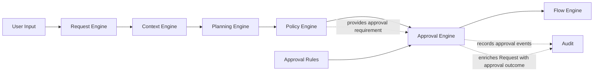
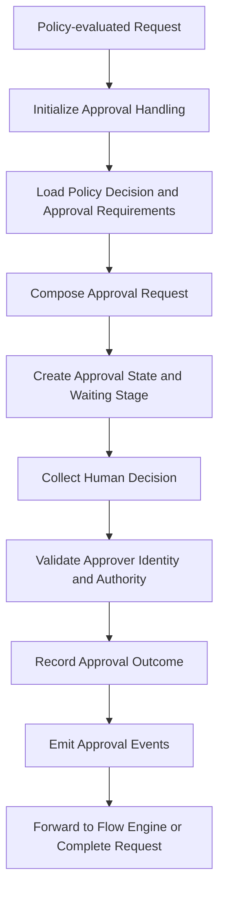
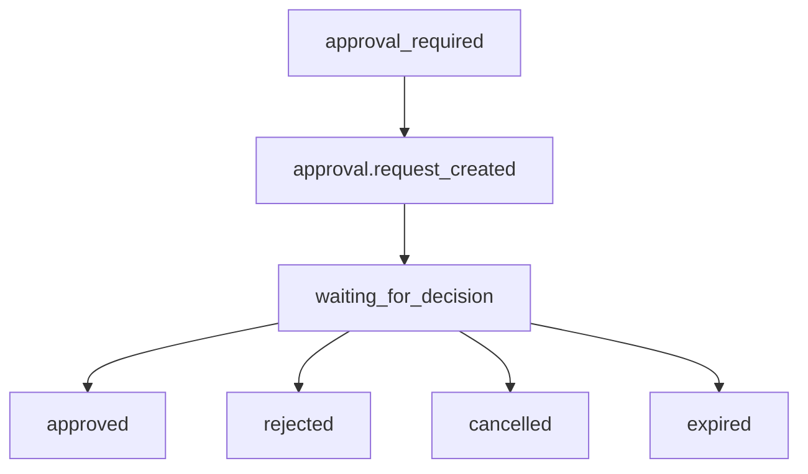

# Approval Engine

> **STATIS Intelligence Layer (SIL)**  
> **Approval Engine**

**Document:** `14_Approval_Engine.md`  
**Version:** 0.1 (Draft)  
**Status:** Core Architecture  
**Owner:** SIL Core  
**Audience:** Software architects, backend developers, plugin developers, AI engineers, future contributors

## Table of contents

- [Purpose](#purpose)
- [Responsibilities and boundaries](#responsibilities-and-boundaries)
- [Processing model](#processing-model)
- [Approval definition](#approval-definition)
- [Behavioural rules](#behavioural-rules)
- [Examples](#examples)
- [Architecture decisions](#architecture-decisions)
- [Future evolution and related documents](#future-evolution-and-related-documents)

## Purpose

The Approval Engine is the fifth engine in the SIL processing pipeline.

Its role is to manage explicit human authorization when the Policy Engine determines that a planned Request may continue only after Approval.

If the Request Engine answers the question *what is the user asking for*, the Context Engine answers the question *under which surrounding conditions should SIL interpret and plan that Request*, the Planning Engine answers the question *which Flow should fulfill that Request and with which explicit planning inputs*, and the Policy Engine answers the question *whether SIL may continue with that planned Request under explicit organizational control*, the Approval Engine answers the question *whether the required human authority has been explicitly granted for that planned and policy-evaluated Request*.

This makes the Approval Engine the architectural boundary between governance decision and governed continuation.

SIL is built on the principle that human authority is preserved. High-impact or sensitive operations must not continue because an AI model was confident, because a Flow exists, or because the request appears reasonable. They may continue only when the organizational policy allows them to continue, and when the required human decision has actually been made by an authenticated and authorized approver. Approval exists to make that transition explicit, visible and auditable before any business operation begins.

An approval requirement does **not** imply an asynchronous workflow or a separate approver.

Architecturally, Approval represents a requirement for an explicit authorized human decision before execution may continue. Depending on organizational policy, that decision may be resolved immediately by the requesting user, immediately by another authorized participant, or through an external approval workflow.

The Approval Engine is therefore responsible for resolving approval requirements rather than creating waiting states. Waiting is one possible resolution model, not the architectural definition of Approval.

The Approval Engine exists to answer a small set of architectural questions:

- Which Request requires human Approval because Policy said so?
- What exactly must an approver be shown in order to make an informed decision?
- Which human decision states are valid for this Request?
- Whether the acting approver is authenticated and authorized to approve this Request at this stage.
- How the approval outcome becomes part of the Request in a deterministic and auditable form.
- When the Request may continue toward execution, and when it must terminate instead.

These questions are essential because governance is incomplete if policy can require approval but the platform has no explicit architectural owner for collecting and validating that approval.

The Flow Engine must not begin execution and discover only afterward that an approval was still pending. The Policy Engine must not carry the additional responsibility of waiting for humans, validating approver identity and recording approval outcomes. Applications should continue enforcing their own business permissions, but SIL must own the human authorization stage for its own orchestration lifecycle. Approval therefore belongs after policy and before execution.

The Approval Engine does **not** reinterpret free-form language. That belongs to the [Request Engine](10_Request_Engine.md).

It does **not** collect missing execution facts such as user, roles, workspace or environment. That belongs to the [Context Engine](11_Context_Engine.md).

It does **not** select a Flow or compose an Execution Plan. That belongs to the [Planning Engine](12_Planning_Engine.md).

It does **not** decide whether approval is required. That belongs to the [Policy Engine](13_Policy_Engine.md).

It does **not** execute capabilities, resolve Tools or communicate with Applications. That belongs to the [Flow Engine](15_Flow_Engine.md).

A useful way to state the architectural intent is this:

> The Request Engine produces a Request.  
> The Context Engine produces explicit Execution Context for that Request.  
> The Planning Engine produces an explicit Execution Plan for that Request.  
> The Policy Engine produces an explicit policy decision for that Request.  
> The Approval Engine produces an explicit approval outcome for that Request when approval is required.  
> It does not produce policy and it does not produce execution.

## Responsibilities and Boundaries

The Approval Engine is responsible for the controlled management of human authorization for a policy-evaluated Request.

At a high level, it performs five architectural responsibilities.

First, it materializes an approval requirement into one explicit approval lifecycle. Policy can determine that approval is required, but Policy alone does not create waiting states, decision collection, approver validation or approval history. The Approval Engine is the component that turns the policy outcome into an operationally usable approval process attached to the Request.

Second, it presents the Request in approval-relevant business terms. An approver should be able to understand what is being authorized, by whom it was requested, which Flow would execute, in which application or environment it would operate, and why approval is required. The Approval Engine therefore owns the transformation from internal Request state into approval-facing information. This belongs here because approval quality depends on decision clarity, not only on policy correctness.

Third, it validates approver authority. SIL cannot accept a human click, message reply or API response as valid approval unless the approver is authenticated and authorized for the relevant approval stage. Human authority must be explicit, not implied.

Fourth, it records one authoritative approval outcome. Whether the decision is approved, rejected, cancelled or expired, SIL needs one explicit answer that downstream processing can consume deterministically. The Approval Engine exists to produce that answer in a form that later engines do not need to reinterpret.

Fifth, it enriches the Request with auditable approval state. Existing SIL documents consistently treat the Request as the central business object that evolves through explicit lifecycle stages. Approval therefore becomes part of the same Request rather than a detached external workflow artifact. This preserves continuity for audit, explanation and execution control.

These responsibilities are intentionally narrow.

The Approval Engine is **not** responsible for deciding whether approval is required. That distinction remains one of the most important boundaries in SIL. Policy answers *whether* approval is necessary. Approval answers *whether the required human decision was actually provided*. Collapsing these two concerns would make policy less explainable and approval less deterministic.

It is **not** responsible for re-evaluating policy. Once the Policy Engine has determined that a Request is `approval_required`, the Approval Engine should not second-guess the policy basis, weaken it or broaden it. It consumes the policy outcome. It does not replace it.

It is **not** responsible for changing the Execution Plan. Approval concerns whether the planned operation may continue, not how that operation should be re-planned. The selected Flow, resolved parameters and plan structure remain the same plan that Policy evaluated. Approval governs continuation of that plan. It does not rewrite it.

It is **not** responsible for execution. The Approval Engine must not invoke Capabilities, choose Tools, call Agents or contact Applications for business operations. SIL explicitly forbids layers from skipping adjacent layers, and approval is part of governance rather than execution.

It is **not** responsible for defining organizational governance from scratch. Plugins may contribute Approval Rules, and organizations may impose approval requirements or approver scopes, but the Approval Engine remains the runtime owner of approval collection rather than the source of policy meaning. Governance still begins upstream.

The boundary can be summarized like this:



### What enters the Approval Engine

The Approval Engine consumes more than the policy decision alone.

Its architectural inputs typically include:

| Input | Why it matters |
|---|---|
| Policy-evaluated Request from the Policy Engine | Preserves one continuous Request lifecycle and the explicit `approval_required` decision |
| Explicit Execution Context | Provides identity, roles, workspace, environment and other facts required for approval presentation and approver validation |
| Execution Plan | Provides the selected Flow, application scope and resolved parameters that the approver is being asked to authorize |
| Policy decision details | Explain why approval is required and which rule or source made that determination |
| Applicable Approval Rules | Define approval stages, approver scopes or related approval lifecycle requirements where such rules exist |
| Existing Request lifecycle state | Keeps approval part of one continuous Request history |

This input model reflects a core SIL principle: an approver should decide over explicit facts, not over hidden assumptions. Approval should never need to rediscover what the Request means, which Flow was selected or why the operation is considered sensitive. Those facts should already be explicit by the time approval begins.

### What leaves the Approval Engine

The output of the Approval Engine is the same Request, enriched with explicit approval state.

An approval-evaluated Request should be:

- still identifiable as the same Request,
- explicit about the approval requirement it satisfied or failed to satisfy,
- explicit about the decision state and who made it,
- explicit about approval stages when multiple approvals are required,
- explicit about rejection, cancellation or expiration when continuation is no longer allowed,
- ready for Flow execution only when the required approval state is complete.

This mirrors the same architectural honesty required by the previous engines. The Request Engine expresses what is known and not known about user intent. The Context Engine expresses what is known and not known about execution conditions. The Planning Engine expresses what is known and not known about orchestration. The Policy Engine expresses what is known and not known about authorization. The Approval Engine expresses what is known and not known about human authorization.

The Approval Engine does not transform the Request into a different business object.

This point matters. Approval is not a side workflow detached from orchestration. It is part of the Request lifecycle. The Request that eventually reaches the Flow Engine is the same Request that entered SIL, but now enriched with explicit approval outcome in addition to Request, Context, plan and policy state.

### Why the Approval Engine exists as a separate engine

The separation of the Approval Engine from neighbouring components is not accidental. It protects the architecture.

If approval collection were collapsed into the Policy Engine, the same component would both determine that human authorization is required and manage the resulting human interaction. That would blur the line between deterministic policy evaluation and long-lived human waiting states. SIL keeps those concerns separate so that policy remains a governance decision and approval remains a human authorization lifecycle.

If approval were moved into the Flow Engine, SIL would begin execution-oriented processing before governance was complete. Approval is not an execution step. It is a gate before execution may begin. For the same reason, Approval does not appear as a Flow step in the [Flow DSL](16_Flow_DSL.md). Flows describe execution once execution is allowed. Approval determines whether execution may begin at all.

If approval were delegated entirely to applications, SIL would lose a common orchestration boundary for human authorization. Applications should continue enforcing their own domain approvals where necessary, but SIL must remain responsible for approvals required by SIL orchestration policy over Flows, environments and cross-application operations.

If approval were delegated to AI, SIL would violate one of its own most important principles. AI may explain, summarize and assist. AI does not approve.

## Processing Model

The Approval Engine follows a staged processing model.

This is not an implementation algorithm. It is the conceptual architecture every implementation should preserve.



Each stage enriches the same Request object.

This is consistent with the SIL execution model in which the Request remains the central business object while its knowledge grows through explicit lifecycle events. Approval is therefore not an external side-effect and not a hidden workflow running beside SIL. It is an explicit lifecycle phase of the same Request.

### Initialization

The Approval Engine begins with a Request that has already passed Request formation, context enrichment, planning and policy evaluation.

At this point the Request should already contain original input, normalized input, intent, entities, parameters, explicit Execution Context, explicit Execution Plan and explicit policy state. The Approval Engine does not rebuild any of those parts. It begins from them.

This sequencing matters.

Approval is meaningful only after SIL knows what would be executed and why organizational policy requires human authorization for it. Before that point, approval would be asking a human to authorize an incomplete or poorly explained operation.

### Approval requirement assembly

The first approval stage is assembly of the approval-relevant facts that already exist in Request state.

These typically include:

- the policy decision,
- the policy reason,
- the selected Flow,
- the application scope,
- the environment,
- the initiating user,
- the Request identity,
- approval stages or scopes where applicable.

The architectural rule is simple: if a fact influences the approver’s decision or SIL’s validation of that decision, that fact should already be explicit enough for the Approval Engine to consume it deterministically.

This stage preserves an important separation.

The Approval Engine may gather approval-relevant facts from the Request, policy state and applicable Approval Rules, but it does not reinterpret the user’s intent, repair missing Context or redesign the Execution Plan. It assembles approval inputs. It does not restart earlier engines.

### Approval request composition

After approval-relevant facts are assembled, the Approval Engine composes one business-facing approval request.

The purpose of this stage is to translate execution-oriented internal structure into an approval-friendly view without losing architectural truth. The approver should see the operation in business language:

- who requested it,
- what would happen,
- where it would happen,
- why approval is required,
- what the expected impact is.

The approver should not need to inspect Tool names, registry internals or low-level protocol details. SIL is a business-facing orchestration platform, and approval presentation must respect that design principle.

### Approval stage creation

Once the approval request has been composed, the Approval Engine creates explicit approval state for the Request.

This may be as simple as one waiting approval or as structured as multiple explicit approval stages. SIL already allows for the possibility that some organizations require more than one approval, such as a four-eyes principle or separate technical and business approvals. The Approval Engine is responsible for representing these stages explicitly rather than hiding them inside informal implementation logic.

A useful way to visualize the lifecycle is this:



This lifecycle is intentionally explicit. Silence is not approval. Absence of an approver is not approval. A missing callback is not approval. Approval must become a concrete state transition.

### Decision collection and validation

When a human decision is submitted, the Approval Engine validates more than the decision value itself.

It must validate:

- the identity of the approver,
- the authentication state of that approver,
- the authorization of that approver for the relevant approval stage,
- the current state of the Request,
- whether the approval request is still active and not expired or already completed.

This validation belongs here because human authorization is meaningful only when it comes from the right human under the right conditions. A technically well-formed decision from an unauthorized actor is not approval.

### Outcome handling

Once the decision has been validated, the Approval Engine records one authoritative approval outcome.

If the outcome is `approved`, the Request may continue toward execution only when all required approval stages have been satisfied.

If the outcome is `rejected`, the Request terminates as a rejected approval outcome rather than silently returning to policy or planning.

If the outcome is `cancelled`, the Request terminates as voluntarily abandoned.

If the outcome is `expired`, the Request terminates because the required human decision was not obtained in time.

This behaviour is important because approval is not advisory. It is a control point. Downstream components should not have to infer what rejection or expiration means. The Approval Engine should make that meaning explicit.

### Event emission and forwarding

Like the previous engines, the Approval Engine should emit meaningful lifecycle events.

Illustrative events may include:

- `approval.required`
- `approval.request_created`
- `approval.waiting`
- `approval.decision_received`
- `approval.validated`
- `approval.approved`
- `approval.rejected`
- `approval.cancelled`
- `approval.expired`
- `request.forwarded_to_flow`

These names are illustrative rather than normative. What matters architecturally is that approval becomes a visible part of Request history and that downstream execution begins only when the approval lifecycle has reached a valid continuation state.

## Approval Definition

The Approval Engine is responsible for attaching an explicit approval model to the Request.

The exact code representation may vary by implementation language, but the logical model should remain stable.

An approval-enabled Request should be able to express at least the following conceptual structure:

```yaml
approval:
  required:
  status:
  reason:
  requested_at:
  requested_by:
  stages:
  current_stage:
  final_decision:
  decided_by:
  decided_at:
  comments:
  expires_at:
  events:
```

This is a conceptual model, not a schema contract. The purpose is to define what approval state must be able to express.

### Core approval fields

The following fields should exist in some form whenever approval is required.

| Field | Purpose |
|---|---|
| `required` | Whether the Request requires Approval |
| `status` | Current approval lifecycle state |
| `reason` | Why approval is required |
| `requested_at` | Time at which approval lifecycle began |
| `requested_by` | Initiating user or principal of the Request |
| `stages` | One or more explicit approval stages |
| `current_stage` | The stage currently waiting for decision |
| `final_decision` | Authoritative terminal outcome when complete |
| `decided_by` | Final decision actor where applicable |
| `decided_at` | Time of terminal decision where applicable |
| `comments` | Human explanation supplied during decision where relevant |
| `expires_at` | Expiration time if approval may time out |
| `events` | Approval lifecycle history |

These fields preserve a crucial architectural property: approval is explicit both as current state and as historical record.

### Approval states

Approval must remain explicit about its lifecycle state.

A Request that requires Approval should typically move through states such as:

- `required`
- `waiting`
- `approved`
- `rejected`
- `cancelled`
- `expired`

The names may vary by implementation, but the structural meaning should remain stable. Downstream engines should never need to inspect loosely structured comments or user-facing messages to determine whether approval is complete. There should be a clear approval state.

A minimal example looks like this:

```yaml
approval:
  required: true
  status: waiting
  reason: production_execution
  requested_at: "2026-07-01T08:55:00Z"
  requested_by: "goran.gruic"
  current_stage: technical_approval
```

### Approval stages and multiple approvals

SIL should be able to express one approval or several approvals without changing the architectural model.

Some organizations may require only one approver.

Others may require multiple explicit stages, for example:

- technical approval,
- business approval,
- four-eyes confirmation.

The Approval Engine supports this by treating stages as explicit approval structure rather than informal implementation detail.

Example:

```yaml
approval:
  required: true
  status: waiting
  reason: production_execution
  stages:
    - id: technical_approval
      status: approved
      decided_by: "ana.kovac"
      decided_at: "2026-07-01T09:15:42Z"

    - id: business_approval
      status: waiting
  current_stage: business_approval
```

This expression is important because it keeps the approval lifecycle deterministic. SIL should know exactly which stage is pending, which stages were completed and whether execution may continue.

### Approver identity and authorization

Approval is valid only when the platform can bind the decision to an explicit and authorized human actor.

The Approval Engine should therefore preserve approver identity in a way that can support:

- audit,
- explanation,
- authorization validation,
- organizational accountability.

Example:

```yaml
approval:
  final_decision: approved
  decided_by:
    user_id: "u-1042"
    username: "ana.kovac"
    roles:
      - platform.approver
      - pipeline.production.approver
  decided_at: "2026-07-01T09:15:42Z"
```

This does not change the principle that Applications continue enforcing their own domain permissions. It simply ensures that SIL can prove who approved the orchestration step that SIL was responsible for controlling.

### Business-facing approval content

The Approval Engine is also responsible for presenting approval information in terms an approver can actually use.

An approval request should be able to express at least:

- Request identity,
- requesting user,
- selected Flow,
- target application,
- target environment,
- reason approval is required,
- expected impact.

A business-facing example might look like this:

```yaml
approval_request:
  request_id: "req-2026-07-01-00041"
  requested_by: "Goran Gruic"
  operation: "Run Pipeline job"
  application: "Pipeline"
  environment: "PROD"
  flow: "pipeline.job.run_and_summarize"
  reason: "Production execution requires approval"
  impact: "A production statistical job will be executed and summarized for the user"
```

This is not merely a user experience preference. It is part of architecture. Human approval is only reliable when the human can understand what is being authorized.

### Approval outcome and Request continuity

Approval does not replace earlier Request state. It enriches it.

A Request that reaches the Flow Engine after approval should still contain:

- original input,
- normalized input,
- intent,
- entities,
- parameters,
- Execution Context,
- Execution Plan,
- policy decision,
- approval outcome.

This continuity is one of the reasons SIL remains explainable. A downstream engine or auditor should not have to reconstruct which plan was approved or why. The Request should already contain that full chain.

## Approval Resolution Models

| Resolution Model | Description | Typical Scenario |
|---|---|---|
| Inline Self-Approval | Requester is also authorized to approve. | OpenWebUI, developer tools |
| Inline Delegated Approval | Another authorized participant approves during the same interaction. | Shared operational sessions |
| External Approval Workflow | Approval is resolved outside the current interaction. | Production, four-eyes |

These are different resolution models of the same architectural concept.

## Behavioural Rules

### Start approval only from explicit policy requirement

The Approval Engine should begin approval handling only when the Request carries an explicit policy outcome requiring Approval.

This rule matters because approval must be a consequence of governance, not an improvised safety mechanism inserted ad hoc by downstream components or user interfaces.

### Prefer immediate resolution when policy allows

If Policy allows approval to be resolved by an authenticated and authorized actor already participating in the interaction, the Approval Engine should resolve it inline instead of creating an unnecessary waiting state.

Waiting is a consequence of the selected resolution model, not the purpose of the Approval Engine.

### Never decide whether approval is required

The Approval Engine must never upgrade or downgrade a Request from `allow` to `approval_required`, from `approval_required` to `allow`, or from `deny` to `approval_required`.

That responsibility belongs to Policy. Approval is downstream of that decision.

### Preserve human authority

Approval decisions must be made by humans.

AI may explain the Request, summarize impact or help present contextual information, but AI must never supply the authoritative approval decision on behalf of a human. This boundary is one of the strongest constitutional rules in SIL.

### Require explicit authenticated decisions

Approval must always be explicit.

A timeout is not approval.

Lack of rejection is not approval.

A guessed approver identity is not approval.

Only an explicit decision from an authenticated and authorized approver should move the Request into an approved state.

### Validate authorization at decision time

The Approval Engine should validate approver authorization when the decision is made, not merely when the approval request is created.

This preserves architectural correctness in situations where authorization scope may have changed between request creation and the eventual human response.

### Present approval in business language

Approval requests should be understandable without deep technical knowledge.

Approvers should not need to inspect registry metadata, Tool internals or transport protocols to understand what they are authorizing. Approval belongs to governance, and governance must remain intelligible.

### Never modify the Execution Plan

Approval should not rewrite the selected Flow, remove steps, alter parameters or silently degrade the planned operation to something easier to approve.

The plan remains the plan. Approval determines whether that plan may continue.

### Treat rejection, cancellation and expiration as explicit terminal outcomes

The Approval Engine should not treat non-approval outcomes as temporary noise.

A rejected Request is explicitly rejected.

A cancelled Request is explicitly cancelled.

An expired Request is explicitly expired.

These are valid architectural outcomes and should become part of Request history in a way that downstream components do not need to reinterpret.

### Remain deterministic

Under the same Request state, the same approval rules and the same human decisions, the Approval Engine should produce the same approval history and the same continuation outcome.

Human choice is inherently variable. The engine’s handling of that choice must not be.

### Emit auditable approval history

Every important approval event should become part of the Request and the audit trail.

SIL should be able to explain:

- why approval was required,
- when approval was requested,
- who approved or rejected,
- when the decision was made,
- which stage was active,
- why the Request continued or stopped.

### Stop before execution

The Approval Engine ends at approval outcome.

It does not begin Flow execution itself. Once approval is complete, the Request may be forwarded toward the Flow Engine. This preserves the separation between governance and execution.

## Examples

### Example of a Request waiting for production approval

The following example shows a policy-evaluated Request that now requires one explicit human approval before execution may continue.

```yaml
request:
  id: req-2026-07-01-00041
  intent: run_job
  entities:
    - type: job
      value: "FA validation"
  parameters:
    environment: PROD

  execution_context:
    user: goran.gruic
    roles:
      - pipeline.operator
    workspace: "Regulatory Reporting"
    application: pipeline

  execution_plan:
    flow: pipeline.job.run_and_summarize
    application: pipeline
    parameters:
      job: "FA validation"
      environment: PROD

  policy:
    decision: approval_required
    reason: production_execution
    source: organization.production.policy

  approval:
    required: true
    status: waiting
    reason: production_execution
    requested_at: "2026-07-01T08:55:00Z"
    requested_by: "goran.gruic"
    stages:
      - id: production_approval
        status: waiting
    current_stage: production_approval
```

This example illustrates a core SIL pattern. The Request remains one continuous object. Approval state appears beside Context, plan and policy rather than replacing them.

### Example of an approved Request ready for Flow execution

The following example shows the same Request after approval has been granted.

```yaml
request:
  id: req-2026-07-01-00041

  policy:
    decision: approval_required
    reason: production_execution

  approval:
    required: true
    status: approved
    reason: production_execution
    requested_at: "2026-07-01T08:55:00Z"
    requested_by: "goran.gruic"
    final_decision: approved
    decided_by:
      username: "ana.kovac"
      roles:
        - platform.approver
        - pipeline.production.approver
    decided_at: "2026-07-01T09:15:42Z"
    stages:
      - id: production_approval
        status: approved
        decided_by: "ana.kovac"
        decided_at: "2026-07-01T09:15:42Z"
        comment: "Approved for scheduled monthly production execution."
```

At this point the Request is still the same Request. It has simply crossed one more explicit governance stage.

### Example of rejection terminating the Request

The following example shows a rejection outcome.

```yaml
request:
  id: req-2026-07-01-00057

  policy:
    decision: approval_required
    reason: production_execution

  approval:
    required: true
    status: rejected
    final_decision: rejected
    decided_by:
      username: "ivana.horvat"
    decided_at: "2026-07-01T10:04:18Z"
    comments:
      - "Production run is not approved during an active incident window."

  status: completed
  outcome: rejected
```

The important point is that rejected approval is not an ambiguous failure. It is a valid terminal outcome of the Request lifecycle.

### Example of expiration

The following example shows an approval that timed out before a valid decision was received.

```yaml
request:
  id: req-2026-07-01-00062

  policy:
    decision: approval_required
    reason: release_promotion

  approval:
    required: true
    status: expired
    requested_at: "2026-07-01T11:00:00Z"
    expires_at: "2026-07-01T13:00:00Z"
    final_decision: expired

  status: completed
  outcome: expired
```

Expiration is explicit because execution relevance and organizational control can change over time. A stale approval should not silently authorize a later operation.

### Example of multiple approval stages

The following example shows a Request that requires two explicit approvals.

```yaml
request:
  id: req-2026-07-01-00070

  policy:
    decision: approval_required
    reason: production_release

  approval:
    required: true
    status: waiting
    stages:
      - id: technical_approval
        status: approved
        decided_by: "marko.juric"
        decided_at: "2026-07-01T12:10:00Z"

      - id: business_approval
        status: waiting
    current_stage: business_approval
```

This example clarifies why approval stages belong in the Approval Engine rather than remaining hidden inside policy detail or user interface logic. The platform must be able to state precisely which approval has happened and which one is still pending.

### Example of approver-facing approval text

Approval information should be understandable as a business decision.

```text
Approve execution?

Operation:
Run Pipeline job in production

Requested by:
Goran Gruic

Application:
Pipeline

Flow:
pipeline.job.run_and_summarize

Environment:
PROD

Reason:
Production execution requires explicit approval.

Impact:
A production statistical job will be executed and the result will be summarized for the requesting user.

Approve?
```

This example is intentionally simple. The architectural point is not the exact wording. The point is that SIL should present approval in terms the approver can responsibly judge.

### Example of inline self-approval

```yaml
policy:
  decision: approval_required

approval:
  required: true
  resolution_model: inline_self
  approver: current_user
  status: approved
```

In this example the requesting user is also authorized to approve the operation, so the Request continues immediately without entering a waiting state.

## Architecture Decisions

### AD-1401

The Approval Engine manages approval lifecycle but never decides when approval is required.

That decision belongs to the Policy Engine.

### AD-1402

Approval decisions must be explicit, authenticated and authorized.

Human silence, missing callbacks or unauthenticated interaction are never treated as Approval.

### AD-1403

Approval state becomes part of the Request.

SIL preserves one continuous Request lifecycle rather than creating detached approval workflow artifacts.

### AD-1404

The Approval Engine never modifies the Execution Plan.

Approval governs continuation of the selected plan. It does not redesign that plan.

### AD-1405

Rejected, cancelled and expired approval outcomes terminate the Request.

These are explicit lifecycle outcomes rather than incidental errors.

### AD-1406

Multiple approvals are represented as explicit approval stages.

The platform must be able to express and audit stage-by-stage human authorization when required.

### AD-1407

Approval is not part of Flow execution.

Approval occurs before the Flow Engine begins and is therefore not modeled as a Flow step.

### AD-1408

Approval requests should be presented in business language.

Approvers must be able to understand operational impact without inspecting technical implementation details.

### AD-1409

Approval defines an authorization requirement rather than an asynchronous workflow.

Resolution may occur through inline self-approval, inline delegated approval or an external approval workflow. The architectural responsibility is explicit authorized human decision, not waiting.

## Future Evolution and Related Documents

The following topics are likely to evolve in later SIL documents or implementation work:

- approval notification channels,
- delegated approvals,
- reminder behaviour,
- approval expiration policies,
- approval user interface patterns,
- integration with external organizational workflow systems,
- richer approval stage metadata,
- approval analytics and reporting.

These topics do not change the architectural role of the Approval Engine. They refine how approval is delivered operationally, not why Approval exists or where its responsibility belongs.

### Related documents

- [00_Principles](00_Principles.md)
- [01_Vision](01_Vision.md)
- [02_Architecture](02_Architecture.md)
- [03_Core_Concepts](03_Core_Concepts.md)
- [10_Request_Engine](10_Request_Engine.md)
- [11_Context_Engine](11_Context_Engine.md)
- [12_Planning_Engine](12_Planning_Engine.md)
- [13_Policy_Engine](13_Policy_Engine.md)
- [15_Flow_Engine](15_Flow_Engine.md)
- [16_Flow_DSL](16_Flow_DSL.md)

Approval is most easily understood as part of the broader SIL processing chain.

The Request Engine establishes the Request.

The Context Engine makes execution conditions explicit.

The Planning Engine selects the orchestration path.

The Policy Engine determines whether the planned Request may continue and whether Approval is required.

The Approval Engine manages the resulting human authorization lifecycle.

The Flow Engine begins only after that lifecycle has produced a valid continuation outcome.

That sequence is not merely procedural.

It is one of the ways SIL turns natural-language interaction into governed enterprise execution without giving up determinism, human authority or auditability.