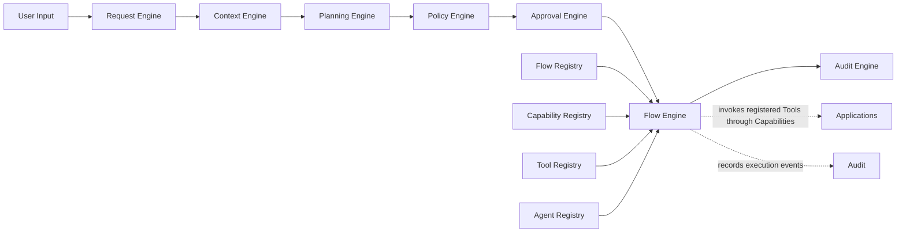
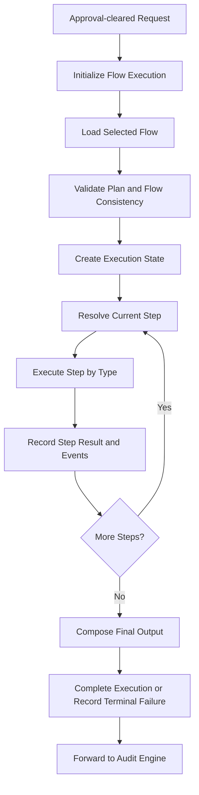
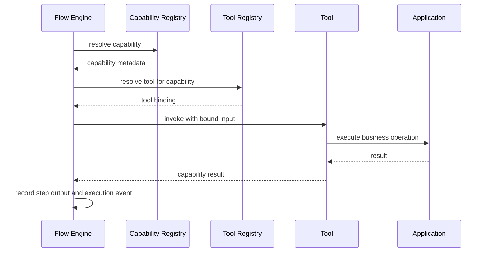
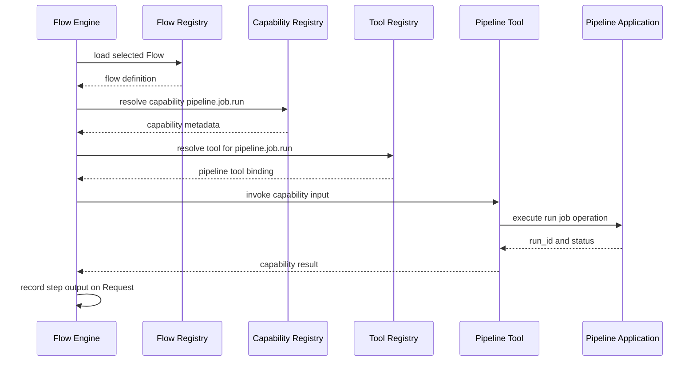
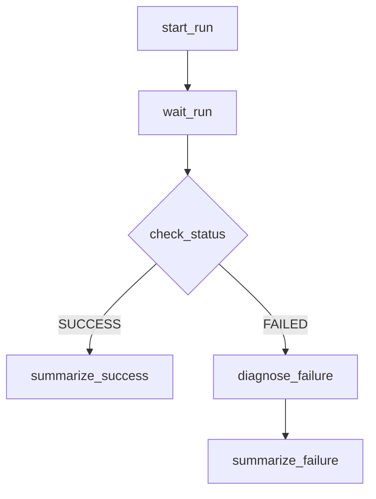

# Flow Engine

> **STATIS Intelligence Layer (SIL)**  
> **Flow Engine**

**Document:** `15_Flow_Engine.md`  
**Version:** 0.1 (Draft)  
**Status:** Core Architecture  
**Owner:** SIL Core  
**Audience:** Software architects, backend developers, plugin developers, AI engineers, future contributors

## Table of contents

- [Purpose](#purpose)
- [Responsibilities and Boundaries](#responsibilities-and-boundaries)
- [Processing Model](#processing-model)
- [Flow Execution Definition](#flow-execution-definition)
- [Behavioural Rules](#behavioural-rules)
- [Examples](#examples)
- [Architecture Decisions](#architecture-decisions)
- [Future Evolution and Related Documents](#future-evolution-and-related-documents)

## Purpose

The Flow Engine is the sixth engine in the SIL processing pipeline.

Its role is to execute a policy-cleared and approval-cleared **Execution Plan** by loading the selected **Flow** and orchestrating its declared steps through registered **Capabilities**.

If the Request Engine answers the question *what is the user asking for*, the Context Engine answers the question *under which surrounding conditions should SIL interpret and plan that Request*, the Planning Engine answers the question *which Flow should fulfill that Request and with which explicit planning inputs*, the Policy Engine answers the question *whether SIL may continue with that planned Request under explicit organizational control*, and the Approval Engine answers the question *whether the required human authority has been explicitly granted*, the Flow Engine answers the question *how that approved plan is actually executed in a deterministic, auditable and architecturally controlled way*.

This makes the Flow Engine the architectural boundary between governed continuation and actual orchestration.

That boundary matters.

Upstream engines progressively remove ambiguity, make context explicit, select the orchestration path and determine whether execution is allowed. None of those engines perform the business operation itself. A governed platform still needs one explicit architectural component whose responsibility is to take the approved orchestration contract and execute it without bypassing the layered SIL model.

The Flow Engine exists to answer a small set of architectural questions.

- Which Flow definition is actually executed for this Request?
- In which order are Flow steps executed?
- How are step inputs resolved from the Request, the Execution Context, the Execution Plan and previous step outputs?
- Which Capability is invoked at each execution step, and how is that Capability resolved to a Tool at runtime?
- How do step results, intermediate outputs and terminal outcomes become explicit Request state?
- How is final execution output composed in a way that remains explainable and auditable?

These questions are essential because deterministic planning is still not deterministic execution.

A selected Flow is a declarative orchestration model. An Execution Plan is an execution contract. Neither of them actually performs work. The platform still needs a controlled runtime owner for executing that contract, recording what happened and preserving layer boundaries while business operations are performed through applications.

The Flow Engine therefore exists because SIL does not allow execution to be implicit.

Execution must not happen because an AI model “understood” the request.

Execution must not happen because a UI button called an application directly.

Execution must not happen because a Flow exists in a registry.

Execution happens only when the Request has passed through Request, Context, Planning, Policy and Approval, and when the Flow Engine executes the approved plan through the declared runtime path:

```text
Flow → Capability → Tool → Application
```

The Flow Engine does **not** reinterpret free-form language. That belongs to the [Request Engine](10_Request_Engine.md).

It does **not** collect missing runtime facts such as user, roles, workspace or environment. That belongs to the [Context Engine](11_Context_Engine.md).

It does **not** select a Flow or change the Execution Plan. That belongs to the [Planning Engine](12_Planning_Engine.md).

It does **not** decide whether execution is allowed, denied or subject to Approval. That belongs to the [Policy Engine](13_Policy_Engine.md).

It does **not** collect human authorization. That belongs to the [Approval Engine](14_Approval_Engine.md).

It does **not** own business logic. Business logic remains inside Applications, exactly as required by the SIL principles.

A useful way to state the architectural intent is this:

> The Request Engine produces a Request.  
> The Context Engine produces explicit Execution Context for that Request.  
> The Planning Engine produces an explicit Execution Plan for that Request.  
> The Policy Engine produces an explicit policy decision for that Request.  
> The Approval Engine produces an explicit approval outcome for that Request when approval is required.  
> The Flow Engine executes the approved plan for that Request through the selected Flow.  
> It does not produce business logic and it does not produce policy.

## Responsibilities and Boundaries

The Flow Engine is responsible for the controlled execution of an approved Request through a selected Flow.

At a high level, it performs five architectural responsibilities.

First, it materializes the selected Flow as runtime orchestration for one specific Request. Planning selects the Flow. The Flow Engine is the component that loads that Flow and turns its declarative definition into actual execution behaviour. This belongs here because the Flow Engine is the runtime owner of orchestration, not the owner of matching or selection.

Second, it executes Flow steps deterministically according to the Flow Definition Model described in the [Flow DSL](16_Flow_DSL.md). SIL already establishes that MVP Flows are declarative and that MVP step types are limited to `capability`, `wait`, `condition` and `agent`. The Flow Engine is therefore responsible for interpreting those step declarations as controlled execution behaviour rather than allowing arbitrary code or hidden runtime logic.

Third, it resolves declared Capabilities to executable Tools at runtime and invokes them without exposing Tool details to the Flow itself. This separation is one of the central SIL principles. Flows orchestrate Capabilities. Tools implement Capabilities. Applications own business logic. The Flow Engine sits at the point where that layered transition becomes real during execution.

Fourth, it records explicit execution state on the Request. SIL is request-first and audit-first. The Flow Engine therefore does not execute work and discard runtime knowledge. It enriches the same Request with step history, intermediate outputs, terminal status and final execution output so that later components and human operators do not need to infer what happened.

Fifth, it produces one authoritative execution outcome. A Request that has entered the Flow Engine should leave with an explicit execution result: completed, failed or cancelled. Downstream components must not need to reconstruct the meaning of runtime events by reading logs in an ad hoc way. The Flow Engine should make execution outcome explicit.

These responsibilities are intentionally strict.

The Flow Engine is **not** responsible for selecting a Flow. It consumes the selected Flow from the Execution Plan. This distinction is one of the most important boundaries in SIL. Planning answers *which orchestration path should be used*. The Flow Engine answers *how that selected orchestration path is executed*.

It is **not** responsible for re-evaluating Policy or Approval. Once the Request reaches the Flow Engine, governance has already determined whether execution may continue. The Flow Engine must not decide that a denied Request should now execute, that an approved Request should now require another approval, or that human authorization should be reinterpreted. It consumes governance outcome. It does not replace it.

It is **not** responsible for inventing missing business input. If a required step input cannot be resolved from explicit Request state, the Execution Context, the Execution Plan, Flow defaults or previous step outputs, the correct behaviour is explicit execution failure or earlier prevention by upstream stages. The Flow Engine must not silently improvise business data.

It is **not** responsible for business logic. A Flow step may invoke `pipeline.job.run`, `sudreg.company.read` or `catalogue.dataset.search`, but the meaning, validation and side effects of those operations remain inside the Application reached through the Tool. The Flow Engine coordinates orchestration. It does not become a hidden application layer.

It is **not** responsible for full audit persistence strategy. The Flow Engine must emit execution events and attach execution state to the Request, but the dedicated audit lifecycle still belongs to the Audit Engine and the broader SIL audit model. The Flow Engine contributes auditable execution history. It is not itself the entire audit subsystem.

The boundary can be summarized like this:



### What enters the Flow Engine

The Flow Engine consumes more than the Execution Plan alone.

Its architectural inputs typically include:

| Input | Why it matters |
|---|---|
| Approval-cleared Request from the Approval Engine | Preserves one continuous Request lifecycle and confirms that governance is complete |
| Explicit Execution Plan | Provides selected Flow identity, resolved planning inputs and the orchestration contract that execution must honor |
| Flow Definition | Provides declarative steps, required Capabilities, output rules and audit behaviour |
| Capability Registry | Resolves business Capabilities declared by the Flow |
| Tool Registry | Resolves the executable Tool implementation for each Capability |
| Agent or Persona metadata | Resolves `agent` steps for reasoning or summarization |
| Current registry and plugin state | Determines which runtime integrations are actually available |
| Existing Request lifecycle state | Keeps execution part of the same evolving Request history |

This input model reflects a core SIL principle: execution happens from explicit facts, not hidden runtime intuition.

The Flow Engine should not have to guess which Flow was intended.

It should not re-read human language to infer the business objective.

It should not discover at runtime that governance was never completed.

It should start from one explicit Request whose meaning, context, plan and governance state are already known.

A subtle but important distinction exists between planning-time validation and runtime resolution.

The Planning Engine may validate that a Flow’s required Capabilities exist and that a selected Flow is plan-worthy under the current registry state. The Flow Engine still performs runtime resolution because an executable Tool must be bound when a step actually runs. This is not duplication. It is the normal separation between plan formation and plan execution.

### What leaves the Flow Engine

The output of the Flow Engine is the same Request, enriched with explicit execution state.

An execution-complete Request should be:

- still identifiable as the same Request,
- explicit about which Flow was executed,
- explicit about step-by-step execution history,
- explicit about intermediate results or references to them,
- explicit about terminal outcome,
- explicit about final output intended for downstream audit and response handling,
- ready for audit without requiring hidden runtime reconstruction.

This mirrors the same architectural honesty required by the previous engines.

The Request Engine expresses what is known and not known about user intent.

The Context Engine expresses what is known and not known about execution conditions.

The Planning Engine expresses what is known and not known about orchestration.

The Policy Engine expresses what is known and not known about authorization.

The Approval Engine expresses what is known and not known about human authorization.

The Flow Engine expresses what actually happened when the approved plan ran.

The Flow Engine does not transform the Request into a different business object.

This matters for explainability and auditability. The Request that ultimately reaches audit and response is still the same Request that entered SIL. It now contains original input, explicit context, explicit plan, explicit governance outcome and explicit execution history.

### Why the Flow Engine exists as a separate engine

The separation of the Flow Engine from neighbouring components is not accidental. It protects the architecture.

If execution were collapsed into Planning, the component that selects a Flow would also start performing that Flow. The distinction between *choosing orchestration* and *running orchestration* would disappear. Planning would become harder to explain, harder to replay and harder to govern because selection and execution would no longer be separate lifecycle phases.

If execution were delegated entirely to Plugins, SIL would lose a platform-owned orchestration boundary. Plugins are intentionally the integration mechanism between SIL and Applications, but the platform must still own the orchestration lifecycle, step traversal, execution history and Request enrichment. Otherwise each Plugin would become a bespoke execution engine and the platform would lose consistency.

If execution were delegated directly to AI, SIL would violate one of its most important principles. AI may assist understanding and reasoning. AI does not control enterprise execution. An `agent` step may appear inside a Flow, but even there the Flow Engine remains the owner of when and why that agent is invoked, and the agent remains limited to reasoning rather than business operations.

If execution were delegated directly to Applications, the layered model would collapse. Applications should continue owning business logic and domain truth, but they should not own cross-application orchestration, Request lifecycle state or SIL governance semantics. The platform exists precisely to keep orchestration above the application layer.

## Processing Model

The Flow Engine follows a staged processing model.

This is not an implementation algorithm. It is the conceptual architecture every implementation should preserve.



Each stage enriches the same Request object.

This is consistent with the SIL execution model in which the Request remains the central business object while its knowledge grows through explicit lifecycle events. Execution is therefore not an invisible side effect of a Tool call. It is an explicit lifecycle phase of the Request.

### Initialization

The Flow Engine begins with a Request that has already passed Request formation, context enrichment, planning, policy evaluation and approval handling where required.

At this point the Request should already contain original input, normalized input, intent, entities, explicit Execution Context, explicit Execution Plan, policy state and approval state. The Flow Engine does not rebuild those parts. It begins from them.

This sequencing matters.

Execution is meaningful only after SIL knows what would be executed, under which conditions, through which Flow, and whether organizational governance allows it. Before that point, execution would be architecturally unsafe because it would bypass the very control pipeline SIL was designed to provide.

### Flow loading

The first execution stage is loading the selected Flow from the authoritative Flow source.

The Execution Plan should identify the Flow explicitly. The Flow Engine uses that identity to load the corresponding Flow Definition Model. This preserves a crucial property of the architecture: Planning selects a Flow by identity, but the runtime source of truth for how that Flow behaves remains the Flow definition itself.

This stage belongs here rather than in Planning because Planning is not a runtime executor. The fact that a Flow was selected does not mean its step-by-step structure should be embedded ad hoc into the plan. SIL already establishes registries and declarative definitions as sources of truth. The Flow Engine therefore loads and consumes the Flow definition at execution time.

### Plan and Flow consistency validation

After the Flow is loaded, the Flow Engine validates that the Execution Plan and the loaded Flow remain consistent enough for execution to begin.

This includes questions such as:

- does the plan identify the same Flow that was loaded,
- are the required runtime definitions present,
- are the expected Flow steps materially executable,
- are the declared outputs meaningful under the loaded definition.

This is not re-planning.

The Flow Engine is not free to substitute a different Flow because one looks more convenient at runtime. It validates consistency and then executes the selected orchestration path. If the selected Flow cannot be executed as planned, the correct behaviour is explicit failure rather than silent orchestration drift.

### Execution state creation

Once the selected Flow is loaded and validated, the Flow Engine creates explicit execution state on the Request.

This is where the Request becomes execution-bearing rather than merely execution-ready.

Typical execution state includes:

- execution start time,
- current status,
- selected Flow identity and version,
- current step,
- step history,
- accumulated outputs,
- execution events.

This stage matters because deterministic execution is not only about calling the right Tool. It is also about preserving a trustworthy runtime history that can later be audited, explained and resumed where the architecture allows.

### Step traversal

The Flow Engine then traverses the Flow step sequence.

The Flow DSL intentionally keeps step types small and explicit. For MVP, execution is built around four step types:

- `capability`
- `wait`
- `condition`
- `agent`

No other step types are architecturally required for MVP execution. This restriction is deliberate. It prevents hidden procedural behavior and keeps runtime behaviour explainable.

Step traversal must remain deterministic.

Given the same Request state, the same Flow definition, the same step results and the same surrounding runtime conditions, the Flow Engine should take the same next step. This does not mean that external business results are identical in every real-world execution. It means the engine’s orchestration behaviour should not become opaque or improvisational.

### Capability step execution

A `capability` step invokes a registered business Capability.

This is the most direct form of Flow execution and the clearest expression of SIL’s layered execution model. The Flow declares the Capability in business terms. The Flow Engine resolves that Capability through the Capability Registry, binds the required step input from explicit Request data, resolves the Tool through the Tool Registry, invokes the Tool and records the result.

A useful way to visualize the runtime layering is this:



This step belongs in the Flow Engine because execution is where the declarative business operation becomes a runtime call. It does not belong in the Flow definition because Flows remain declarative. It does not belong in Planning because Planning chooses the Flow but does not invoke Capabilities. It does not belong in Applications because applications should not own SIL orchestration order.

A subtle but important distinction exists between a technically failed step and a business result that describes failure.

For example, a `pipeline.run.status` call may successfully return `FAILED` as the domain status of a run. That capability step executed successfully because the runtime call succeeded and returned an explicit result. A later `condition` step may branch based on that result.

By contrast, if the Capability cannot be resolved, the Tool cannot be invoked or the runtime call fails before SIL obtains a meaningful result, the step itself has failed. That is an execution failure rather than a business-status value.

### Wait step execution

A `wait` step waits until a declared condition becomes true.

Architecturally, this is still orchestration rather than business logic. The Flow Engine remains responsible because the waiting behaviour belongs to the runtime control path of the Flow. It is not planning, not approval and not raw application logic.

A wait step typically works by invoking a declared Capability repeatedly or at controlled intervals until the `until` expression becomes true or a timeout is reached. For MVP, wait behaviour should remain simple and declarative. SIL does not require hidden loops, custom scripts or arbitrary retry languages inside the Flow Engine to express this.

This matters because waiting often introduces opacity into orchestration systems. SIL explicitly avoids that. A wait step should remain visible in Request state, visible in execution history and bounded by declared timeout behaviour.

A wait step also illustrates why execution cannot be reduced to a list of one-time Tool calls. Real orchestration often includes long-running external work such as a job execution or asynchronous application process. The Flow Engine owns that runtime lifecycle because it owns the Flow’s progression.

### Condition step execution

A `condition` step applies simple branching over explicit execution facts.

This is not business policy.

It is not user-intent interpretation.

It is orchestration branching inside an already selected Flow.

A condition step evaluates an explicit expression over Request state, Execution Context or previous step outputs and chooses the next declared execution path. This belongs in the Flow Engine because the Flow Engine owns how a selected Flow progresses once execution has started.

This distinction is important.

Policy already answered whether execution may continue at all.

A condition step answers something narrower and runtime-specific, such as:

- did the previous run finish with `SUCCESS`,
- should diagnosis steps execute because a status is `FAILED`,
- should summarization follow one explicit branch or another.

The branch is part of the Flow, not part of governance.

### Agent step execution

An `agent` step invokes an AI Agent or Persona for reasoning, explanation or summarization.

The architectural boundary here must remain explicit.

An agent step does not authorize.

It does not choose the Flow.

It does not execute business operations.

It reasons over explicit information already collected by earlier steps and produces reasoning output declared by the Flow.

This belongs in the Flow Engine because, once a Flow declares an `agent` step, that step is part of the orchestration path just like any other step. The Flow Engine remains the runtime owner of when the agent is invoked, with which bound input, and where the resulting output is recorded.

This also preserves SIL’s most important responsibility separation:

- AI understands and reasons,
- SIL controls and orchestrates,
- Applications execute business logic.

An agent step is therefore valid only when it remains inside the AI part of that separation. It may summarize, compare, explain or narrate. It must not silently become an application executor or a policy engine.

### Output composition

After the required steps complete, the Flow Engine composes final execution output according to the Flow definition.

This belongs here because the Flow output is part of the execution contract. The Flow definition declares what the output should be and from which step or source that output is derived. The Flow Engine therefore resolves the declared output source and attaches the resulting output to the Request.

This should not be confused with late-stage user-interface rendering.

The Flow Engine is responsible for producing the execution output that the Flow declares. How that output is later presented to a specific channel may be refined downstream, but the architectural content of the result belongs to execution.

A useful way to say this is:

Planning chooses the Flow.

The Flow defines the steps.

The Flow Engine runs the steps and composes the output that the Flow says they produce.

### Terminal outcome handling

Once execution reaches a terminal state, the Flow Engine records one authoritative execution outcome.

Typical terminal outcomes include:

- `completed`
- `failed`
- `cancelled`

These states are important because runtime orchestration is not complete until SIL can explicitly say how the Request ended.

A Request does not become “probably complete” because the final Tool call returned something plausible.

A Request becomes complete because the Flow Engine reached a valid terminal state under the declared Flow and recorded that state explicitly.

The same discipline applies to failure.

A failed step must not produce a vague runtime impression that “something went wrong somewhere.” The Flow Engine should record which step failed, why it failed and why downstream execution stopped.

### Event emission and forwarding

Like the previous engines, the Flow Engine should emit meaningful lifecycle events.

Illustrative events may include:

- `execution.started`
- `execution.flow.loaded`
- `execution.step.started`
- `execution.capability.resolved`
- `execution.tool.invoked`
- `execution.step.completed`
- `execution.waiting`
- `execution.condition.evaluated`
- `execution.agent.invoked`
- `execution.completed`
- `execution.failed`
- `execution.cancelled`
- `request.forwarded_to_audit`

These names are illustrative rather than normative. What matters architecturally is that execution becomes a visible part of Request history and that the completed Request is forwarded to audit only after the Flow Engine has produced an explicit terminal outcome.

## Flow Execution Definition

The Flow Engine is responsible for attaching explicit execution state to the Request.

The exact code representation may vary by implementation language, but the logical model should remain stable.

An execution-bearing Request should be able to express at least the following conceptual structure:

```yaml
execution:
  status:
  flow:
    id:
    version:
  started_at:
  completed_at:
  current_step:
  steps:
  output:
  error:
  events:
```

This is a conceptual model, not a schema contract.

Its purpose is to define what execution state must be able to express after the Flow Engine begins orchestration.

### Core execution fields

The following fields should exist in some form once Flow execution has started.

| Field | Purpose |
|---|---|
| `status` | Current execution lifecycle state |
| `flow.id` | Identifies which Flow was executed |
| `flow.version` | Preserves which version or runtime identity of the Flow was used |
| `started_at` | Time at which execution began |
| `completed_at` | Time at which execution reached a terminal state |
| `current_step` | The step currently executing or waiting |
| `steps` | Ordered record of executed or evaluated steps |
| `output` | Final execution output declared by the Flow |
| `error` | Terminal execution failure where applicable |
| `events` | Execution lifecycle history |

These fields preserve a crucial architectural property: execution is explicit both as current runtime state and as historical record.

### Execution states

Execution must remain explicit about its lifecycle state.

A Request that has entered the Flow Engine should typically be able to express states such as:

- `running`
- `waiting`
- `completed`
- `failed`
- `cancelled`

The exact representation may vary, but the architectural meaning should remain stable.

`running` means the Flow Engine is actively progressing through the Flow.

`waiting` means a Flow step has intentionally paused progression while remaining inside controlled execution, typically because a `wait` step is still unresolved.

`completed` means the declared execution path reached a valid end and the final output was composed.

`failed` means the Flow Engine could not continue because execution failed explicitly.

`cancelled` means the Request was terminated intentionally after execution had already entered the Flow Engine.

These states are not interchangeable and should not be hidden inside low-level logs.

### Step representation

The `steps` part of execution state should preserve what happened at step level.

A typical conceptual shape is:

```yaml
execution:
  steps:
    - id:
      type:
      status:
      capability:
      agent:
      started_at:
      completed_at:
      input:
      output:
      error:
```

Not every field applies to every step type.

A `capability` step will usually identify a Capability.

An `agent` step will usually identify an Agent or Persona.

A `condition` step may record the evaluated expression and resulting branch.

A `wait` step may record the observed result, timeout boundary and whether the wait condition was satisfied.

The important point is not the exact field list.

The important point is that SIL should be able to explain step-by-step execution without asking implementers to inspect opaque runtime traces.

### Step inputs and outputs

Step inputs may originate from multiple explicit sources:

- Request entities and parameters,
- Execution Context,
- resolved plan parameters,
- Flow defaults already made explicit,
- previous step outputs.

This is architecturally acceptable because all of these are explicit parts of Request or Flow state.

What is not acceptable is hidden input binding from informal session state, UI memory or undocumented adapter behaviour. The Flow Engine should bind step input from explicit sources only.

The same principle applies to outputs.

A step output should become explicit in the Request or in an execution structure referenced by the Request. Downstream steps may depend on it. Later audit depends on it. Explainability depends on it.

### Final output

The `output` field in execution state is the declared result of the Flow.

This is not merely the raw output of the last Tool invocation.

A Flow may define final output as:

- a direct capability result,
- an aggregated structure,
- an agent-produced explanation or summary,
- another explicit output source declared by the Flow.

The Flow Engine should therefore treat final output as a controlled execution artifact rather than as an incidental by-product of the last step.

A helpful conceptual example is:

```yaml
execution:
  output:
    type: markdown
    source_step: summarize
    value: |
      FA validation completed successfully in TEST.
      No critical issues were detected.
```

This keeps final output explainable because SIL can show which Flow produced it and from which step it originated.

### Error representation

Execution failure should also be explicit.

An execution-bearing Request should be able to express at least the following conceptual structure when terminal failure occurs:

```yaml
execution:
  status: failed
  current_step: read_logs
  error:
    type: capability_invocation_failed
    message: "Pipeline log service did not return a result."
    at: "2026-07-01T09:18:14Z"
```

This does not define a universal error taxonomy.

It defines the architectural requirement that failure must be explicit enough for operators and downstream systems to understand why execution stopped.

### Execution and audit are not the same thing

The Flow Engine records execution state.

That does not mean execution state and audit are the same concern.

Execution state captures what the Flow Engine needs to express in the evolving Request. Audit is the broader platform capability that preserves the permanent and explainable history of that Request.

This distinction matters because the Flow Engine should contribute rich execution history without becoming the owner of all audit storage or reporting choices. Execution belongs here. Audit remains a broader platform responsibility.

## Behavioural Rules

### Start execution only from an explicit approved state

The Flow Engine should begin only when the Request carries an explicit plan and an explicit continuation outcome from governance.

If Policy denied the Request, execution must not begin.

If Approval is still pending, execution must not begin.

If the Execution Plan is incomplete, execution must not begin.

This rule matters because the Flow Engine is the first engine that performs actual orchestration. Starting too early would bypass SIL’s control model.

### Load exactly the selected Flow

The Flow Engine must execute the Flow identified by the Execution Plan.

It must not dynamically substitute another Flow because it appears similar, easier or more available at runtime. Flow substitution would break determinism, weaken explainability and potentially invalidate prior governance decisions.

### Never re-plan during execution

The Flow Engine must not turn runtime execution into an implicit planning phase.

It may bind declared step inputs, resolve Capabilities to Tools and follow declared Flow branching. It must not re-open candidate Flow selection, reinterpret user objective or redesign the orchestration contract. If the selected Flow cannot execute, the correct outcome is explicit failure rather than silent re-planning.

### Resolve step inputs from explicit sources only

Step inputs should be bound from explicit Request state, explicit Execution Context, explicit Execution Plan values, Flow defaults already made visible, or previous explicit step outputs.

The Flow Engine must not rely on hidden adapter state, untracked UI variables or informal session memory. Hidden input binding produces non-reproducible execution.

### Resolve Capabilities before Tools

A Flow Step declares a Capability, not a Tool.

The Flow Engine should therefore resolve the Capability first and then resolve the Tool implementation that executes it. This preserves the architectural separation between business operation and technical implementation.

### Never communicate with Applications directly

The Flow Engine must never call Application APIs, MCP methods, SQL queries or scripts directly.

All business execution occurs through registered Capabilities and Tools. This is one of the platform’s central invariants. If the Flow Engine bypassed it, Plugins, registries and application autonomy would all be weakened.

### Treat `wait` as execution, not as hidden background magic

A wait step is part of explicit Flow execution.

Its presence should be visible in Request state, visible in execution history and controlled by the declared Flow definition. Waiting must not become an invisible background behavior that operators cannot reason about.

### Treat `condition` as orchestration branching, not policy

Condition steps may branch over explicit runtime facts, but they must not become a second policy system.

They decide how the selected Flow continues.

They do not decide whether the Request is authorized.

### Treat `agent` steps as reasoning only

An `agent` step may explain, summarize, compare or otherwise reason over explicit data already collected by the Flow.

It must not execute business operations, determine governance outcomes or silently invoke Tools outside the Flow’s declared orchestration path. This rule preserves the constitutional SIL separation between AI reasoning and controlled execution.

### Record every important step outcome explicitly

Every materially important execution event should become part of Request history:

- which step started,
- which step completed,
- which Capability was invoked,
- which wait condition was satisfied,
- which condition branch was chosen,
- which agent produced which result,
- why execution stopped.

The Flow Engine should not force later audit or debugging to reconstruct step history from low-level runtime traces alone.

### Distinguish business result from execution failure

A capability invocation may successfully return a business result that itself indicates failure or warning inside the domain model. That is not automatically an execution failure.

Execution failure occurs when the Flow Engine cannot continue the declared orchestration path.

This distinction is important because Flows may legitimately branch on domain results such as `FAILED`, `CANCELLED` or `WARNING` statuses returned by Applications.

### Fail explicitly rather than improvise

If required runtime information is unavailable, if a Capability cannot be resolved, if a Tool invocation fails or if a Flow contract cannot be honored, the Flow Engine should fail explicitly.

It must not compensate for missing architectural truth by guessing business values or inventing alternative orchestration behavior.

### Preserve Request-centric execution history

Execution state belongs to the same Request that entered SIL.

The Flow Engine should therefore enrich the Request rather than create detached execution artifacts that later engines must rediscover. This rule keeps the pipeline explainable and auditable from one stable Request identity.

### Stop before audit and response concerns take over

The Flow Engine ends at explicit execution outcome and final execution output.

It may forward the Request to downstream audit processing, but it does not become the whole audit subsystem and it does not own every later presentation concern. This preserves clean separation between execution and the broader post-execution lifecycle.

## Examples

The following examples illustrate the kind of execution state the Flow Engine should produce. These are examples, not normative schemas. They are intended to clarify architectural behaviour rather than prescribe a specific implementation structure.

### Example of an approved Request entering the Flow Engine

Possible Request representation before Flow execution begins:

```yaml
request:
  id: req_01J1FLOW0001
  created_at: "2026-07-01T09:00:00Z"
  source:
    type: chat
    channel: ops_console
  original_input:
    text: "Run FA validation in TEST and explain the result"
  normalized_input:
    text: "run FA validation in TEST and explain the result"
  intent: run_job
  entities:
    - type: job
      value: "FA validation"
  parameters:
    environment: TEST
  context:
    user:
      id: usr_7842
      username: "ggruic"
    roles:
      - pipeline.operator
    workspace:
      application: Pipeline
      name: "Regulatory Reporting"
    environment:
      active: TEST
    available_plugins:
      - pipeline
  execution_plan:
    flow:
      id: pipeline.job.run_and_summarize
      version: "0.1"
    application: pipeline
    parameters:
      job: "FA validation"
      environment: TEST
    status: ready_for_execution
  policy:
    decision: allow
    reason: standard_test_execution
  approval:
    required: false
    status: not_required
  status: ready_for_execution
```

At this point the Request is execution-ready but not yet execution-bearing.

The Flow Engine begins from this state. It does not reinterpret the input, recalculate context or reselect the Flow. It starts execution of the already approved orchestration contract.

### Example of successful Flow execution

Possible Request representation after successful execution of `pipeline.job.run_and_summarize`:

```yaml
request:
  id: req_01J1FLOW0001
  intent: run_job

  execution_plan:
    flow:
      id: pipeline.job.run_and_summarize
      version: "0.1"
    application: pipeline
    parameters:
      job: "FA validation"
      environment: TEST

  execution:
    status: completed
    flow:
      id: pipeline.job.run_and_summarize
      version: "0.1"
    started_at: "2026-07-01T09:00:05Z"
    completed_at: "2026-07-01T09:03:14Z"
    current_step: null
    steps:
      - id: find_job
        type: capability
        status: completed
        capability: pipeline.job.find
        started_at: "2026-07-01T09:00:05Z"
        completed_at: "2026-07-01T09:00:06Z"
        input:
          query: "FA validation"
          environment: TEST
        output:
          job_id: "job_7821"
          job_name: "FA validation"

      - id: start_run
        type: capability
        status: completed
        capability: pipeline.job.run
        started_at: "2026-07-01T09:00:06Z"
        completed_at: "2026-07-01T09:00:07Z"
        input:
          job_id: "job_7821"
        output:
          run_id: "run_99114"

      - id: wait_run
        type: wait
        status: completed
        capability: pipeline.run.status
        started_at: "2026-07-01T09:00:07Z"
        completed_at: "2026-07-01T09:02:41Z"
        input:
          run_id: "run_99114"
        output:
          status: SUCCESS
          finished_at: "2026-07-01T09:02:41Z"

      - id: read_logs
        type: capability
        status: completed
        capability: pipeline.run.logs.read
        started_at: "2026-07-01T09:02:41Z"
        completed_at: "2026-07-01T09:02:43Z"
        input:
          run_id: "run_99114"
        output:
          log_ref: "log_554190"

      - id: summarize
        type: agent
        status: completed
        agent: run_reporter
        started_at: "2026-07-01T09:02:43Z"
        completed_at: "2026-07-01T09:03:14Z"
        input:
          run_status: SUCCESS
          log_ref: "log_554190"
        output:
          markdown: |
            FA validation completed successfully in TEST.
            The run finished without critical errors.
            No immediate follow-up action is required.

    output:
      type: markdown
      source_step: summarize
      value: |
        FA validation completed successfully in TEST.
        The run finished without critical errors.
        No immediate follow-up action is required.

    events:
      - type: execution.started
        at: "2026-07-01T09:00:05Z"
      - type: execution.flow.loaded
        at: "2026-07-01T09:00:05Z"
      - type: execution.step.completed
        step: find_job
        at: "2026-07-01T09:00:06Z"
      - type: execution.step.completed
        step: start_run
        at: "2026-07-01T09:00:07Z"
      - type: execution.waiting
        step: wait_run
        at: "2026-07-01T09:00:07Z"
      - type: execution.step.completed
        step: wait_run
        at: "2026-07-01T09:02:41Z"
      - type: execution.step.completed
        step: read_logs
        at: "2026-07-01T09:02:43Z"
      - type: execution.step.completed
        step: summarize
        at: "2026-07-01T09:03:14Z"
      - type: execution.completed
        at: "2026-07-01T09:03:14Z"

  status: completed
```

This example illustrates several important architectural points.

The Flow Engine keeps the Request as the central business object.

The `wait` step is explicit rather than hidden.

The agent produced reasoning output, but only after capability steps had already retrieved the required business information.

The final result is a declared Flow output, not an arbitrary runtime side effect.

### Example of deterministic capability resolution during execution

The following example shows how a capability step should be resolved at runtime without allowing the Flow to depend on Tool internals.



This is the runtime expression of the layered business execution model.

The Flow Engine knows which business capability is required.

It does not know or care whether the Tool uses REST, SDK calls, MCP or another technical mechanism. That separation is exactly what keeps Flows stable when technical integrations evolve.

### Example of wait and condition steps in the same Flow

A Flow may wait for a run to complete and then branch depending on the resulting status.



Possible execution state after a failed run might look like this:

```yaml
execution:
  status: completed
  flow:
    id: pipeline.run.diagnose_failed
    version: "0.1"
  steps:
    - id: start_run
      type: capability
      status: completed
      output:
        run_id: "run_99199"

    - id: wait_run
      type: wait
      status: completed
      output:
        status: FAILED
        finished_at: "2026-07-01T11:14:02Z"

    - id: check_status
      type: condition
      status: completed
      output:
        branch: diagnose_failure

    - id: diagnose_failure
      type: capability
      status: completed
      capability: pipeline.run.logs.read
      output:
        log_ref: "log_554290"

    - id: summarize_failure
      type: agent
      status: completed
      agent: technical_explainer
      output:
        markdown: |
          The Pipeline run failed after startup.
          Log analysis indicates that the input file set was incomplete.
```

This example is architecturally important because it shows that runtime branching belongs to Flow orchestration, not to Policy.

The Request was already authorized to execute.

The `condition` step merely selected the appropriate declared branch inside the selected Flow.

### Example of explicit execution failure

If a step cannot be executed, the failure should become explicit Request state.

```yaml
request:
  id: req_01J1FLOW0099

  execution_plan:
    flow:
      id: pipeline.job.run_and_summarize
      version: "0.1"

  execution:
    status: failed
    flow:
      id: pipeline.job.run_and_summarize
      version: "0.1"
    started_at: "2026-07-01T12:20:00Z"
    completed_at: "2026-07-01T12:20:12Z"
    current_step: read_logs
    steps:
      - id: find_job
        type: capability
        status: completed
      - id: start_run
        type: capability
        status: completed
        output:
          run_id: "run_99220"
      - id: wait_run
        type: wait
        status: completed
        output:
          status: SUCCESS
      - id: read_logs
        type: capability
        status: failed
        capability: pipeline.run.logs.read
        error:
          type: capability_invocation_failed
          message: "Pipeline log service did not return a result."
    error:
      type: execution_failed
      message: "Flow execution stopped because step read_logs failed."
      failed_step: read_logs
    events:
      - type: execution.started
        at: "2026-07-01T12:20:00Z"
      - type: execution.step.failed
        step: read_logs
        at: "2026-07-01T12:20:12Z"
      - type: execution.failed
        at: "2026-07-01T12:20:12Z"

  status: failed
```

This is a good execution outcome because it is honest.

The Flow Engine does not pretend the Flow completed because some earlier steps succeeded.

It does not silently skip the missing logs and invent a summary.

It stops, records the failure and makes the terminal outcome explicit.

## Architecture Decisions

### AD-1501

The Flow Engine executes approved Execution Plans by loading the selected Flow and orchestrating its declared steps.

### AD-1502

The Flow Engine executes Flows, not business logic.

Business logic remains inside Applications.

### AD-1503

The Flow Engine never selects or substitutes a different Flow at runtime.

Flow selection belongs to the Planning Engine and remains fixed for execution.

### AD-1504

Flow steps invoke Capabilities, never Tools or Applications directly.

Capability and Tool resolution remain runtime responsibilities of the Flow Engine.

### AD-1505

MVP Flow execution supports only the step types defined by the Flow DSL: `capability`, `wait`, `condition` and `agent`.

### AD-1506

Execution state becomes part of the Request.

SIL preserves one continuous Request lifecycle rather than creating detached execution artifacts.

### AD-1507

`wait` and `condition` steps are orchestration constructs, not policy constructs.

They control runtime progression of an already authorized Flow.

### AD-1508

Agent steps may reason, explain and summarize, but they never execute business operations and never replace governance decisions.

### AD-1509

Execution must remain deterministic.

Given the same explicit Request state, the same Flow definition and the same runtime results, the Flow Engine should produce the same orchestration behavior and recorded execution history.

### AD-1510

Terminal execution outcomes must be explicit.

At minimum, the Flow Engine must express completion, failure or cancellation as authoritative Request state.

### AD-1511

The Flow Engine contributes auditable execution history but does not replace the broader Audit Engine responsibility.

### AD-1512

The Flow Engine ends at execution outcome and final execution output.

It does not reinterpret user intent, rebuild context, re-evaluate policy or collect approval.

## Future Evolution and Related Documents

The Flow Engine defined in this document is intended to remain stable at the architectural level, but several implementation-oriented areas may evolve over time.

Expected areas of future refinement include:

- formal runtime schema for execution state,
- step retry semantics,
- timeout policies beyond the basic MVP model,
- cancellation propagation across long-running executions,
- resumable waits for long-lived Requests,
- distributed execution strategies,
- richer execution observability and monitoring,
- controlled support for parallel execution where the architecture later allows it,
- stronger output contract validation,
- streaming or partial-result delivery models.

These topics should evolve without changing the architectural centre of gravity of the component:

- execute the selected Flow rather than select it,
- preserve the layered `Flow → Capability → Tool → Application` model,
- keep business logic inside Applications,
- keep AI reasoning separate from business execution,
- keep execution state explicit and request-centric,
- forward a fully explicit execution outcome into the broader audit lifecycle.

### Related documents

- [00_Principles](00_Principles.md)
- [01_Vision](01_Vision.md)
- [02_Architecture](02_Architecture.md)
- [03_Core_Concepts](03_Core_Concepts.md)
- [10_Request_Engine](10_Request_Engine.md)
- [11_Context_Engine](11_Context_Engine.md)
- [12_Planning_Engine](12_Planning_Engine.md)
- [13_Policy_Engine](13_Policy_Engine.md)
- [14_Approval_Engine](14_Approval_Engine.md)
- [16_Flow_DSL](16_Flow_DSL.md)

The Flow Engine is easiest to understand as the point where the entire upstream SIL pipeline becomes actual governed execution.

The Request Engine establishes the Request.

The Context Engine makes execution conditions explicit.

The Planning Engine selects the orchestration path.

The Policy Engine determines whether the planned Request may continue.

The Approval Engine resolves required human authorization.

The Flow Engine then executes that approved orchestration path through declared Capabilities and registered Tools.

That sequence is not merely procedural.

It is the architectural expression of the SIL constitution: AI may help understand, SIL controls orchestration, and Applications continue to own business execution.