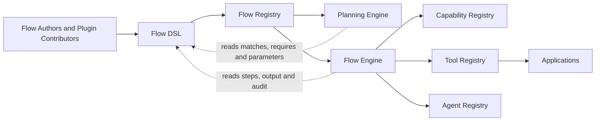
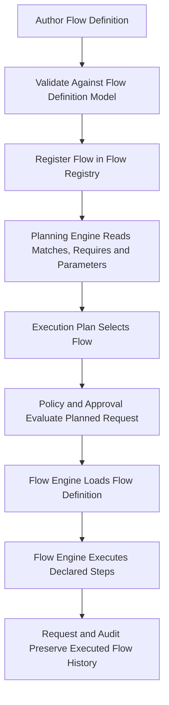
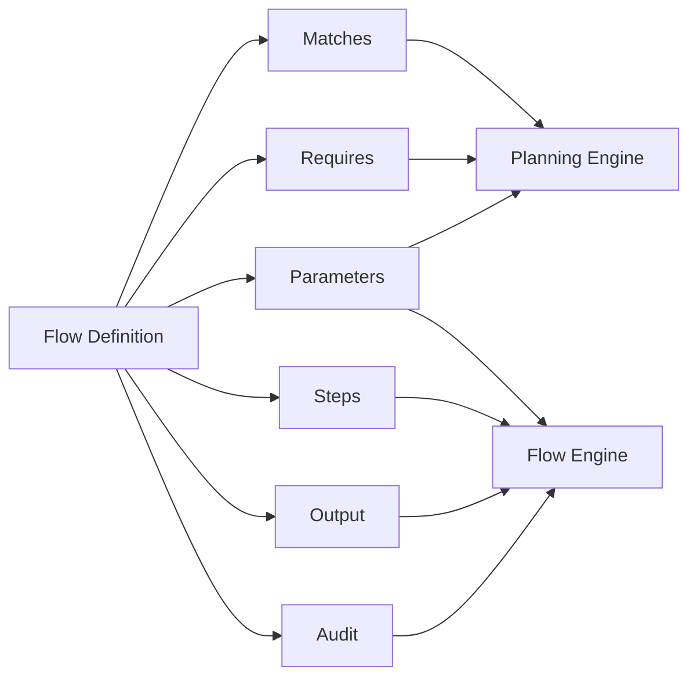
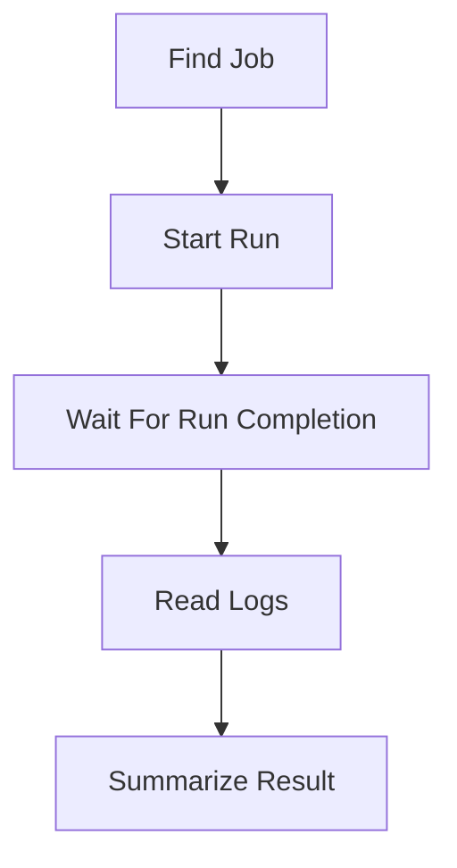
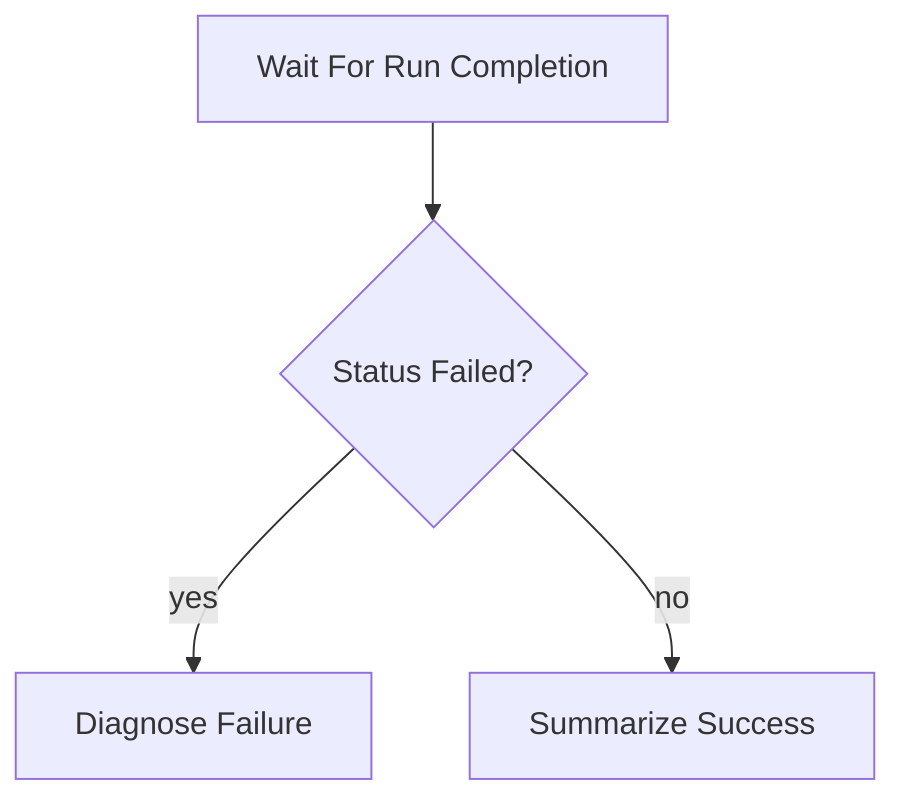

# Flow DSL

> **STATIS Intelligence Layer (SIL)**  
> **Flow Definition Model**

**Document:** `16_Flow_DSL.md`  
**Version:** 0.1 (Draft)  
**Status:** Core Architecture  
**Owner:** SIL Core  
**Audience:** Software architects, backend developers, plugin developers, AI engineers, future contributors

- [Purpose](#purpose)
- [Responsibilities and Boundaries](#responsibilities-and-boundaries)
- [Processing Model](#processing-model)
- [Flow Definition Model](#flow-definition-model)
- [Behavioural Rules](#behavioural-rules)
- [Examples](#examples)
- [Architecture Decisions](#architecture-decisions)
- [Future Evolution and Related Documents](#future-evolution-and-related-documents)

## Purpose

The Flow DSL is the declarative definition model used by SIL to describe executable orchestration.

If the Request Engine answers the question *what is the user asking for*, the Context Engine answers the question *under which surrounding conditions should SIL interpret and plan that Request*, the Planning Engine answers the question *which Flow should fulfill that Request and with which explicit planning inputs*, the Policy Engine answers the question *whether SIL may continue with that planned Request under explicit organizational control*, the Approval Engine answers the question *whether the required human authority has been explicitly granted*, and the Flow Engine answers the question *how that approved plan is executed in a deterministic and auditable way*, the Flow DSL answers the question *how a Flow is structurally described so that planning and execution can remain explicit, deterministic and explainable*.

This makes the Flow DSL the architectural contract between Flow definition and Flow execution.

That distinction matters.

A Flow is not just a runtime artifact loaded by the Flow Engine. It is also not just a planning hint used by the Planning Engine. A Flow is a first-class architectural object whose structure must be stable, intelligible and constrained before it can be planned, governed or executed. SIL therefore needs an explicit definition model for Flows rather than treating them as ad hoc configuration files or application-specific scripts.

The Flow DSL exists to answer a small set of architectural questions.

- What is a Flow in SIL, beyond a general idea of “steps”?
- Which parts of a Flow are relevant for planning, and which parts are relevant for execution?
- How does SIL describe orchestration without embedding business logic into the orchestration layer?
- How are Capabilities, parameters, outputs and audit behaviour declared explicitly?
- How does SIL allow Plugin-based extensibility without allowing arbitrary runtime code inside Flows?
- How does the platform ensure that Flow definitions remain auditable, portable and explainable across applications?

These questions are essential because deterministic execution requires deterministic orchestration definitions.

The Flow Engine cannot safely execute a Flow unless the structure of that Flow is explicit.

The Planning Engine cannot safely select a Flow unless matching, required Capabilities and declared parameters are explicit.

The Policy Engine cannot evaluate a planned Request meaningfully unless the selected Flow has a stable identity and predictable orchestration semantics.

The Audit model cannot explain what SIL did unless the orchestration model itself is well-defined.

The Flow DSL therefore exists because SIL does not allow orchestration to be implicit.

A Flow must not be hidden inside application code.

A Flow must not be an arbitrary script.

A Flow must not call infrastructure endpoints directly.

A Flow must not rely on unstated runtime behaviour.

A Flow must instead be described through a constrained declarative model that preserves the layered SIL principles:

```text
Flow → Capability → Tool → Application
```

The Flow DSL does **not** define application business logic. Business logic remains inside Applications.

It does **not** decide which Flow should be selected for a Request. That belongs to the [Planning Engine](12_Planning_Engine.md).

It does **not** execute Flow steps, resolve Tools at runtime or communicate with Applications. That belongs to the [Flow Engine](15_Flow_Engine.md).

It does **not** decide whether execution is allowed, denied or subject to Approval. That belongs to the [Policy Engine](13_Policy_Engine.md) and [Approval Engine](14_Approval_Engine.md).

It does **not** redefine the Request model or the Execution Context. Those belong to earlier documents and earlier engines.

A useful way to state the architectural intent is this:

> The Planning Engine selects a Flow.  
> The Flow DSL defines what a Flow is allowed to contain.  
> The Flow Engine executes the selected Flow.  
> The Flow DSL does not produce execution.  
> It defines execution structure.

An equally important clarification follows from that statement.

The Flow DSL is **not** YAML.

YAML is only one possible representation of the Flow Definition Model.

A Flow may later be authored, stored or transported as YAML, JSON, a database record, a generated object or an API resource. The architectural concern of this document is not the serialization format. The architectural concern is the canonical definition model that every representation must preserve.

## Responsibilities and Boundaries

The Flow DSL is responsible for defining the canonical structure and allowed semantics of a Flow.

Because the Flow DSL is a definition model rather than a runtime engine, its responsibilities are architectural rather than operational. Even so, they are specific and important.

First, it defines the structural shape of a Flow. SIL needs one authoritative answer to questions such as which top-level sections a Flow may contain, how steps are declared, how outputs are described and how audit intent is expressed. Without that structure, each Plugin or application author would invent its own orchestration grammar and the platform would immediately lose determinism.

Second, it separates planning-facing and execution-facing concerns inside the same Flow definition. The Planning Engine must be able to reason over Flow matchability, required Capabilities and declared parameters without executing the Flow. The Flow Engine must then be able to consume the same definition as runtime orchestration. The Flow DSL exists to make both concerns explicit without collapsing them into one ambiguous blob of configuration.

Third, it constrains orchestration to safe, explainable constructs. SIL has already established that MVP execution is deterministic and that Flows orchestrate Capabilities rather than infrastructure details. The Flow DSL must therefore say not only what may be expressed, but also what may not be expressed. This is why arbitrary code, direct REST calls, direct SQL, shell execution and hidden logic do not belong inside Flow definitions.

Fourth, it provides a stable authoring contract for Plugin contributors. Plugins may contribute Capabilities, Tools, Context Providers, Policies and Flows. If Flows are to be contributed by Plugins in a predictable way, their definition model must be shared across the platform. The Flow DSL provides that common authoring surface.

Fifth, it preserves explainability by design. A Flow should be understandable to architects, backend developers and technically literate business stakeholders without reading application internals. This does not mean that every Flow is simple in business consequence. It means that the orchestration model itself should remain intelligible and explicit.

These responsibilities are intentionally narrow.

The Flow DSL is **not** responsible for choosing the best Flow for a given Request. Planning consumes Flow definitions; it does not emerge from them automatically.

It is **not** responsible for executing business operations. A Flow definition may declare that SIL should invoke `pipeline.job.run`, but the actual execution still belongs to the Flow Engine and the Tool/Application path behind that Capability.

It is **not** responsible for implementing Capabilities. Capabilities remain business-facing contracts, Tools remain their implementations and Applications remain the owners of business logic.

It is **not** responsible for governance. A Flow may declare that it runs a production job, but the Flow DSL does not determine whether that should be allowed or require approval. Governance remains downstream.

It is also **not** a general-purpose programming model. SIL is not defining a scripting language for arbitrary automation. It is defining a constrained orchestration model for governed enterprise Requests.

The boundary can be summarized like this:



### What belongs in a Flow definition

The Flow DSL is the right place for information that defines orchestration shape.

| Flow concern | Why it belongs in the Flow DSL |
|---|---|
| Stable Flow identity | Downstream engines need an authoritative identity for planning, policy, approval, audit and execution |
| Matching metadata | Planning must know which Requests a Flow may satisfy before execution begins |
| Required Capabilities | Planning and validation must know whether a Flow is materially usable |
| Declared parameters | Planning and execution need explicit input expectations |
| Ordered or conditional steps | The Flow Engine needs deterministic orchestration structure |
| Final output composition | SIL must define what execution returns to the Request lifecycle and to the originating channel |
| Audit intent | The platform must know which execution facts the Flow explicitly expects to preserve |

A useful rule of thumb is this:

> If a fact defines how SIL should orchestrate a Request through registered Capabilities, it probably belongs in the Flow DSL.

### What does not belong in a Flow definition

Just as important are the concerns that must remain outside the DSL.

| Concern | Why it does **not** belong in the Flow DSL |
|---|---|
| Application business logic | Business logic belongs to Applications |
| Direct Tool implementation details | Flows orchestrate Capabilities, not Tools |
| Direct REST, MCP, SQL or shell calls | Layers must not be skipped |
| Policy rules | Governance belongs to the Policy Engine |
| Approval decisions | Human authorization belongs to the Approval Engine |
| Free-form Request interpretation | Understanding belongs to the Request Engine |
| Hidden runtime assumptions | SIL requires explicit Request, Context and Plan state |
| Arbitrary executable code | The DSL is declarative, not a scripting language |

This boundary is central to SIL.

If business logic enters the Flow DSL, Applications lose ownership of business behaviour.

If Tool details enter the Flow DSL, Capabilities stop being the stable orchestration contract.

If arbitrary code enters the Flow DSL, deterministic execution becomes much harder to explain, validate and audit.

### Why the Flow DSL exists as a separate architectural concern

At first sight it may appear that the Flow DSL could simply be a subsection of the Flow Engine. In SIL, that would be too weak a boundary.

The Flow Engine is a runtime owner. It executes approved plans.

The Flow DSL is a definition owner. It says what a Flow is.

Those should remain separate because definition and execution evolve differently.

A runtime engine may change its internal implementation strategy without changing the public structure of a Flow.

A Flow author may contribute a new Flow definition without changing the architecture of the Flow Engine.

Planning may use the same Flow definition model without executing anything.

Audit may reference the same Flow structure after execution is complete.

Keeping the Flow DSL explicit therefore strengthens portability, validation and explanation across the whole platform.

## Processing Model

The Flow DSL does not have a runtime processing pipeline in the same sense as the Request Engine or Flow Engine. Even so, it does participate in a well-defined architectural lifecycle.

This lifecycle begins with Flow definition and ends with Flow execution, but the Flow DSL itself remains the stable model in the middle.



This model is not an implementation algorithm.

It is the architectural lifecycle that every conforming implementation should preserve.

### Definition authoring

A Flow begins as a declarative definition authored by SIL Core or by a Plugin contributor.

At this stage, the most important architectural requirement is not storage technology. It is conformance to the Flow Definition Model.

The author should be able to express:

- what kinds of Requests the Flow may satisfy,
- which Capabilities the Flow depends on,
- which parameters the Flow expects,
- which steps define orchestration,
- how output is produced,
- and how audit behaviour is described.

The author should **not** need to embed hidden code, runtime callbacks or application-specific scripts to do so.

This is exactly why the DSL exists.

### Structural validation

Before a Flow becomes part of the authoritative platform registry, a conforming implementation should validate that the Flow is structurally sound.

That validation includes questions such as:

- Does the Flow contain the required top-level sections?
- Is the Flow identity stable and well-formed?
- Are step types limited to supported DSL constructs?
- Are step identifiers unique within the Flow?
- Are required Capabilities declared explicitly?
- Are references written against explicit state rather than hidden runtime assumptions?
- Is the Flow within the supported MVP feature set?

This validation does not execute the Flow.

It confirms that the Flow is a valid orchestration definition.

### Planning-time consumption

Once a Flow is registered, the Planning Engine consumes only part of the definition model.

Planning is primarily concerned with:

- Flow identity and descriptive metadata,
- `matches`,
- `requires`,
- `parameters`.

This is one of the most important reasons the Flow DSL must be explicit. The Planning Engine does not execute a Flow to discover whether it might match a Request. It reads registered declarative metadata from the Flow definition.

Stated differently:

> Matching belongs to Flow definition.  
> Selection belongs to Planning.  
> Execution belongs to the Flow Engine.

Those are different concerns, and the Flow DSL is where the first concern becomes explicit.

### Execution-time consumption

Once an Execution Plan has selected one Flow and governance has allowed continuation, the Flow Engine consumes the execution-facing parts of the same definition model.

Execution is primarily concerned with:

- `steps`,
- `output`,
- `audit`,
- and the execution-relevant meaning of declared parameters.

The Flow Engine does not treat the Flow as arbitrary configuration. It interprets a known definition model whose semantics are already bounded by the DSL.

That allows the Flow Engine to remain deterministic.

### Request continuity and audit

The final architectural stage is not “Flow file loaded successfully”. The final stage is that the Request and audit history can explain what orchestration model was in force.

Because the Flow DSL gives each Flow a stable identity and explicit structure, downstream lifecycle records can say:

- which Flow was selected,
- which version of that Flow was selected,
- which declared steps were executed,
- which outputs were produced,
- and which audit intent applied.

This is not a secondary implementation detail. It is part of explainability by design.

A second useful view of the processing model highlights the split between planning-time and execution-time interpretation:



This split is architectural, not incidental.

It is one of the main reasons the Flow DSL strengthens the SIL model rather than merely documenting syntax.

## Flow Definition Model

The Flow DSL defines a canonical Flow Definition Model. The examples in this document use YAML because YAML is readable, concise and already familiar to many engineers. However, the representation is secondary. The model is primary.

A Flow definition contains the following logical sections:

```yaml
id:
name:
description:
version:

matches:

requires:

parameters:

steps:

output:

audit:
```

Not every section has the same responsibility.

Some sections primarily support planning.

Some sections primarily support execution.

Some sections support both because they preserve identity and explanation across the whole lifecycle.

### Canonical structure

The following table summarizes the architectural role of each section.

| Section | Purpose | Consumed primarily by |
|---|---|---|
| `id` | Stable Flow identity | Planning, Policy, Approval, Flow Engine, Audit |
| `name` | Human-readable name | Planning, Approval, Audit, operator-facing tooling |
| `description` | Architectural explanation of business intent | Planning, Approval, Audit, documentation |
| `version` | Stable definition version | Planning, Flow Engine, Audit |
| `matches` | Declares which Requests this Flow may satisfy | Planning Engine |
| `requires` | Declares required Capabilities | Planning Engine, validation |
| `parameters` | Declares input expectations and defaults | Planning Engine, Flow Engine |
| `steps` | Declares execution orchestration | Flow Engine |
| `output` | Declares Flow result composition | Flow Engine |
| `audit` | Declares explicit audit behaviour | Flow Engine, Audit |

This model is intentionally small.

A good DSL for SIL is not the most expressive DSL imaginable.

It is the one that makes orchestration explicit without turning Flow definition into a second application runtime.

### Flow metadata

Every Flow requires stable metadata.

A minimal metadata section may look like this:

```yaml
id: pipeline.job.run_and_summarize
name: Run Job and Summarize
description: Runs a Pipeline job and summarizes the execution result.
version: 0.1
```

The most important field here is `id`.

The Flow ID should be stable and globally unique within SIL. It is the identity by which Planning selects a Flow, Policy evaluates a Flow, Approval presents a Flow for authorization and Audit records what was executed.

Recommended naming follows a stable business-oriented pattern:

```text
<plugin>.<domain>.<action>
```

Examples:

```text
pipeline.job.explain
pipeline.job.run_and_summarize
pipeline.run.diagnose_failed
sudreg.company.explain
catalogue.dataset.search_and_describe
```

The goal of this convention is not aesthetic consistency alone. It supports traceability across the platform.

### Matching

The `matches` section declares which kinds of Requests a Flow may satisfy.

```yaml
matches:
  intents:
    - run_job
  entities:
    - job
  applications:
    - pipeline
```

This section belongs to planning, not execution.

That distinction is fundamental.

The `matches` section tells SIL that a Flow is a candidate for certain Request shapes. It does **not** mean that the Flow will always be selected whenever such a Request appears. Selection still belongs to the Planning Engine, which evaluates the Request, the Execution Context, candidate suitability and any relevant planning constraints.

A useful way to phrase the rule is:

> `matches` declares eligibility.  
> Planning decides selection.

For MVP, matching should remain explicit and simple.

A Flow may match by:

- intent,
- entity type,
- application scope where relevant.

This keeps Flow selection deterministic and explainable. If matching becomes too opaque or too dynamic, planning will become harder to reason about.

### Requirements

The `requires` section declares the Capabilities that must exist for the Flow to be materially usable.

```yaml
requires:
  capabilities:
    - pipeline.job.find
    - pipeline.job.run
    - pipeline.run.status
    - pipeline.run.logs.read
```

This section is deliberately Capability-oriented.

A Flow should not declare Tool requirements.

A Flow should not declare endpoint requirements.

A Flow should not declare “call this REST method” requirements.

The reason is architectural: Flows orchestrate Capabilities. Tools implement Capabilities. Applications own business logic.

The `requires` section therefore makes the Flow’s business dependencies explicit without collapsing orchestration into implementation detail.

Planning can use this section to verify that the selected Flow is real, registered and available under the current registry state. The Flow Engine then performs runtime Capability resolution later, during actual execution.

### Parameters

The `parameters` section declares what information the Flow expects to run deterministically.

```yaml
parameters:
  job:
    type: job_ref
    required: true

  environment:
    type: enum
    values: [DEV, TEST, PROD]
    default: DEV

  period:
    type: period
    required: false
```

The Parameter model is not meant to replicate full application schemas. It exists to express the orchestration-relevant input contract of the Flow.

Typical parameter concerns include:

- type,
- whether the parameter is required,
- whether it has a default,
- and whether its value is constrained to a known set.

Parameters may be resolved from several explicit sources:

| Source | Meaning |
|---|---|
| Request | The user explicitly provided or implied the parameter in the structured Request |
| Execution Context | The parameter can be derived from explicit runtime context such as environment, workspace or authenticated scope |
| Flow defaults | The Flow declares a default value that Planning may use when no explicit value is present |
| Previous step outputs | A later step may consume values produced by earlier execution steps |

This is another place where the Flow DSL strongly supports SIL principles. Parameters must come from explicit state. They must not come from hidden guesses in the Flow Engine.

### Steps

The `steps` section defines the orchestration structure of the Flow.

MVP supports four and only four step types:

```text
capability
wait
condition
agent
```

This limited set is intentional.

SIL does not need a general-purpose orchestration grammar for the MVP. It needs a small number of step types that match its core architectural concerns:

- invoke a business operation,
- wait for an external or asynchronous lifecycle,
- choose between simple branches,
- use AI for reasoning over already retrieved information.

Each step should have a stable step identity within the Flow.

```yaml
steps:
  - id: find_job
    type: capability
    capability: pipeline.job.find
    input:
      query: "{{request.entities.job}}"
```

At minimum, a step requires:

- an `id`,
- a `type`,
- and step-type-specific fields.

The `id` is important because later steps, outputs and audit records refer to it explicitly.

### Reference model

Examples in this document use moustache-style references such as:

```yaml
{{request.entities.job}}
{{context.environment}}
{{plan.parameters.environment}}
{{steps.find_job.output.job_id}}
{{result.status}}
```

These examples show architectural intent, not a mandatory parser implementation.

The important rule is not the exact punctuation. The important rule is that references resolve only from explicit state already known to SIL, such as:

- the Request,
- the Execution Context,
- the Execution Plan,
- previous step outputs,
- or the current result being evaluated by a `wait` expression.

This keeps orchestration explainable and prevents hidden side channels from entering Flow execution.

### Capability step

A `capability` step invokes a registered business Capability.

```yaml
- id: find_job
  type: capability
  capability: pipeline.job.find
  input:
    query: "{{request.entities.job}}"
    environment: "{{context.environment}}"
```

This is the most direct expression of the SIL orchestration model.

The Flow says *which business operation is needed*.

The Flow does **not** say *which Tool implementation should be used*.

The Flow does **not** call the Application directly.

The Flow Engine later resolves the Capability to a Tool at runtime, preserving the layered path:

```text
Flow → Capability → Tool → Application
```

A `capability` step should perform one business-facing orchestration responsibility. If a step needs to do too much, that usually means the business logic belongs in the Application or the Flow needs to be decomposed into smaller steps.

### Wait step

A `wait` step represents controlled waiting for an asynchronous or long-running lifecycle to reach a terminal or usable state.

```yaml
- id: wait_run
  type: wait
  capability: pipeline.run.status
  input:
    run_id: "{{steps.start_run.output.run_id}}"
  until: "{{result.status in ['SUCCESS', 'FAILED', 'CANCELLED']}}"
  timeout_seconds: 3600
```

Architecturally, `wait` is not a loophole for arbitrary looping.

It exists because enterprise systems frequently expose asynchronous business operations:

- job execution,
- long-running pipeline runs,
- external processing,
- background tasks,
- staged completion workflows.

The Flow DSL therefore needs an explicit way to describe controlled waiting without pushing that concern into hidden engine behaviour.

For MVP, a `wait` step should remain simple:

- one Capability to read current state,
- one explicit condition for completion,
- one explicit timeout boundary.

Complex retry strategies, open-ended looping and dynamic control logic are intentionally deferred.

### Condition step

A `condition` step enables simple deterministic branching.

```yaml
- id: check_status
  type: condition
  if: "{{steps.wait_run.output.status == 'FAILED'}}"
  then: diagnose_failure
  else: summarize_success
```

This step exists because some Flows need modest branch behaviour while still remaining declarative.

Typical examples include:

- if a run failed, diagnose failure,
- otherwise summarize success,
- if a company search returns one result, continue,
- otherwise produce a disambiguation result.

For MVP, condition expressions should remain limited to explicit values from Request state, Context, Plan state and previous step outputs. Conditions should not become a hidden programming language inside the DSL.

### Agent step

An `agent` step invokes an Agent or Persona for reasoning, explanation or summarization over explicit inputs.

```yaml
- id: summarize
  type: agent
  agent: run_reporter
  input:
    prompt: |
      Summarize the result of this Pipeline run.

      Status:
      {{steps.wait_run.output}}

      Logs:
      {{steps.read_logs.output}}
```

This step type embodies one of the central SIL principles:

> AI understands, SIL controls, Applications execute.

An `agent` step may:

- explain,
- summarize,
- compare,
- classify,
- or otherwise reason over information already retrieved.

An `agent` step may **not**:

- execute application operations directly,
- grant authorization,
- replace Policy,
- replace Approval,
- or bypass Capabilities.

This boundary allows SIL to use AI where AI is appropriate while keeping orchestration and governance deterministic.

### Output

The `output` section declares what the Flow returns as its execution result.

```yaml
output:
  type: markdown
  source: "{{steps.summarize.output}}"
```

The purpose of this section is architectural clarity.

A Flow should not leave downstream components guessing what the final business-facing result is supposed to be. The Flow should explicitly declare which step output or composed result becomes the Flow’s authoritative execution output.

The output should be suitable for the originating Request channel. In some cases that will be concise business text. In some cases it may be structured data. In others it may be a summarized explanation produced by an Agent step.

What matters is that final output composition is explicit rather than accidental.

### Audit

The `audit` section declares the Flow’s audit intent.

```yaml
audit:
  enabled: true
  include:
    - request
    - flow
    - steps
    - capabilities
    - tool_results
    - final_output
```

The inclusion model shown here is illustrative rather than exhaustive, but the architectural requirement is simple:

Flows in SIL should be auditable by design.

The audit section exists because the Flow itself should say whether and how execution-relevant facts are expected to become part of interpretable runtime history. In the MVP, audit should be enabled for every Flow. This keeps behaviour aligned with SIL’s request-first and audit-first principles.

## Behavioural Rules

The Flow DSL exists not only to describe what a Flow looks like, but also to constrain how Flow authors use that model. The following rules preserve the architectural integrity of SIL.

### Keep Flows declarative

A Flow should describe what SIL should orchestrate, not contain executable business code.

If a Flow starts to look like a script, the architecture is already weakening.

A declarative Flow is easier to validate, easier to explain and easier to audit. It also keeps the Application layer responsible for actual business logic, which is exactly where that logic belongs.

### Never skip layers

A Flow may call a Capability.

It may not call a Tool directly.

It may not call an Application directly.

It may not call a REST endpoint, SQL query, shell command or other infrastructure detail directly.

Correct:

```text
Flow → Capability → Tool → Application
```

Incorrect:

```text
Flow → Tool
Flow → REST API
Flow → SQL Query
Flow → Shell Script
```

This rule is one of the strongest architectural protections in SIL.

### Keep matching separate from execution

The `matches` section exists so that Planning can reason over candidate Flows before execution begins.

A Flow author should not hide matchability inside step logic.

The Planning Engine should never need to inspect execution steps to guess whether a Flow is suitable for a Request. Matching belongs in explicit planning-facing metadata.

### Declare Capability dependencies explicitly

Any Capability that makes a Flow materially possible should be declared in `requires`.

This allows planning-time validation and avoids surprise orchestration failures that could have been detected earlier.

The Flow Engine still performs runtime resolution, but planning should not have to treat Flow dependencies as mysterious.

### Resolve values only from explicit state

Step inputs, conditions and outputs should resolve only from known Request state, explicit Execution Context, explicit Execution Plan state and previous step outputs.

A Flow should not depend on hidden session state, UI-local assumptions or unstated infrastructure values.

If a value matters for execution, it should be explicit somewhere in the Request lifecycle.

### Keep steps narrow and readable

Each step should perform one orchestration responsibility.

A Flow that contains very large or heavily overloaded steps becomes harder to explain, harder to audit and harder to reuse.

This rule reflects the same architectural preference already used elsewhere in SIL: explicit small units are easier to govern than hidden complex ones.

### Use wait for controlled waiting, not general looping

A `wait` step is the correct way to express controlled waiting for asynchronous lifecycle change.

It is not a general replacement for loops, retries or custom polling scripts.

For MVP, `wait` should remain bounded, explicit and easy to explain.

### Use condition for simple branching only

A `condition` step should capture simple branch decisions over explicit state.

If Flow authors begin encoding large decision trees or complex business rules inside `condition` expressions, those rules probably belong elsewhere:

- in Applications if they are business logic,
- in Policy if they are governance logic,
- or in better Flow decomposition if they are orchestration structure.

### Use Agent steps only for reasoning

An `agent` step is appropriate when SIL needs interpretation, explanation or summarization over information already collected.

It is not appropriate for:

- choosing a Tool implementation,
- deciding authorization,
- inventing missing business facts,
- or executing application operations.

Agent steps are valuable inside SIL precisely because they are bounded.

### Make output explicit

A Flow should declare what its terminal output is.

This removes ambiguity for the Flow Engine, for response handling and for audit. It also allows a human reader to understand the end product of orchestration without reading the entire execution history.

### Make audit explicit

Every MVP Flow should be auditable.

The audit section of the Flow should make that expectation visible rather than relying on undocumented runtime conventions. This is especially important because Flows are contributed by different parts of the system, including Plugins.

### Remain within the MVP Flow model

For MVP, the Flow DSL intentionally excludes several powerful but destabilizing features:

- arbitrary executable code,
- direct infrastructure calls,
- loops,
- parallel execution,
- dynamic Tool selection by AI,
- hidden side effects,
- complex retry grammars,
- and general-purpose scripting.

These exclusions are not signs of an incomplete architecture. They are deliberate architecture decisions that protect determinism and explainability at the point where SIL most needs them.

## Examples

The examples in this section are intentionally realistic. They are not implementation recipes. Their purpose is to clarify how the Flow Definition Model expresses orchestration across multiple application domains.

### Example of a minimal explanatory Flow

This Flow demonstrates a relatively simple pattern: find an object, read it and explain it in business-facing language.

```yaml
id: pipeline.job.explain
name: Explain Job
description: Explains what a Pipeline job does.
version: 0.1

matches:
  intents:
    - explain_job
  entities:
    - job
  applications:
    - pipeline

requires:
  capabilities:
    - pipeline.job.find
    - pipeline.job.read
    - pipeline.job.files.read

parameters:
  job:
    type: job_ref
    required: true

steps:
  - id: find_job
    type: capability
    capability: pipeline.job.find
    input:
      query: "{{request.entities.job}}"

  - id: read_job
    type: capability
    capability: pipeline.job.read
    input:
      job_id: "{{steps.find_job.output.job_id}}"

  - id: explain
    type: agent
    agent: technical_explainer
    input:
      prompt: |
        Explain what this job does.
        Focus on purpose, inputs, outputs and risks.

        Job:
        {{steps.read_job.output}}

output:
  type: markdown
  source: "{{steps.explain.output}}"

audit:
  enabled: true
  include:
    - request
    - flow
    - steps
    - final_output
```

Several architectural characteristics are visible here.

The Flow remains firmly declarative.

It operates through Capabilities, not through Tool names.

The Agent step does not execute anything. It explains information already retrieved.

The output is explicit.

The audit expectation is explicit.

### Example of a run-and-summarize Flow

This Flow demonstrates a more operational pattern: execute, wait, inspect and summarize.

```yaml
id: pipeline.job.run_and_summarize
name: Run Job and Summarize
description: Runs a Pipeline job and summarizes the execution result.
version: 0.1

matches:
  intents:
    - run_job
  entities:
    - job
  applications:
    - pipeline

requires:
  capabilities:
    - pipeline.job.find
    - pipeline.job.run
    - pipeline.run.status
    - pipeline.run.logs.read

parameters:
  job:
    type: job_ref
    required: true

  environment:
    type: enum
    values: [DEV, TEST, PROD]
    default: DEV

steps:
  - id: find_job
    type: capability
    capability: pipeline.job.find
    input:
      query: "{{request.entities.job}}"
      environment: "{{request.parameters.environment}}"

  - id: start_run
    type: capability
    capability: pipeline.job.run
    input:
      job_id: "{{steps.find_job.output.job_id}}"

  - id: wait_run
    type: wait
    capability: pipeline.run.status
    input:
      run_id: "{{steps.start_run.output.run_id}}"
    until: "{{result.status in ['SUCCESS', 'FAILED', 'CANCELLED']}}"
    timeout_seconds: 3600

  - id: read_logs
    type: capability
    capability: pipeline.run.logs.read
    input:
      run_id: "{{steps.start_run.output.run_id}}"

  - id: summarize
    type: agent
    agent: run_reporter
    input:
      prompt: |
        Summarize the result of this Pipeline run for a business user.

        Status:
        {{steps.wait_run.output}}

        Logs:
        {{steps.read_logs.output}}

output:
  type: markdown
  source: "{{steps.summarize.output}}"

audit:
  enabled: true
  include:
    - request
    - flow
    - steps
    - capabilities
    - tool_results
    - final_output
```

The orchestration path can be visualized like this:



Architecturally, this example is important because it shows why the Flow DSL must support both controlled waiting and AI reasoning without collapsing them into one step type.

The `wait` step handles lifecycle progression.

The `agent` step handles human-readable explanation.

The two concerns remain separate.

### Example of simple conditional branching

This example focuses specifically on the `condition` step. It shows a Flow that branches after a run reaches terminal state.

```yaml
id: pipeline.job.run_with_diagnostics
name: Run Job with Diagnostics
description: Runs a Pipeline job and either summarizes success or diagnoses failure.
version: 0.1

matches:
  intents:
    - run_job
  entities:
    - job
  applications:
    - pipeline

requires:
  capabilities:
    - pipeline.job.find
    - pipeline.job.run
    - pipeline.run.status
    - pipeline.run.logs.read

parameters:
  job:
    type: job_ref
    required: true

steps:
  - id: find_job
    type: capability
    capability: pipeline.job.find
    input:
      query: "{{request.entities.job}}"

  - id: start_run
    type: capability
    capability: pipeline.job.run
    input:
      job_id: "{{steps.find_job.output.job_id}}"

  - id: wait_run
    type: wait
    capability: pipeline.run.status
    input:
      run_id: "{{steps.start_run.output.run_id}}"
    until: "{{result.status in ['SUCCESS', 'FAILED', 'CANCELLED']}}"
    timeout_seconds: 3600

  - id: check_status
    type: condition
    if: "{{steps.wait_run.output.status == 'FAILED'}}"
    then: diagnose_failure
    else: summarize_success

  - id: diagnose_failure
    type: agent
    agent: failure_analyst
    input:
      prompt: |
        Diagnose the likely cause of this run failure.

        Run:
        {{steps.wait_run.output}}

  - id: summarize_success
    type: agent
    agent: run_reporter
    input:
      prompt: |
        Summarize this successful run.

        Run:
        {{steps.wait_run.output}}

output:
  type: markdown
  source: "{{steps.summarize_success.output}}"

audit:
  enabled: true
```

The main value of this example is not the exact branch syntax. It is the architectural pattern:

- business execution still occurs through Capabilities,
- branching remains explicit,
- and AI is used only for interpretation of explicit results.

A conceptual view of the branching path is:



### Example of application independence

This Flow demonstrates that the DSL is intentionally application-independent.

It uses the same Flow Definition Model outside the Pipeline domain.

```yaml
id: sudreg.company.explain
name: Explain Company
description: Finds a company in Sudreg and explains its basic registry information.
version: 0.1

matches:
  intents:
    - explain_company
  entities:
    - company
  applications:
    - sudreg

requires:
  capabilities:
    - sudreg.company.search
    - sudreg.company.read
    - sudreg.company.owners.read

parameters:
  company:
    type: company_ref
    required: true

steps:
  - id: search_company
    type: capability
    capability: sudreg.company.search
    input:
      query: "{{request.entities.company}}"

  - id: read_company
    type: capability
    capability: sudreg.company.read
    input:
      company_id: "{{steps.search_company.output.company_id}}"

  - id: read_owners
    type: capability
    capability: sudreg.company.owners.read
    input:
      company_id: "{{steps.search_company.output.company_id}}"

  - id: explain
    type: agent
    agent: business_analyst
    input:
      prompt: |
        Explain this company in clear business language.

        Company:
        {{steps.read_company.output}}

        Owners:
        {{steps.read_owners.output}}

output:
  type: markdown
  source: "{{steps.explain.output}}"

audit:
  enabled: true
  include:
    - request
    - flow
    - steps
    - final_output
```

This example matters because it shows that the DSL is not Pipeline-specific, Tool-specific or channel-specific.

It is a platform orchestration model.

## Architecture Decisions

### AD-1601

The Flow DSL defines a Flow Definition Model, not a YAML-specific format.

YAML is used in examples because it is readable and concise, but the architecture does not bind SIL permanently to YAML serialization.

Any future representation must preserve the same definition model.

### AD-1602

Flows are declarative and contain no executable business code.

The Flow DSL exists to describe orchestration structure, not to introduce a second programmable runtime inside SIL.

Business logic remains inside Applications.

### AD-1603

Flows orchestrate Capabilities and never call Tools or Applications directly.

This preserves the core SIL principle that Flows describe business operations through Capabilities while Tools remain implementation details and Applications remain business logic owners.

### AD-1604

Planning-visible Flow metadata is kept explicit and separate from execution steps.

The `matches`, `requires` and `parameters` sections exist so that the Planning Engine can reason over Flow suitability without executing the Flow.

### AD-1605

Flow values resolve only from explicit Request lifecycle state.

Flow references may resolve from explicit Request state, Execution Context, Execution Plan state and previous step outputs.

They must not depend on hidden runtime assumptions.

### AD-1606

The MVP Flow DSL supports only four step types: `capability`, `wait`, `condition` and `agent`.

This limited set is intentional.

It is sufficient for the architectural scope of the MVP while keeping execution explainable and bounded.

### AD-1607

Agent steps provide reasoning, explanation and summarization only.

Agent steps do not execute business operations, do not authorize Requests, do not replace Policy and do not replace Approval.

This preserves the principle that AI may assist SIL but SIL remains in control.

### AD-1608

All MVP Flows are auditable by design.

The Flow DSL includes explicit audit intent so that execution history remains attributable to a known Flow structure rather than to undocumented runtime conventions.

## Future Evolution and Related Documents

The current Flow DSL is intentionally narrow. That narrowness is part of the architecture, not an omission.

Several topics are intentionally deferred because they are not required to establish the core SIL orchestration model:

- formal schema validation and tooling,
- Flow versioning strategy beyond the basic `version` field,
- richer parameter metadata,
- reusable subflows,
- Flow composition and inheritance,
- retry policies,
- parallel execution,
- advanced branching semantics,
- visual Flow editor support,
- AI-assisted Flow authoring,
- alternate storage and transport representations.

All of these topics may evolve later.

None of them changes the current architectural role of the Flow DSL: to define a clear, bounded and deterministic model for Flow orchestration.

### Related documents

The Flow DSL should be read together with the following SIL architecture documents:

- [10_Request_Engine.md](10_Request_Engine.md)
- [11_Context_Engine.md](11_Context_Engine.md)
- [12_Planning_Engine.md](12_Planning_Engine.md)
- [13_Policy_Engine.md](13_Policy_Engine.md)
- [14_Approval_Engine.md](14_Approval_Engine.md)
- [15_Flow_Engine.md](15_Flow_Engine.md)

Those documents explain how Requests are formed, enriched, planned, governed and executed.

This document explains how the Flow itself is defined so that each of those later stages can consume the same orchestration model without hidden behaviour or architectural ambiguity.