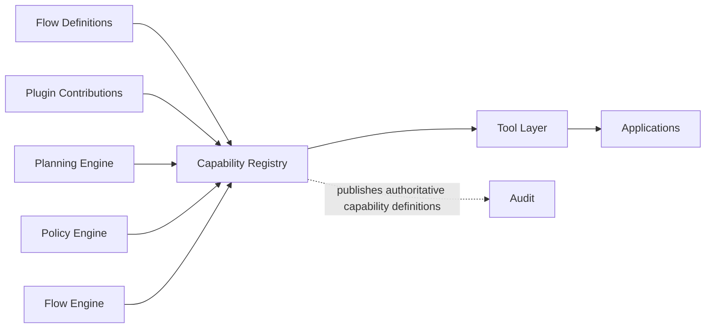
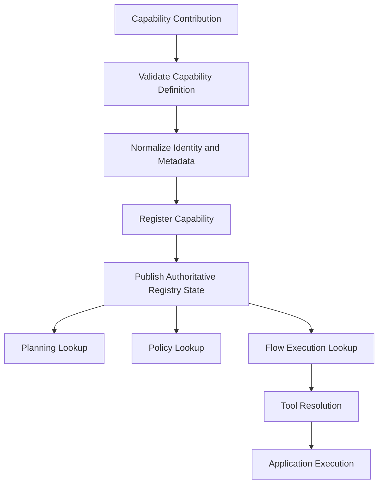
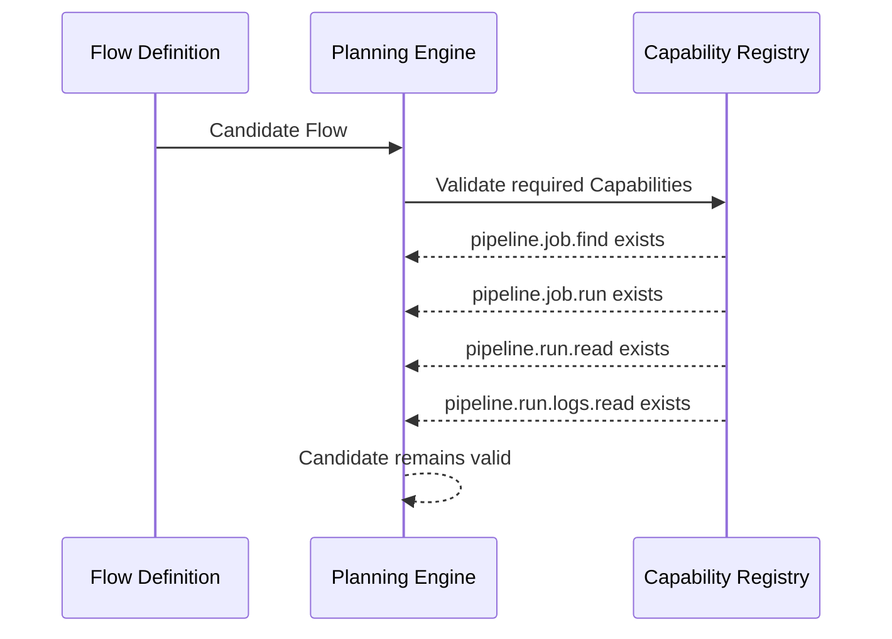
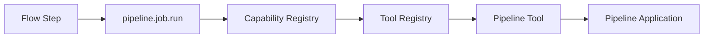

# Capability Registry

> **STATIS Intelligence Layer (SIL)**  
> **Capability Registry**

**Document:** `17_Capability_Registry.md`  
**Version:** 0.1 (Draft)  
**Status:** Core Architecture  
**Owner:** SIL Core  
**Audience:** Software architects, backend developers, plugin developers, AI engineers, future contributors

## Table of contents

- [Purpose](#purpose)
- [Responsibilities and Boundaries](#responsibilities-and-boundaries)
- [Processing Model](#processing-model)
- [Capability Registry Definition](#capability-registry-definition)
- [Behavioural Rules](#behavioural-rules)
- [Examples](#examples)
- [Architecture Decisions](#architecture-decisions)
- [Future Evolution and Related Documents](#future-evolution-and-related-documents)

## Purpose

The Capability Registry is the authoritative registry of business operations available to SIL through the **Capability** abstraction.

If the Request Engine answers the question *what is the user asking for*, the Context Engine answers the question *under which surrounding conditions should SIL interpret and plan that Request*, the Planning Engine answers the question *which Flow should fulfill that Request and with which explicit planning inputs*, the Policy Engine answers the question *whether SIL may continue with that planned Request under explicit organizational control*, the Approval Engine answers the question *whether the required human authority has been explicitly granted*, the Flow Engine answers the question *how that approved plan is executed in a deterministic and auditable way*, and the Flow DSL answers the question *how executable orchestration is structurally described*, the Capability Registry answers the question *which business operations SIL may orchestrate as registered Capabilities, and how those operations are described in a stable, explainable and implementation-independent way*.

This makes the Capability Registry one of the foundational registries of the platform rather than another execution engine.

That distinction matters.

A Capability is referenced by Flows, validated during planning, evaluated by policy, and resolved during execution. It therefore cannot remain an implicit convention hidden inside Plugins, Tools or application code. SIL needs one authoritative place where Capabilities are registered as explicit platform objects. Without that registry, the platform would immediately lose one of its most important architectural properties: the ability to speak about business operations in a deterministic and shared language that is independent of how those operations are technically implemented.

The Capability Registry exists to answer a small set of architectural questions.

- Which Capabilities are currently known to SIL?
- Which Plugin or platform component contributed a given Capability?
- Which Application domain does a Capability belong to?
- Which Flows may safely reference that Capability by stable identity?
- Which downstream runtime path may implement that Capability through registered Tools?
- Which Capability metadata is stable enough to support planning, policy, approval, execution and audit?

These questions are essential because SIL is intentionally layered:

```text
Flow → Capability → Tool → Application
```

That layered model only works if the middle layer is real.

If Capabilities are merely comments in Flow files, the Planning Engine cannot validate them reliably.

If Capabilities are merely aliases for Tools, the platform loses the separation between business-facing orchestration and implementation-facing execution.

If Capabilities are merely ad hoc strings invented by Plugins at runtime, the Policy Engine cannot reason over them in a governed and explainable way.

If Capabilities are not centrally registered at all, the Flow Engine is forced to discover implementation details while executing, which weakens determinism and auditability.

The Capability Registry therefore exists because SIL does not allow business operations to be implicit.

A Flow must not call a Tool directly.

A Flow must not call an Application directly.

A Plugin must not introduce business operations that only its own runtime understands.

A Policy must not govern hidden technical endpoints.

A Request must ultimately resolve toward registered Capabilities that the platform can name, validate and audit.

The Capability Registry does **not** reinterpret free-form language. That belongs to the [Request Engine](10_Request_Engine.md).

It does **not** enrich runtime conditions such as user, workspace or environment. That belongs to the [Context Engine](11_Context_Engine.md).

It does **not** select a Flow. That belongs to the [Planning Engine](12_Planning_Engine.md).

It does **not** decide governance outcomes. That belongs to the [Policy Engine](13_Policy_Engine.md).

It does **not** collect human authorization. That belongs to the [Approval Engine](14_Approval_Engine.md).

It does **not** execute business operations. That belongs to the [Flow Engine](15_Flow_Engine.md).

It also does **not** replace Applications as the owners of business logic. Business logic remains inside Applications exactly as required by the core SIL principles. The Capability Registry describes the business operations SIL is allowed to orchestrate. It does not become the place where those operations are implemented.

A useful way to state the architectural intent is this:

> The Flow DSL allows Flows to reference Capabilities.  
> The Planning Engine validates that required Capabilities are real.  
> The Policy Engine may reason over requested Capabilities as governance inputs.  
> The Flow Engine resolves Capabilities through the registered runtime path.  
> The Capability Registry is the authoritative source of truth that makes those Capabilities explicit.  
> It does not produce execution and it does not produce business logic.

## Responsibilities and Boundaries

The Capability Registry is responsible for the controlled registration and exposure of Capability definitions as first-class platform objects.

At a high level, it performs five architectural responsibilities.

First, it gives every Capability a stable and authoritative identity. SIL cannot rely on informal naming when multiple Plugins, Flows and Tools refer to the same business operation across time. The platform therefore needs one explicit registry where Capability identity is established and preserved. This is important not only for runtime correctness, but also for explanation, policy reasoning and long-term architectural stability.

Second, it separates business operation contracts from runtime implementations. A Capability is not a Tool. It is also not an Application endpoint. It is the business-facing contract that Flows orchestrate and that Tools implement. The Capability Registry exists precisely to preserve this distinction. Without it, the layered model would collapse into implementation leakage.

Third, it enables deterministic planning. Planning must be able to validate whether a selected Flow is materially usable under current platform conditions. When a Flow declares required Capabilities, the Planning Engine should be able to consult one authoritative registry rather than infer availability from Plugin internals or Tool-specific assumptions. The Capability Registry provides that planning-time truth.

Fourth, it supports deterministic execution. The Flow Engine executes Capability steps, not arbitrary integrations. When execution begins, SIL must know that the referenced Capability is a real and registered platform object with a stable meaning. The Capability Registry provides the canonical definition that execution consumes before runtime implementation resolution continues through the Tool layer.

Fifth, it preserves explainability by design. SIL should be able to answer questions such as *which business operation was requested*, *which registry object defined that operation*, *which Plugin contributed it*, and *which Flow referenced it*. A registry that only serves runtime lookup but does not preserve architectural meaning would be insufficient for a governed platform.

These responsibilities are intentionally specific.

The Capability Registry is **not** responsible for interpreting user intent. Request understanding still belongs to the Request Engine and remains intentionally upstream.

It is **not** responsible for selecting Flows. The registry may expose Capabilities that a Flow requires or invokes, but the choice of which Flow should satisfy a Request still belongs to the Planning Engine.

It is **not** responsible for policy decisions. Policy may evaluate the meaning or sensitivity of a requested Capability, but the Capability Registry itself does not decide allow, deny or approval outcomes.

It is **not** responsible for approval workflows. Human authorization remains entirely outside the registry boundary.

It is **not** responsible for Tool implementation or runtime execution. A Capability may later resolve to a Tool implementation, but the registry does not itself invoke Tools, call Applications or perform orchestration.

It is also **not** a general-purpose service catalog. SIL is not trying to model every technical artifact of an enterprise platform inside one registry. The Capability Registry exists specifically because **Capability** is a first-class concept in the SIL ubiquitous language and one of the core architectural boundaries in the orchestration model.

The boundary can be summarized like this:



### What enters the Capability Registry

The Capability Registry is populated through explicit registration rather than through runtime guesswork.

Its architectural inputs typically include:

| Input | Why it matters |
|---|---|
| SIL Core capability definitions | Provides platform-native business operations that exist independently of any one Plugin |
| Plugin-contributed capability definitions | Allows application integrations to expose business operations through the SIL abstraction model |
| Registry metadata | Preserves identity, ownership, scope, version and descriptive information |
| Implementation-facing bindings or references | Connects the business-facing Capability concept to downstream runtime implementation layers without collapsing them |
| Validation rules | Ensure that registered Capabilities remain structurally valid and architecturally compatible |

Each of these inputs belongs here because the registry is the point where platform-wide meaning is normalized. A Plugin may know how its application works internally, but it should not unilaterally define what the rest of SIL believes a Capability is. The registry exists to turn contributed definitions into one shared platform truth.

### What leaves the Capability Registry

The Capability Registry exposes one canonical view of registered Capabilities for downstream consumers.

That view should be sufficient for at least four distinct concerns.

For planning, it should allow the platform to validate that a Flow’s required Capabilities exist.

For policy, it should allow the platform to reason about the business operation being governed rather than only about technical runtime details.

For execution, it should allow the Flow Engine to treat a Capability reference as a real and stable platform object before runtime resolution continues.

For audit and explanation, it should allow SIL to preserve the identity and meaning of the business operation that was requested and executed.

This means the Capability Registry does not need to expose every implementation detail to every consumer. It does need to expose enough stable meaning that every consumer can remain deterministic within its own boundary.

### Why the Capability Registry belongs here

The Capability Registry belongs in SIL Core because Capabilities are not application-private concepts once they become part of the orchestration model.

A Capability may originate in a Plugin.

A Tool may implement that Capability for a specific application.

A Flow may orchestrate that Capability.

A Policy may govern that Capability.

An audit trail may later explain that Capability.

At that point the concept is no longer local.

It has become a platform contract.

That contract requires one common authority, and that authority is the Capability Registry.

## Processing Model

The Capability Registry follows a two-sided processing model.

One side concerns **registration**.

The other side concerns **consumption**.

This is not an implementation algorithm. It is the conceptual architecture that every implementation should preserve.



The most important architectural point is that registration and consumption are related but not identical concerns.

The registry first turns contributed definitions into authoritative platform objects.

Only then do planning, policy and execution consume those objects.

### Capability registration

Registration begins when SIL Core or a Plugin contributes a Capability definition.

That definition should be treated as a proposal to the platform rather than as an immediately trusted runtime fact. The registry exists precisely because contributed definitions must be normalized before they become part of the platform-wide execution vocabulary.

At minimum, registration should confirm that the Capability has a stable identity, that its descriptive metadata is structurally valid, and that the definition can be understood as a proper Capability rather than as a Tool alias, a script name or an application-specific implementation detail disguised as a business operation.

This is an architectural necessity.

If the registry accepted arbitrary strings and ad hoc payloads as Capabilities, every later stage would inherit that instability.

Planning would validate nonsense.

Policy would govern inconsistent abstractions.

Execution would resolve inconsistent meanings.

Audit would preserve inconsistent language.

Registration is therefore the point where SIL protects its ubiquitous language.

### Validation and normalization

Validation is not about punishing Plugin authors. It is about preserving platform coherence.

A Capability should be recognizably a Capability.

That means it should describe a business operation in the SIL sense of the term.

It should have a stable identifier.

It should not collapse directly into a Tool, endpoint, query or script name.

It should belong to an identifiable plugin or platform domain.

It should carry enough descriptive meaning that other components can treat it as more than an opaque token.

Normalization follows validation.

Different contributors may author definitions differently. SIL should still expose a single canonical model to downstream consumers. The registry therefore normalizes contributed definitions into one shared structural form even when their origin differs.

This keeps Plugin-based extensibility compatible with deterministic core behaviour.

### Publication of registry state

Once registered, a Capability becomes part of the authoritative registry state visible to platform consumers.

That statement sounds simple, but its architectural implications are important.

A Flow author may now reference the Capability.

A Planning Engine may now validate a Flow requirement against it.

A Policy Engine may now evaluate governance using its identity.

A Flow Engine may now trust that the Capability reference corresponds to a real platform object.

The registry has therefore changed the set of operations the platform can safely orchestrate.

This is why the registry is not merely metadata storage. It participates in the definition of what SIL is actually capable of orchestrating at a given time.

### Planning-time consumption

During planning, the registry is consulted to answer a precise question:

> Are the Capabilities required by this candidate Flow real, known and valid in the current platform model?

This belongs to planning because Flow selection should remain deterministic and explicit. The Planning Engine must not select a Flow whose required Capabilities are unknown or unavailable according to authoritative registry state.

The Capability Registry does not choose the Flow.

It provides the truth that allows Planning to validate the Flow.

This separation is important.

If the registry started ranking Flows, it would absorb planning responsibility.

If planning started inventing missing Capabilities, it would weaken registry authority.

The two components remain clean precisely because the registry answers *what exists* and planning answers *what should be selected*.

### Policy-time consumption

Policy may reason over the meaning of a requested Capability as one of its governance inputs.

That does not mean the registry performs governance.

It means the Policy Engine should be able to refer to a registered business operation rather than to brittle implementation details.

For example, a policy may decide that `pipeline.job.run` in `PROD` requires approval while `pipeline.run.logs.read` in `TEST` may continue immediately. Such reasoning only remains stable if the Capability identities being governed are themselves stable and authoritative.

The Capability Registry therefore helps protect policy explainability even though policy evaluation remains outside the registry boundary.

### Execution-time consumption

At execution time the Flow Engine consumes a selected Flow whose steps reference Capabilities.

The Flow Engine must then treat those references as real platform objects before moving toward runtime implementation.

This is where the registry’s role becomes operationally visible.

A `capability` step does not say:

```text
Call REST endpoint X
```

It says:

```text
Invoke registered Capability Y
```

That difference is the heart of SIL orchestration.

The Flow Engine relies on the Capability Registry to preserve the existence and meaning of `Y`.

It may then continue toward Tool resolution, implementation selection and application invocation through the next layers of the architecture.

The registry therefore supports execution without becoming the executor.

## Capability Registry Definition

The Capability Registry is the canonical structural model of registered Capabilities in SIL.

Its concern is not one particular storage format. Its concern is the architectural meaning that every implementation must preserve.

### What a Capability is

A Capability is the SIL abstraction for a business operation that can be orchestrated by a Flow and implemented through one or more Tools.

That definition is intentionally narrow.

A Capability is **not** a Flow. A Flow orchestrates one or more Capabilities.

A Capability is **not** a Tool. A Tool implements one or more Capabilities.

A Capability is **not** an Application. An Application owns business logic and domain behaviour.

A Capability is **not** a Request. A Request expresses what the user wants.

A Capability is the explicit business operation contract that sits between orchestration and implementation.

A useful way to state the distinction is this:

- Request expresses objective.
- Flow expresses orchestration.
- Capability expresses business operation.
- Tool expresses implementation.
- Application expresses business logic.

The Capability Registry exists because that middle contract must remain explicit.

### What the registry stores

The Capability Registry stores the canonical registration state of Capabilities as first-class platform objects.

The exact persistence technology is not architecturally important.

The canonical meaning is.

At a conceptual level, a registered Capability should include:

- stable identity,
- descriptive business meaning,
- ownership or contribution source,
- application or domain association where relevant,
- version or evolution marker where relevant,
- implementation-facing references required for downstream runtime resolution,
- any registry-level metadata required to keep the Capability understandable and governable.

This list is intentionally architectural rather than implementation-specific.

The registry should store enough to preserve the Capability as a real platform concept.

It should not degenerate into either of two extremes:

- a trivial string table with no real meaning, or
- an overgrown technical configuration system that absorbs responsibilities belonging to later runtime layers.

### Stable identity

Capability identity is one of the most important properties of the registry.

A Capability should have a stable identifier that can be referenced by Flows, Policies, audits and execution logic without ambiguity. That identity should remain stable across time for as long as the meaning of the Capability remains materially the same.

This matters for more than convenience.

If Capability identity is unstable, a Flow cannot be a stable orchestration artifact.

If Policy rules cannot refer to Capabilities stably, governance becomes brittle.

If audit records refer to transient names, explainability weakens over time.

If Tool implementations change but Capability identity also changes unnecessarily, the platform loses the crucial separation between business operation and implementation detail.

A stable identifier preserves that separation.

### Business-facing description

Identity alone is not enough.

A Capability should carry descriptive meaning that allows architects, Flow authors and governance designers to understand what business operation is being exposed.

This does not mean the registry becomes end-user documentation.

It means the platform should not rely on opaque identifiers to carry all meaning.

The Capability Registry should be able to answer not only *what is the key of this object* but also *what business operation does this object represent*.

This is important because SIL is explainable by design, and explanation cannot be built entirely on inscrutable tokens.

### Ownership and contribution source

Because SIL is Plugin-based, the registry must preserve where a Capability came from.

Some Capabilities may be native to SIL Core.

Others may be contributed by application Plugins.

The platform should remain explicit about that provenance.

This is not merely an administrative concern.

Ownership influences how the platform reasons about lifecycle, compatibility, extension and support.

If a Capability is contributed by the `pipeline` Plugin, that fact helps planning, operations and troubleshooting remain intelligible without leaking the internals of the Plugin into every consumer.

### Implementation relationship

The registry must preserve the architectural relationship between a Capability and its downstream implementation path without collapsing the two.

This is a subtle but important point.

The registry should make it possible for execution to continue from Capability identity toward Tool resolution.

But the Capability Registry should not become identical to the Tool Registry.

A Capability remains a business-facing contract.

A Tool remains an implementation artifact.

The Capability Registry may therefore preserve implementation-facing bindings, references or compatibility information needed by downstream runtime layers, but it should do so in a way that preserves the conceptual independence of the Capability.

This keeps the architecture layered.

### Capability availability

Availability is not identical to definition, but the registry participates in both.

Planning must know whether a required Capability is available as a real platform object under current registry state.

Execution must know whether a referenced Capability is resolvable through the expected runtime path.

The registry should therefore make availability explicit rather than forcing consumers to infer it from Plugin presence, Tool startup logs or application-specific side channels.

This does not mean every transient runtime condition belongs in the registry.

It does mean the existence and readiness of a Capability as a valid platform-level business operation should not be hidden.

### Capability comparison

The following table summarizes the key distinctions that the registry preserves.

| Concept | What it represents | Registered here | Why it is different |
|---|---|---|---|
| Request | What the user wants | No | Requests are produced by the Request Engine and evolve through the lifecycle |
| Flow | How SIL orchestrates fulfillment | No | Flows are defined in the Flow DSL and selected by Planning |
| Capability | Business operation contract | Yes | This is the core registry object |
| Tool | Runtime implementation of a Capability | No | Tools belong to the implementation layer, not the business operation layer |
| Application | Owner of business logic | No | Applications remain external domain owners reached through Tools |

### Capability naming

SIL already uses dotted identifiers extensively for stable architectural naming.

Capability naming should follow the same spirit.

A Capability ID should be globally unique within the SIL platform and descriptive enough to preserve business meaning without exposing low-level technical implementation.

Recommended naming should remain aligned to domain and action, for example:

```text
pipeline.job.find
pipeline.job.run
pipeline.run.read
pipeline.run.logs.read
sudreg.company.read
catalogue.dataset.search
```

These examples illustrate an important principle.

The identifier names the business operation as SIL understands it.

It does not name:

- a REST path,
- a SQL query,
- a shell script,
- a method in a specific SDK,
- an MCP command,
- an implementation class.

That distinction is what makes the identifier safe for long-term orchestration and governance.

## Behavioural Rules

The following rules define how the Capability Registry should behave regardless of implementation details.

### Keep Capabilities explicit

If a business operation is orchestrated by SIL, it should exist as an explicit registered Capability.

This is the foundational rule of the component. Hidden business operations inside Plugins or direct technical integrations weaken determinism and make the platform harder to govern. If SIL is going to plan, govern and execute through Capabilities, then Capabilities must be registrable and inspectable first-class objects.

### Preserve stable identity

A registered Capability should keep the same identity for as long as its business meaning remains materially the same.

Implementation changes do not automatically justify Capability identity changes. A Tool may be replaced, optimized or reimplemented while the business-facing Capability remains stable. SIL should preserve that continuity because it is one of the principal reasons the Capability abstraction exists.

### Keep Capabilities separate from Tools

A Capability describes a business operation. A Tool implements that operation.

The registry should never collapse those two concepts into one object model. If the platform starts treating Capabilities as thin aliases for Tools, Flows will effectively begin depending on implementation details and the architectural layer boundary will weaken.

### Keep Capabilities separate from Applications

Applications own business logic. The registry does not.

A Capability may clearly belong to an application domain such as Pipeline, Sudreg or Catalogue, but the registry must not become an application facade or business-logic host. It records the business operation contract that SIL may orchestrate. It does not become the application itself.

### Require registration before orchestration

A Flow should reference only registered Capabilities.

Planning should validate candidate Flows against registered Capability state.

Execution should invoke only registered Capability references.

This rule protects the whole platform from ad hoc orchestration. SIL should never discover during execution that a Flow depends on a business operation that was never explicitly registered.

### Prefer business language over technical leakage

Capability definitions should remain business-facing and implementation-independent.

A Capability name such as `pipeline.job.run` preserves a clear business meaning. A name such as `pipeline.rest.post.jobs.execute.v2` leaks transport details into the orchestration language. The registry should protect the platform from that kind of leakage because every later component inherits the vocabulary it publishes.

### Normalize Plugin contributions through SIL Core

Plugins may contribute Capabilities.

They should not define private capability dialects.

The registry should normalize Plugin contributions into the common SIL model so that every consumer sees one coherent platform vocabulary rather than a collection of incompatible extension styles. This is how plugin extensibility remains compatible with deterministic core behaviour.

### Make absence explicit

If a required Capability is missing, unavailable or invalid, the platform should know that explicitly.

Planning should prefer explicit failure over silent fallback.

Execution should prefer explicit termination over bypassing the Capability layer.

Governance should prefer explicit truth over inferred availability.

A governed orchestration platform should not treat missing Capabilities as an invitation to improvise.

### Support explanation across the lifecycle

The registry should preserve enough meaning that SIL can explain what business operation a Request planned, governed and executed.

This matters because the Capability concept appears in more than one stage. The same identity may be visible in planning records, policy decisions, approval context, execution history and audit trails. If the registry is explainable, the rest of the lifecycle becomes easier to explain as well.

### Stop before execution

The registry must remain a registry.

It should not:

- select Flows,
- evaluate governance,
- collect approvals,
- invoke Tools,
- call Applications,
- execute business behaviour.

The architectural strength of the component comes from its narrowness. It defines and exposes Capabilities as authoritative platform objects. It should remain clean enough that every later layer can trust it precisely because it does not attempt to do their work.

## Examples

The following examples illustrate the kind of Capability model the registry should expose. These are examples, not normative schemas. They are intended to clarify architectural behaviour rather than prescribe one implementation format.

### Example of a simple registered Capability

```yaml
capability:
  id: pipeline.job.run
  name: Run Pipeline Job
  description: Starts execution of a pipeline job in a selected environment.
  plugin: pipeline
  application: pipeline
  version: 1.0
  semantics:
    category: operation
    business_operation: run_job
  implementation:
    tool_bindings:
      - pipeline.job.run.default
```

This example shows the minimum architectural shape clearly.

The Capability has a stable identity.

It has a business-facing name and description.

Its ownership is explicit.

Its relationship to the downstream implementation layer is explicit without collapsing the two concepts.

Most importantly, the object is recognizably a Capability rather than a Tool or an endpoint.

### Example of a read-oriented Capability

```yaml
capability:
  id: sudreg.company.read
  name: Read Company
  description: Reads company information from Sudreg by an explicit company reference.
  plugin: sudreg
  application: sudreg
  version: 1.0
  semantics:
    category: read
    business_operation: company_lookup
  implementation:
    tool_bindings:
      - sudreg.company.read.primary
```

This example illustrates that read-oriented Capabilities are modeled in the same way as command-oriented Capabilities.

The registry is not limited to “action” operations such as `run` or `promote`. It should represent any business operation that SIL orchestrates through the same layered model.

### Example of a Flow referencing registered Capabilities

```yaml
flow:
  id: pipeline.job.run_and_explain
  name: Run Pipeline Job and Explain Result
  version: 1.0

  requires:
    capabilities:
      - pipeline.job.find
      - pipeline.job.run
      - pipeline.run.read
      - pipeline.run.logs.read

  steps:
    - id: find_job
      type: capability
      capability: pipeline.job.find

    - id: run_job
      type: capability
      capability: pipeline.job.run

    - id: wait_for_completion
      type: wait
      capability: pipeline.run.read

    - id: read_logs
      type: capability
      capability: pipeline.run.logs.read
```

This example shows why the registry is necessary.

The Flow does not reference Tools.

The Flow does not reference Applications.

The Flow references Capabilities by stable identity.

Planning can now validate that those Capability identifiers are registered.

Execution can later resolve them through the runtime path.

### Example of planning-time validation against the registry



This example clarifies an important boundary.

The Planning Engine does not discover Capabilities by guessing from Tool availability.

It validates candidate Flows against the authoritative registry.

That is why the Capability Registry belongs upstream of execution concerns.

### Example of execution-time resolution path



This example shows the layered architecture in its execution form.

The Flow step names a Capability.

The Capability Registry preserves the meaning of that business operation.

The Tool layer carries implementation.

The Application remains the owner of business logic.

### Example of a Request state that records Capability identity explicitly

```yaml
request:
  id: req_01J123ABCXYZ
  intent: run_job
  execution_plan:
    flow:
      id: pipeline.job.run_and_explain
    required_capabilities:
      - pipeline.job.find
      - pipeline.job.run
      - pipeline.run.read
      - pipeline.run.logs.read
  policy:
    decision: approval_required
    reason: production_execution
  approval:
    status: approved
  execution:
    current_step: run_job
    current_capability: pipeline.job.run
```

This example shows why stable Capability identity helps the whole lifecycle.

The same business operation can be understood consistently during planning, governance and execution. SIL does not need different vocabularies for each stage because the registry preserves one authoritative Capability model.

## Architecture Decisions

### AD-1701

The Capability Registry is the authoritative source of truth for all Capabilities that SIL may reference, validate, govern or execute.

### AD-1702

A Capability is a business-facing operation contract and remains conceptually separate from its Tool implementations and from the Application that owns business logic.

### AD-1703

Flows may reference only registered Capabilities by stable identity. Unregistered Capability references are architecturally invalid.

### AD-1704

Plugin-contributed Capabilities are normalized through the common SIL registry model rather than exposed as plugin-private runtime conventions.

### AD-1705

The Planning Engine uses the Capability Registry to validate that candidate Flows depend on real and available Capabilities, but Flow selection remains a Planning responsibility rather than a registry responsibility.

### AD-1706

The Flow Engine consumes Capability identity from the registry and continues toward runtime implementation through the Tool layer. The Capability Registry does not itself execute business operations.

### AD-1707

Capability identity must remain stable across implementation changes whenever the business meaning of the Capability remains materially the same.

### AD-1708

The Capability Registry must preserve enough descriptive meaning and provenance for Capabilities to remain explainable across planning, policy, approval, execution and audit.

### AD-1709

SIL does not permit direct orchestration of Tools, endpoints, scripts or Applications in place of registered Capabilities. The Capability layer remains mandatory.

## Future Evolution and Related Documents

The Capability Registry defined in this document is intended to remain stable at the architectural level, but several implementation-oriented areas may evolve over time.

Expected areas of future refinement include:

- formal capability schema definition,
- definition of capability versioning semantics,
- compatibility rules between Capability Registry and Tool Registry,
- lifecycle rules for plugin-contributed capability registration,
- capability deprecation and replacement handling,
- registry query APIs for planning and execution components,
- validation rules for descriptive metadata and ownership,
- richer policy-facing capability classification metadata.

These topics should evolve without changing the architectural centre of gravity of the component:

- Capabilities remain first-class platform objects,
- the registry remains authoritative,
- Flows continue orchestrating Capabilities rather than Tools,
- business logic remains inside Applications,
- plugin extensibility continues to pass through explicit registration rather than hidden conventions.

### Related documents

- [00_Principles](00_Principles.md)
- [01_Vision](01_Vision.md)
- [02_Architecture](02_Architecture.md)
- [03_Core_Concepts](03_Core_Concepts.md)
- [10_Request_Engine](10_Request_Engine.md)
- [11_Context_Engine](11_Context_Engine.md)
- [12_Planning_Engine](12_Planning_Engine.md)
- [13_Policy_Engine](13_Policy_Engine.md)
- [14_Approval_Engine](14_Approval_Engine.md)
- [15_Flow_Engine](15_Flow_Engine.md)
- [16_Flow_DSL](16_Flow_DSL.md)

> **A strong Capability Registry does not execute work. It makes business operations explicit so that orchestration, governance and execution can remain deterministic, layered and explainable.**