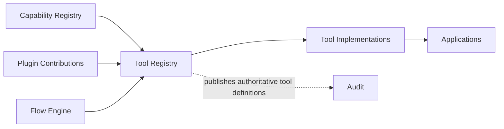
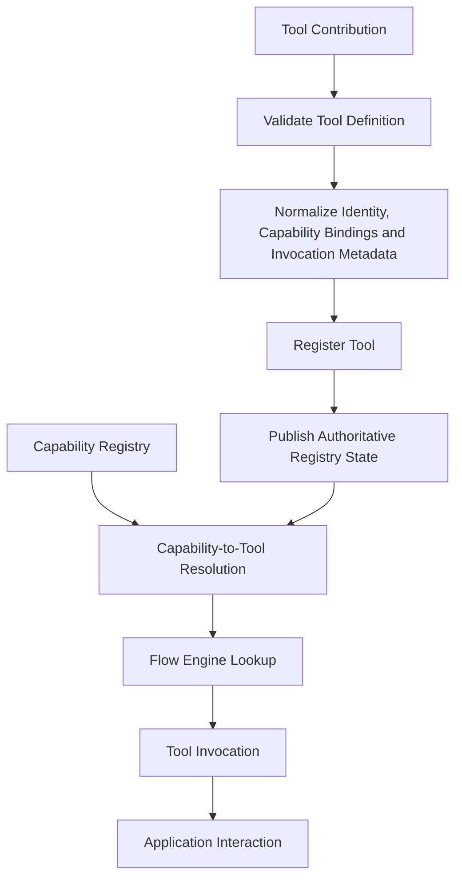
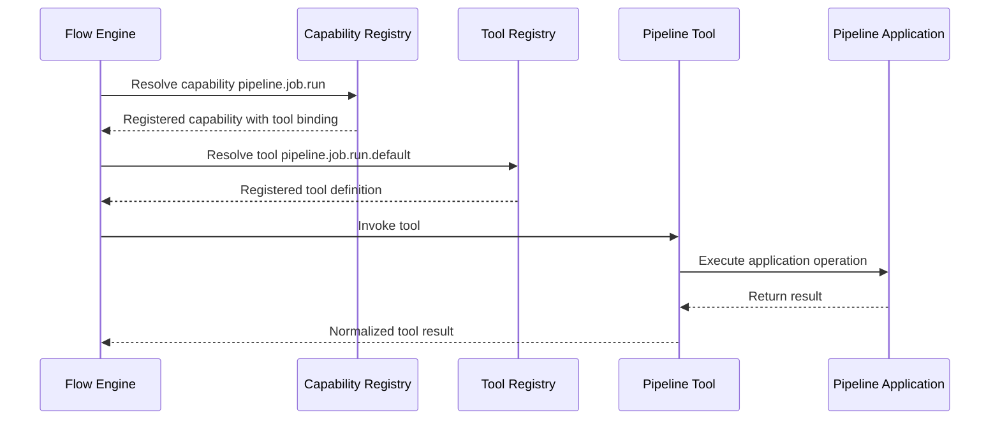

# Tool Registry

> **STATIS Intelligence Layer (SIL)**  
> **Tool Registry**

**Document:** `18_Tool_Registry.md`  
**Version:** 0.1 (Draft)  
**Status:** Core Architecture  
**Owner:** SIL Core  
**Audience:** Software architects, backend developers, plugin developers, AI engineers, future contributors

## Table of contents

- [Purpose](#purpose)
- [Responsibilities and Boundaries](#responsibilities-and-boundaries)
- [Processing Model](#processing-model)
- [Tool Registry Definition](#tool-registry-definition)
- [Behavioural Rules](#behavioural-rules)
- [Examples](#examples)
- [Architecture Decisions](#architecture-decisions)
- [Future Evolution and Related Documents](#future-evolution-and-related-documents)

## Purpose

The Tool Registry is the authoritative registry of runtime implementations available to SIL through the **Tool** abstraction.

If the Request Engine answers the question *what is the user asking for*, the Context Engine answers the question *under which surrounding conditions should SIL interpret and plan that Request*, the Planning Engine answers the question *which Flow should fulfill that Request and with which explicit planning inputs*, the Policy Engine answers the question *whether SIL may continue with that planned Request under explicit organizational control*, the Approval Engine answers the question *whether the required human authority has been explicitly granted*, the Flow Engine answers the question *how that approved plan is executed in a deterministic and auditable way*, the Flow DSL answers the question *how executable orchestration is structurally described*, and the Capability Registry answers the question *which business operations SIL may orchestrate as registered Capabilities*, the Tool Registry answers the question *which registered runtime implementations may fulfill those Capabilities, and how those implementations are described in a stable, execution-facing and architecturally controlled way*.

This makes the Tool Registry one of the foundational registries of the platform rather than another execution engine.

That distinction matters.

A Tool is not merely a piece of plugin-private runtime code.

It is the implementation-facing object that sits between SIL orchestration and the Application that owns business logic.

If SIL expects the Flow Engine to resolve Capabilities deterministically and to invoke downstream implementations without leaking those implementation details into Flows, then Tools cannot remain hidden inside Plugin internals, ad hoc startup code or application-specific conventions. SIL needs one authoritative place where Tools are registered as explicit platform objects. Without that registry, the platform would lose one of its key architectural guarantees: the ability to resolve execution paths explicitly rather than by runtime guesswork.

The Tool Registry exists to answer a small set of architectural questions.

- Which Tools are currently known to SIL?
- Which Plugin or platform component contributed a given Tool?
- Which Application or integration domain does a Tool belong to?
- Which registered Capabilities may resolve through that Tool?
- Which implementation-facing metadata is stable enough to support deterministic execution?
- Which Tool identities and bindings should be preserved for explanation, operations and audit?

These questions are essential because SIL is intentionally layered:

```text
Flow → Capability → Tool → Application
```

That layered model only works if the implementation layer is also real.

If Tools are merely anonymous runtime handlers hidden inside Plugins, the Flow Engine cannot resolve Capabilities in an explainable way.

If Tools are treated as interchangeable code fragments with no stable identity, audit cannot preserve which implementation path was actually used.

If Tool definitions are discovered by looking at whatever application connector happens to be loaded, execution becomes dependent on implicit runtime state rather than on authoritative registry truth.

If Capability-to-Tool relationships are not centrally modeled at all, the platform is forced to improvise the implementation path at the worst possible time: during execution.

The Tool Registry therefore exists because SIL does not allow implementation to be implicit.

A Flow must not call a Tool directly.

A Capability must not degenerate into a Tool alias.

A Plugin must not expose private implementation paths that only its own runtime understands.

A Flow Engine must not discover implementation bindings by reading arbitrary Plugin internals.

A governed orchestration platform must resolve Tools through explicit registry state rather than through hidden conventions.

The Tool Registry does **not** reinterpret free-form language. That belongs to the [Request Engine](10_Request_Engine.md).

It does **not** enrich runtime conditions such as user, workspace or environment. That belongs to the [Context Engine](11_Context_Engine.md).

It does **not** select a Flow. That belongs to the [Planning Engine](12_Planning_Engine.md).

It does **not** decide governance outcomes. That belongs to the [Policy Engine](13_Policy_Engine.md).

It does **not** collect human authorization. That belongs to the [Approval Engine](14_Approval_Engine.md).

It does **not** execute business operations. That belongs to the [Flow Engine](15_Flow_Engine.md).

It also does **not** replace Applications as the owners of business logic. Business logic remains inside Applications exactly as required by the core SIL principles. The Tool Registry describes the registered implementation surfaces through which SIL may reach those Applications. It does not become the place where business behaviour is authored.

A useful way to state the architectural intent is this:

> The Capability Registry makes business operations explicit.  
> The Tool Registry makes implementation paths explicit.  
> The Flow Engine resolves Capabilities through the Tool Registry before invoking runtime implementations.  
> The Tool Registry is the authoritative source of truth that makes those Tools explicit.  
> It does not produce business logic and it does not produce execution.

## Responsibilities and Boundaries

The Tool Registry is responsible for the controlled registration and exposure of Tool definitions as first-class platform objects.

At a high level, it performs five architectural responsibilities.

First, it gives every Tool a stable and authoritative identity. SIL cannot rely on anonymous runtime handlers if execution is expected to remain deterministic and auditable. The platform therefore needs one explicit registry where Tool identity is established and preserved so that execution, operations and audit can refer to the same implementation object consistently across time.

Second, it separates implementation artifacts from business operation contracts. A Tool is not a Capability. A Tool is also not the Application itself. It is the explicit implementation-facing object through which a registered Capability is fulfilled at runtime. The Tool Registry exists precisely to preserve that distinction. Without it, the architecture would collapse from the layered model into one blurred execution surface.

Third, it preserves Capability-to-Tool implementation relationships in an explicit form. The Capability Registry establishes that a Capability is real. The Tool Registry establishes which runtime implementations may fulfill that Capability. This matters because the Flow Engine should not infer implementation bindings from Plugin naming conventions, application SDK structure or other unstable technical clues.

Fourth, it supports deterministic execution. The Flow Engine executes approved Flows whose steps reference Capabilities. When execution continues from Capability identity toward real invocation, SIL needs one authoritative registry that describes which Tool is available, compatible and valid for that runtime path. The Tool Registry provides that execution-facing truth.

Fifth, it preserves explainability by design. SIL should be able to answer questions such as *which Tool implemented this Capability*, *which Plugin contributed that Tool*, *which Application it targeted*, and *which implementation path was used when the Request executed*. A runtime registry that serves lookup but does not preserve meaning, provenance and identity would be insufficient for a governed platform.

These responsibilities are intentionally specific.

The Tool Registry is **not** responsible for interpreting user intent. Request understanding remains intentionally upstream.

It is **not** responsible for selecting Flows. Planning still selects Flows by reasoning over Requests, Execution Context and Flow definitions rather than by reasoning over low-level implementation details.

It is **not** responsible for policy decisions. Governance should primarily depend on Request, Context, Flow and Capability meaning rather than on transport-level implementation detail.

It is **not** responsible for approval workflows. Human authorization remains entirely outside the registry boundary.

It is **not** responsible for invoking Tools. A registered Tool may later be invoked by the Flow Engine, but the registry itself does not call external systems, start jobs or communicate with Applications.

It is also **not** a general-purpose integration catalog. SIL is not trying to register every technical endpoint, queue, SDK method or protocol resource in the enterprise. The Tool Registry exists specifically because **Tool** is a first-class concept in the SIL ubiquitous language and because the execution model depends on it.

The boundary can be summarized like this:



### What enters the Tool Registry

The Tool Registry is populated through explicit registration rather than through runtime guesswork.

Its architectural inputs typically include:

| Input | Why it matters |
|---|---|
| SIL Core tool definitions | Provides platform-native runtime implementations where SIL Core owns the execution-facing adapter |
| Plugin-contributed tool definitions | Allows application Plugins to expose registered implementation paths through the common SIL model |
| Capability implementation bindings | Connects registered Capabilities to registered Tools without collapsing business and implementation layers |
| Invocation-facing metadata | Preserves the implementation information needed for deterministic runtime resolution |
| Registry metadata | Preserves identity, ownership, scope, version and descriptive information |
| Validation rules | Ensure that registered Tools remain structurally valid and architecturally compatible |

Each of these inputs belongs here because the registry is the point where implementation-facing meaning is normalized. A Plugin may know how its application is reached internally, but it should not unilaterally define what the rest of SIL believes a Tool is. The registry exists to turn contributed definitions into one shared platform truth.

### What leaves the Tool Registry

The Tool Registry exposes one canonical view of registered Tools for downstream consumers.

That view should be sufficient for at least three distinct concerns.

For execution, it should allow the Flow Engine to continue from registered Capability identity toward explicit Tool resolution.

For registry compatibility, it should allow the platform to preserve coherent relationships between Capability definitions and Tool implementations.

For audit and explanation, it should allow SIL to preserve which registered Tool identity was selected and used during execution.

This means the Tool Registry does not need to expose every internal implementation detail to every consumer. It does need to expose enough authoritative meaning that runtime resolution can remain deterministic and later explanation can remain intelligible.

### Why the Tool Registry belongs here

The Tool Registry belongs in SIL Core because Tools are not plugin-private details once they become part of the execution model.

A Tool may originate in a Plugin.

A Capability may resolve through that Tool.

A Flow Engine may invoke that Tool.

An audit trail may later explain that Tool.

At that point the concept is no longer local.

It has become a platform contract.

That contract requires one common authority, and that authority is the Tool Registry.

This does not reduce Plugin ownership.

A Plugin still owns its application-specific integration logic.

The Tool Registry does not take ownership of application code away from Plugins or Applications.

It simply establishes the common platform truth that later layers rely on once a Tool becomes part of deterministic SIL execution.

## Processing Model

The Tool Registry follows a two-sided processing model.

One side concerns **registration**.

The other side concerns **consumption**.

This is not an implementation algorithm. It is the conceptual architecture that every implementation should preserve.



The most important architectural point is that registration and consumption are related but not identical concerns.

The registry first turns contributed definitions into authoritative platform objects.

Only then does execution consume those objects.

### Tool registration

Registration begins when SIL Core or a Plugin contributes a Tool definition.

That definition should be treated as a proposal to the platform rather than as an immediately trusted runtime fact. The registry exists precisely because contributed definitions must be normalized before they become part of the platform-wide execution vocabulary.

At minimum, registration should confirm that the Tool has a stable identity, that its descriptive and invocation-facing metadata is structurally valid, and that the definition can be understood as a proper Tool rather than as an undocumented code hook or a raw infrastructure address.

This is an architectural necessity.

If the registry accepted arbitrary handlers and opaque payloads as Tools, every later stage would inherit that instability.

Execution would resolve inconsistent implementations.

Audit would preserve inconsistent names.

Operations would troubleshoot unknown runtime objects.

Registration is therefore the point where SIL protects the implementation side of its ubiquitous language.

### Validation and normalization

Validation is not about punishing Plugin authors. It is about preserving platform coherence.

A Tool should be recognizably a Tool.

That means it should describe an implementation-facing runtime object in the SIL sense of the term.

It should have a stable identifier.

It should preserve explicit relationship to one or more Capabilities.

It should remain distinct from the Application it calls.

It should expose enough invocation-facing meaning that the Flow Engine can resolve it deterministically without forcing higher layers to know its internal protocol.

Normalization follows validation.

Different contributors may author definitions differently. SIL should still expose a single canonical model to downstream consumers. The registry therefore normalizes contributed definitions into one shared structural form even when their origin differs.

This keeps Plugin-based extensibility compatible with deterministic core behaviour.

### Publication of registry state

Once registered, a Tool becomes part of the authoritative registry state visible to platform consumers.

That statement sounds simple, but its architectural implications are important.

A Capability may now resolve through the Tool by explicit binding.

A Flow Engine may now lookup the Tool as a real platform object rather than as a private Plugin detail.

An audit record may now preserve which implementation identity was actually used.

The registry has therefore changed the set of runtime paths the platform can safely execute.

This is why the Tool Registry is not merely metadata storage. It participates in the definition of which implementation paths SIL may actually use at a given time.

### Capability-to-Tool resolution

During execution, the registry is consulted to answer a precise question:

> Given a registered Capability that the Flow Engine is about to invoke, which registered Tool or Tools are valid runtime implementations for that execution path?

This belongs to execution because runtime resolution should remain deterministic and explicit. The Flow Engine must not invoke a Tool that is unknown, incompatible or unavailable according to authoritative registry state.

The Tool Registry does not invent Capability identity.

That identity remains the responsibility of the Capability Registry.

The Tool Registry does not select the Flow.

That choice remains the responsibility of the Planning Engine.

The Tool Registry answers a narrower and more implementation-facing question: *which Tool definitions are valid runtime continuations for this Capability reference*.

This separation is important.

If the Tool Registry started deciding which Flow should run, it would absorb Planning responsibility.

If execution started inferring Tool bindings from application libraries or Plugin internals, it would weaken registry authority.

The components remain clean precisely because the Capability Registry answers *which business operation exists*, the Tool Registry answers *which implementation path exists*, and the Flow Engine answers *what to invoke now*.

### Execution-time consumption

At execution time the Flow Engine consumes a selected Flow whose steps reference registered Capabilities.

The Flow Engine first treats the Capability reference as a real platform object.

It then continues toward Tool resolution through the Tool Registry.

This is where the registry’s role becomes operationally visible.

A Flow step does not say:

```text
Call SDK method X
```

It does not say:

```text
Call REST endpoint Y
```

It says:

```text
Invoke registered Capability Z
```

The Flow Engine relies on the Capability Registry to preserve the existence and meaning of `Z`.

It then relies on the Tool Registry to preserve the implementation path through which `Z` may be fulfilled.

That is the architectural point where declarative orchestration becomes explicit runtime resolution without leaking implementation details upward into the Flow model.

### Invocation hand-off

The Tool Registry supports invocation without becoming the invoker.

This is one of its most important boundaries.

Once the Flow Engine has resolved a Tool through authoritative registry state, it may invoke that Tool according to the execution model defined elsewhere.

The registry stops there.

It does not call the Tool.

It does not own retries.

It does not manage step lifecycle.

It does not interpret results.

It does not communicate with the Application directly.

Those responsibilities belong to execution.

Business logic then remains where it always belongs: inside the Application reached through the Tool.

## Tool Registry Definition

The Tool Registry is the canonical structural model of registered Tools in SIL.

Its concern is not one particular storage format. Its concern is the architectural meaning that every implementation must preserve.

### What a Tool is

A Tool is the SIL runtime implementation artifact used to fulfill a registered Capability by interacting with an Application or another approved implementation surface.

That definition is intentionally narrow.

A Tool is **not** a Flow. A Flow orchestrates one or more Capabilities.

A Tool is **not** a Capability. A Capability expresses the business operation that the Tool implements.

A Tool is **not** an Application. An Application owns business logic and domain behaviour.

A Tool is **not** a Request. A Request expresses what the user wants.

A Tool is the explicit implementation-facing object that sits between Capability identity and Application execution.

A useful way to state the distinction is this:

- Request expresses objective.
- Flow expresses orchestration.
- Capability expresses business operation.
- Tool expresses implementation.
- Application expresses business logic.

The Tool Registry exists because that implementation contract must remain explicit.

### What the registry stores

The Tool Registry stores the canonical registration state of Tools as first-class platform objects.

The exact persistence technology is not architecturally important.

The canonical meaning is.

At a conceptual level, a registered Tool should include:

- stable identity,
- runtime-facing descriptive meaning,
- ownership or contribution source,
- application or integration association where relevant,
- version or evolution marker where relevant,
- implemented Capabilities or implementation bindings,
- invocation-facing metadata required for downstream execution,
- availability or compatibility metadata required to keep runtime resolution explicit.

This list is intentionally architectural rather than implementation-specific.

The registry should store enough to preserve the Tool as a real platform concept.

It should not degenerate into either of two extremes:

- a trivial lookup table with no real execution meaning, or
- an overgrown execution framework that absorbs responsibilities belonging to the Flow Engine.

### Stable identity

Tool identity is one of the most important properties of the registry.

A Tool should have a stable identifier that can be referenced by execution logic, audit records and operational views without ambiguity. That identity should remain stable across time for as long as the runtime meaning of the Tool remains materially the same.

This matters for more than convenience.

If Tool identity is unstable, Capability bindings become brittle.

If execution records refer to transient or generated names, explainability weakens.

If a Plugin refactors internal code and Tool identity changes unnecessarily, the platform loses the separation between runtime implementation contract and implementation internals.

A stable identifier preserves that separation.

### Capability implementation relationship

The registry must preserve the architectural relationship between a Tool and the Capability or Capabilities it implements without collapsing the two.

This is a subtle but important point.

The registry should make it possible for execution to continue from Capability identity toward Tool identity.

But the Tool Registry should not become identical to the Capability Registry.

A Capability remains a business-facing contract.

A Tool remains an implementation artifact.

The Tool Registry may therefore preserve capability bindings, compatibility information and execution-facing constraints needed for runtime resolution, but it should do so in a way that preserves the conceptual independence of the Tool.

This keeps the architecture layered.

### Application and protocol relationship

The registry must also preserve the relationship between a Tool and the Application or technical implementation surface it reaches.

This is the point where implementation-facing detail becomes legitimate.

Unlike Flows and Capabilities, Tools are allowed to know that invocation may happen through REST, MCP, SDK or another runtime integration style.

That does **not** mean those technical details should leak upward.

The point of the Tool abstraction is precisely that higher layers do not need to depend on them.

A Tool may therefore preserve protocol-facing invocation metadata while still remaining a Tool rather than devolving into raw endpoint registration.

### Runtime-facing description

Identity alone is not enough.

A Tool should carry descriptive meaning that allows architects, operators and future maintainers to understand what runtime implementation path SIL is using.

This does not mean the registry becomes user documentation.

It means the platform should be able to answer not only *what is the key of this object* but also *what runtime implementation does this object represent*.

This is important because SIL is explainable by design, and explanation cannot end at the Capability layer if runtime execution is also expected to remain intelligible.

### Tool availability

Availability is not identical to definition, but the registry participates in both.

Execution must know whether a referenced Tool is available as a valid platform object under current registry state.

Capability-to-Tool resolution must know whether a binding points toward a Tool that is actually present and usable.

The registry should therefore make Tool availability explicit rather than forcing the Flow Engine to infer it from Plugin startup logs, connector health side channels or application-specific probes.

This does not mean every transient runtime signal must permanently live in the registry.

It does mean the existence and readiness of a Tool as a valid runtime implementation object should not be hidden.

### Tool comparison

The following table summarizes the key distinctions that the registry preserves.

| Concept | What it represents | Registered here | Why it is different |
|---|---|---|---|
| Request | What the user wants | No | Requests are produced by the Request Engine and evolve through the lifecycle |
| Flow | How SIL orchestrates fulfillment | No | Flows are defined in the Flow DSL and selected by Planning |
| Capability | Business operation contract | No | Capabilities belong to the Capability Registry |
| Tool | Runtime implementation artifact | Yes | This is the core registry object |
| Application | Owner of business logic | No | Applications remain external domain owners reached through Tools |

### Tool naming

SIL already uses dotted identifiers extensively for stable architectural naming.

Tool naming should follow the same spirit.

A Tool ID should be globally unique within the SIL platform and descriptive enough to preserve implementation meaning without leaking raw infrastructure identifiers into every other layer.

Recommended naming should remain aligned to domain, operation and implementation variant, for example:

```text
pipeline.job.run.default
pipeline.run.logs.read.primary
sudreg.company.read.primary
catalogue.dataset.search.default
```

These examples illustrate an important principle.

The identifier names the registered implementation path as SIL understands it.

It does not need to equal:

- a REST path,
- a raw SDK method name,
- a queue topic,
- a shell command,
- a connector-internal handler class,
- a generated runtime bean identifier.

That distinction is what makes the identifier safe for long-term execution and audit.

## Behavioural Rules

The following rules define how the Tool Registry should behave regardless of implementation details.

### Keep Tools explicit

If SIL may invoke a runtime implementation path, that path should exist as an explicit registered Tool.

This is the foundational rule of the component. Hidden implementation handlers inside Plugins weaken determinism and make execution harder to explain. If SIL is going to resolve and invoke through Tools, then Tools must be registrable and inspectable first-class objects.

### Preserve stable identity

A registered Tool should keep the same identity for as long as its runtime meaning remains materially the same.

Internal refactoring does not automatically justify Tool identity changes. A Tool may be optimized, wrapped or reimplemented while the execution-facing Tool remains stable. SIL should preserve that continuity because it is one of the principal reasons the Tool abstraction exists.

### Keep Tools separate from Capabilities

A Capability describes a business operation. A Tool implements that operation.

The registry should never collapse those two concepts into one object model. If the platform starts treating Tools and Capabilities as interchangeable, Flows and Policies will gradually begin depending on implementation detail and the layered architecture will weaken.

### Keep Tools separate from Applications

Applications own business logic. The registry does not.

A Tool may clearly belong to an application domain such as Pipeline, Sudreg or Catalogue, but the registry must not become an application facade or a business-logic host. It records the implementation-facing contract that SIL may invoke. It does not become the application itself.

### Allow technical detail here, but not above this layer

The Tool layer is where implementation-facing technical detail becomes legitimate.

A Tool may know whether invocation happens through REST, MCP, SDK or another approved integration style. Higher layers should not need to know that. The Tool Registry should preserve implementation detail where it belongs while preventing it from leaking upward into Request, Flow, Capability or Policy vocabulary.

### Require registration before execution

Execution should invoke only registered Tool references.

Capability-to-Tool bindings should resolve only through registered Tool state.

This rule protects the platform from ad hoc implementation. SIL should never discover during execution that a Capability depends on a runtime implementation that was never explicitly registered.

### Do not make planning or governance depend on Tool internals

Planning validates Flows against Capabilities.

Policy governs Requests, Context, Flows and Capabilities.

Those architectural responsibilities should not drift downward into Tool-specific implementation detail except where a later design explicitly defines such a need. The Tool Registry is execution-facing by design, and that narrowness helps keep the rest of the platform clean.

### Normalize Plugin contributions through SIL Core

Plugins may contribute Tools.

They should not define private tool dialects.

The registry should normalize Plugin contributions into the common SIL model so that execution sees one coherent platform vocabulary rather than a collection of incompatible extension styles. This is how plugin extensibility remains compatible with deterministic core behaviour.

### Make availability explicit

If a required Tool is missing, unavailable or invalid, the platform should know that explicitly.

Execution should prefer explicit failure over hidden fallback.

Operations should prefer explicit truth over hopeful inference.

A governed orchestration platform should not treat missing Tools as an invitation to improvise implementation.

### Stop before execution

The registry must remain a registry.

It should not:

- select Flows,
- evaluate governance,
- collect approvals,
- invoke Tools,
- call Applications,
- host business logic.

The architectural strength of the component comes from its narrowness. It defines and exposes Tools as authoritative platform objects. It should remain clean enough that every later layer can trust it precisely because it does not attempt to do their work.

## Examples

The following examples illustrate the kind of Tool model the registry should expose. These are examples, not normative schemas. They are intended to clarify architectural behaviour rather than prescribe one implementation format.

### Example of a simple registered Tool

```yaml
tool:
  id: pipeline.job.run.default
  name: Pipeline Job Run Tool
  description: Invokes the Pipeline application to start execution of a pipeline job.
  plugin: pipeline
  application: pipeline
  version: 1.0
  implements:
    - pipeline.job.run
  invocation:
    protocol: rest
    operation: start_job
  availability:
    status: ready
```

This example shows the minimum architectural shape clearly.

The Tool has a stable identity.

It has an implementation-facing name and description.

Its ownership is explicit.

Its relationship to the Capability and to the downstream Application is explicit.

Most importantly, the object is recognizably a Tool rather than a Capability or an endpoint.

### Example of a read-oriented Tool

```yaml
tool:
  id: sudreg.company.read.primary
  name: Sudreg Company Read Tool
  description: Reads company information from the Sudreg application for an explicit company reference.
  plugin: sudreg
  application: sudreg
  version: 1.0
  implements:
    - sudreg.company.read
  invocation:
    protocol: sdk
    operation: read_company
  availability:
    status: ready
```

This example illustrates that read-oriented Tools are modeled in the same way as command-oriented Tools.

The Tool Registry is not limited to write or action paths. It should represent any registered runtime implementation that SIL may invoke through the same layered model.

### Example of a Capability binding to a registered Tool

```yaml
capability:
  id: pipeline.run.logs.read
  name: Read Pipeline Run Logs
  plugin: pipeline
  application: pipeline
  implementation:
    tool_bindings:
      - pipeline.run.logs.read.primary
```

This example shows why the separation between the Capability Registry and the Tool Registry remains important.

The Capability preserves business-facing meaning.

The Tool binding preserves implementation continuity.

The two concepts are related, but they are not the same object.

### Example of execution-time resolution path



This example shows the layered architecture in its execution form.

The Flow Engine does not jump directly from Flow step to Application.

It resolves Capability identity through the Capability Registry.

It resolves implementation identity through the Tool Registry.

Only then does runtime invocation continue.

### Example of a Flow referencing Capabilities rather than Tools

```yaml
flow:
  id: pipeline.job.run_and_explain
  name: Run Pipeline Job and Explain Result
  version: 1.0

  steps:
    - id: run_job
      type: capability
      capability: pipeline.job.run

    - id: read_logs
      type: capability
      capability: pipeline.run.logs.read
```

This example clarifies one of the most important boundaries in SIL.

The Flow does not reference `pipeline.job.run.default`.

The Flow does not reference `pipeline.run.logs.read.primary`.

The Flow references business-facing Capability identities.

Execution may later resolve those Capabilities through Tools, but the Flow remains insulated from implementation detail.

### Example of a Request state that records Tool identity explicitly

```yaml
request:
  id: req_01J123ABCXYZ
  intent: run_job
  execution_plan:
    flow:
      id: pipeline.job.run_and_explain
    required_capabilities:
      - pipeline.job.run
      - pipeline.run.logs.read
  execution:
    current_step: run_job
    current_capability: pipeline.job.run
    current_tool: pipeline.job.run.default
```

This example shows why stable Tool identity helps the execution and audit lifecycle.

The same runtime implementation can be understood consistently during execution review, troubleshooting and audit. SIL does not need to reconstruct the implementation path from logs alone because the registry preserves one authoritative Tool model.

## Architecture Decisions

### AD-1801

The Tool Registry is the authoritative source of truth for all Tools that SIL may resolve and invoke as part of registered execution paths.

### AD-1802

A Tool is an implementation-facing runtime artifact and remains conceptually separate from the Capability it implements and from the Application that owns business logic.

### AD-1803

Flows may reference only Capabilities, never Tools directly. Tool resolution remains an execution concern mediated through registry state.

### AD-1804

Plugin-contributed Tools are normalized through the common SIL registry model rather than exposed as plugin-private runtime conventions.

### AD-1805

The Capability Registry remains the authoritative business-facing contract registry, while the Tool Registry remains the authoritative implementation-facing contract registry.

### AD-1806

The Flow Engine consumes Tool identity from the Tool Registry and invokes runtime implementations through that registry-backed resolution path. The Tool Registry does not itself execute business operations.

### AD-1807

Tool identity must remain stable across internal implementation changes whenever the runtime meaning of the Tool remains materially the same.

### AD-1808

The Tool Registry must preserve enough invocation-facing metadata, provenance and availability for runtime resolution to remain deterministic and explainable without leaking those details upward into Request, Flow, Capability or Policy vocabulary.

### AD-1809

SIL does not permit ad hoc execution through hidden Plugin handlers, endpoints, scripts or application internals in place of registered Tools. The Tool layer remains explicit.

## Future Evolution and Related Documents

The Tool Registry defined in this document is intended to remain stable at the architectural level, but several implementation-oriented areas may evolve over time.

Expected areas of future refinement include:

- formal tool schema definition,
- compatibility rules between Capability Registry and Tool Registry,
- tool versioning and replacement semantics,
- lifecycle rules for plugin-contributed tool registration,
- richer modeling of tool availability and readiness state,
- deterministic resolution rules where more than one Tool may implement a given Capability,
- registry query APIs for execution components,
- validation rules for invocation metadata and ownership,
- richer audit-facing metadata for resolved Tool paths.

These topics should evolve without changing the architectural centre of gravity of the component:

- Tools remain first-class platform objects,
- the registry remains authoritative,
- Flows continue orchestrating Capabilities rather than Tools,
- business logic remains inside Applications,
- plugin extensibility continues to pass through explicit registration rather than hidden conventions.

### Related documents

- [00_Principles](00_Principles.md)
- [01_Vision](01_Vision.md)
- [02_Architecture](02_Architecture.md)
- [03_Core_Concepts](03_Core_Concepts.md)
- [10_Request_Engine](10_Request_Engine.md)
- [11_Context_Engine](11_Context_Engine.md)
- [12_Planning_Engine](12_Planning_Engine.md)
- [13_Policy_Engine](13_Policy_Engine.md)
- [14_Approval_Engine](14_Approval_Engine.md)
- [15_Flow_Engine](15_Flow_Engine.md)
- [16_Flow_DSL](16_Flow_DSL.md)
- [17_Capability_Registry](17_Capability_Registry.md)

> **A strong Tool Registry does not execute work. It makes implementation paths explicit so that Capability resolution, runtime invocation, audit and operations can remain deterministic, layered and explainable.**