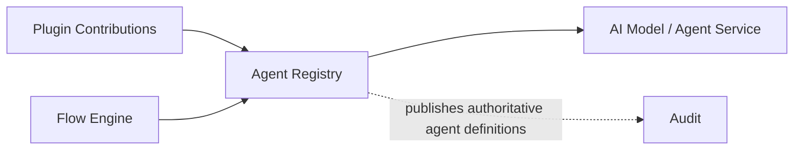

# Agent Registry

> **STATIS Intelligence Layer (SIL)**  
> **Agent Registry**

**Document:** `19_Agent_Registry.md`  
**Version:** 0.1 (Draft)  
**Status:** Core Architecture  
**Owner:** SIL Core  
**Audience:** Software architects, backend developers, plugin developers, AI engineers, future contributors

## Table of contents

- [Purpose](#purpose)
- [Responsibilities and Boundaries](#responsibilities-and-boundaries)
- [Processing Model](#processing-model)
- [Agent Registry Definition](#agent-registry-definition)
- [Behavioural Rules](#behavioural-rules)
- [Examples](#examples)
- [Architecture Decisions](#architecture-decisions)
- [Future Evolution and Related Documents](#future-evolution-and-related-documents)

## Purpose

The Agent Registry is the authoritative registry of AI personas (**Agents**) available to SIL through the **Agent** abstraction. In the SIL architecture, each *Agent* represents a specialized AI persona used in Flows for reasoning, summarization, explanation, or other cognitive assistance. The Agent Registry exists to make these personas explicit, stable, and governed.

If the Request Engine answers *what* the user is asking for and the Planning Engine answers *how* to fulfill it, the Agent Registry answers *who* will carry out AI-related reasoning tasks. When a Flow includes an `agent` step (as defined by the [Flow Definition Model](16_Flow_DSL.md)), it refers to an Agent by a stable identity from this registry. The Agent Registry defines those identities, decoupling the high-level persona from its underlying implementation details (such as specific LLM models or prompt configurations).

Agents serve cross-cutting roles (e.g. “business reporter” or “technical explainer”) that are orthogonal to any single Application or Capability. They provide deterministic hooks into AI-based processing without entangling business logic. The registry ensures that any Agent referenced in a Flow is well-defined, versioned, and auditable.

It does **not** perform the AI reasoning itself. That execution is the responsibility of the [Flow Engine](15_Flow_Engine.md) and the underlying AI services it invokes. Nor does the Agent Registry host business logic or interpret user requests (those belong to Applications, the Request Engine, and Capabilities). The registry simply makes Agent definitions available as first-class platform objects.

A succinct way to view it:

> The Flow DSL allows flows to invoke named Agents for cognitive tasks. The Agent Registry provides the authoritative definitions of those Agents. The Planning Engine and Policy Engine ensure each referenced Agent is valid and permitted. The Flow Engine resolves Agents at runtime via this registry. The Agent Registry itself does not execute steps or contain business rules; it only declares agent identities and metadata.

## Responsibilities and Boundaries

The Agent Registry has five primary architectural responsibilities:

- **Stable Identity:** It gives every Agent a stable, authoritative identity. Each Agent has a unique `id` that remains consistent over time as long as its persona’s meaning stays the same. This stability ensures that flows, audits, and governance refer to the same concept even if the underlying implementation changes.

- **Decoupling Persona from Implementation:** It separates the AI persona concept from any specific implementation. An Agent definition describes *what* the persona is (its role, purpose, and interface) without hard-coding *how* it is implemented. The actual AI model or service behind the Agent is provided by plugins (see [Processing Model](#processing-model)), but flows use the Agent’s stable ID, not a direct model or endpoint. This abstraction allows implementations to evolve without breaking flow definitions or audit trails.

- **Enabling Deterministic Planning:** It enables the Planning Engine to validate and plan for agent steps. When a Flow references an Agent, the Planning Engine queries the registry to ensure that Agent is known and permitted. This allows SIL to deterministically validate that each `agent` step in the plan corresponds to a registered persona before execution begins.

- **Supporting Deterministic Execution:** It supports the Flow Engine during execution. The Flow Engine consults the Agent Registry at runtime to obtain details (such as invocation protocol and version) for each Agent step in the Execution Plan. This ensures that every agent step can be invoked in a stable, predictable way, and that the same Agent identity in the plan will lead to the same persona behavior across runs.

- **Preserving Explainability by Design:** It makes all AI reasoning steps explicit. By listing Agents as first-class objects, the registry ensures that audit logs and explainability mechanisms clearly record *which* persona was used at each step. This adheres to SIL’s principle of explainability: people examining a plan or audit log will see the Agent identities (e.g. `business_reporter`) rather than opaque model calls.

Importantly, the Agent Registry is **not** an execution engine. It does **not** select flows (Planning Engine does that), nor does it interpret the user’s query (Request Engine does). It does **not** make governance decisions (the Policy Engine does), nor does it collect or require approvals (Approval Engine does). It does **not** execute any code or call external AI services; it only stores metadata. The Flow Engine and underlying AI runtime perform the actual work based on these definitions.


The diagram above outlines the core architecture. Plugin contributions feed Agent definitions into the registry. The Flow Engine (and implicitly the Planning Engine) consults the registry to resolve Agents. The registry publishes its authoritative state to the audit log. Agents themselves are executed by an external AI/LLM service as directed by the Flow Engine.

## Processing Model

The Agent Registry follows a two-sided processing model. One side concerns **registration** (how new Agents enter the registry), and the other side concerns **consumption** (how Agents are looked up by other components). This is an architectural abstraction, not a literal implementation algorithm.

- **Registration:** At startup or deployment time, SIL components (especially Plugins) register Agent definitions with the registry. For example, a plugin might include a YAML file that defines one or more Agents. The system validates each definition (checking required fields, uniqueness of IDs, version formats, etc.), normalizes its identity and metadata, and stores it in the registry’s authoritative store. Once committed, the Agent definitions are published to the audit trail as official platform state.

- **Consumption:** Once registered, Agents are consumed by planning and execution. When building an Execution Plan, the Planning Engine checks any `agent` steps against the registry to ensure the Agent ID exists and that the requesting user is allowed to invoke it. During execution, the Flow Engine looks up each Agent in the registry to retrieve invocation details (e.g. which LLM model to call). The Policy Engine may also consult the registry if there are governance rules related to which Agents can be used. Because the registry is the single source of truth, all queries return the same consistent definitions.

```mermaid
flowchart LR
    A[Plugin contribution (YAML)] --> B[Validate Agent Definition]
    B --> C[Normalize Identity/Metadata]
    C --> D[Register Agent]
    D --> E[Publish Authoritative Registry]

    E --> PE[Planning Engine Lookup]
    E --> FE[Flow Engine Lookup]
```
This diagram shows the two sides. A plugin contribution is validated and registered. The resulting state (E) is then queried by the Planning Engine and Flow Engine at runtime. The key architectural point is decoupling registration from consumption: the registry does not discover agents by convention at runtime, nor does it invoke them. It only answers queries about what has been explicitly registered.

## Agent Registry Definition

The Agent Registry is the canonical structural model of registered Agents in SIL. Its concern is not one particular data format; rather, it defines the essential attributes of every Agent. An Agent definition typically includes at least:

- **id**: A stable identifier for the Agent (e.g. `business_reporter`).
- **name** and **description**: Human-friendly metadata explaining the Agent’s purpose.
- **plugin**: The originating Plugin or subsystem that provides this Agent.
- **version**: A version string for the Agent definition.
- **invocation** (or similar): Details on how to invoke the Agent (e.g. `protocol` and `model` for an LLM).
- **availability** (optional): Status of the agent (e.g. `ready`), if applicable.

An Agent definition may include other metadata such as domain or categories of tasks. The exact schema is extensible by implementation, but must at least support stable identity, ownership, and invocation details.

### What an Agent is

An **Agent** is an AI persona or “skill” that flows can invoke to perform cognitive sub-tasks. Think of it as a named virtual assistant with a particular expertise or behavior. For example, an Agent might summarize technical logs into plain language, or generate a checklist from unstructured notes. The Agent Registry models this persona as a first-class object.

This definition is intentionally narrow:

- An Agent is **not** a Flow. Flows orchestrate business Capabilities and may call Agents, but the Flow itself is the sequence of steps, not the Agent persona.
- An Agent is **not** a Capability. Capabilities describe business operations (e.g. “run a pipeline job”). Agents do not implement business logic; they provide AI reasoning or conversion. Agents may *use* Capabilities internally, but they are separate abstractions.
- An Agent is **not** a Tool. Tools are implementation adaptors to applications (e.g. REST calls). An Agent is a persona that may orchestrate multiple tools internally, but it is not a direct integration layer to a single app.
- An Agent is **not** an actual LLM model or endpoint name. It represents a conceptual persona. The underlying AI service (ChatGPT, etc.) is an implementation detail supplied by the `invocation` metadata.
- The Agent identifier names the persona as SIL understands it. It does not need to equal an external model name or a class name. This indirection makes the persona identity stable and safe for long-term reference.

### What enters the Agent Registry

The Agent Registry is populated through explicit registration rather than runtime discovery. Architecturally, inputs typically include:

| Input                               | Why it matters |
|-------------------------------------|---------------|
| SIL Core agent definitions          | Provides built-in personas endorsed by SIL Core (for common tasks like summarization or conversion). This ensures essential agents exist out-of-the-box. |
| Plugin-contributed agent definitions | Allows Plugins (or organization-specific modules) to introduce new Agents tailored to their domain (e.g. a `business_reporter` Agent provided by the pipeline plugin). These expand SIL’s AI capabilities. |

Each registered Agent includes the metadata listed above (id, name, description, plugin, version, invocation details, etc.). Once registered, these definitions become part of SIL’s authoritative platform model and are exposed to all planning and execution components.

## Behavioural Rules

The following rules define how the Agent Registry should behave, regardless of implementation details:

### Keep Agents explicit

If SIL may use an AI persona in its workflows, that persona must exist as an explicit registered Agent. Flows should never rely on an “undeclared” or hidden agent. This is the foundational rule of the component: all personas available to the system must be first-class and inspectable. Hiding an agent (e.g. hard-coding a prompt in a flow) defeats governance and auditability. Agents must be registrable and discoverable in the registry.

### Preserve stable identity

A registered Agent should keep the same identity for as long as its persona remains materially the same. Trivial implementation tweaks (e.g. updating the prompt formatting or underlying model version) do not justify changing the Agent ID. Consistency of ID is crucial for traceability and audit. Only when the persona’s semantic purpose has fundamentally changed should a new Agent ID be used, and the old one deprecated through a versioning policy.

### Agents are separate from Capabilities and Tools

Agents are domain-specific AI personas, not business operations or application integrations. Do not collapse these concepts:
- An Agent is **not** a Capability. Capabilities represent concrete business functions (like `pipeline.job.run`). Agents may *leverage* those functions but do not *become* them.
- An Agent is **not** a Tool. Tools are execution adaptors (e.g. HTTP calls, SDKs). Agents use AI logic, potentially calling multiple tools internally, but they are a distinct abstraction layer.
- The registry should not merge Agent metadata with Capabilities or Tools. Each Agent entry focuses on AI persona metadata and invocation.

### Allow technical detail in invocation, not above this layer

It is acceptable for the `invocation` section of an Agent definition to contain platform-specific or model-specific details (for example, specifying that protocol is `ai-gpt` and the model is `gpt-4`). These details are confined to the Agent layer. Downstream components (Planning and Flow Engine) know how to use them. However, higher-level logic (Flows, Capabilities, Policies) should treat Agents as abstract personas, not hard-code model details.

### The registry must remain a registry

It should not perform any business or execution logic. In particular, the Agent Registry should **not**:
- select Flows or steps (that is Planning Engine’s role)
- interpret user Intents or utterances (Request Engine’s role)
- enforce governance decisions (Policy Engine’s role)
- collect or manage approvals (Approval Engine’s role)
- execute any AI model calls or produce outputs (Flow Engine’s role)
- host business logic or application calls

The architectural strength of the Agent Registry is its narrow focus on defining and exposing Agents. It remains trustworthy precisely because it does *not* attempt to do work beyond metadata.

## Examples

The following examples illustrate the kind of Agent model the registry should expose. They clarify architectural behavior rather than mandate a specific implementation format.

### Example of a simple registered Agent

```yaml
agent:
  id: business_reporter
  name: Business Reporter Persona
  description: Summarizes pipeline run results into plain-language reports for business stakeholders.
  plugin: core
  version: 1.0
  invocation:
    protocol: ai-gpt
    model: gpt-4
```

This example shows the minimum architectural shape clearly. It defines an Agent with a stable identity (`business_reporter`), a human-friendly name and description, and an ownership (`plugin: core`). The `invocation` section specifies how to call this persona: here indicating an AI protocol (e.g. OpenAI GPT) and model name. In practice, the Flow Engine will use these details to route execution through the appropriate AI service. Note that no business logic or flow is included here – the Agent is purely a registered persona.

### Example of another registered Agent

```yaml
agent:
  id: technical_explainer
  name: Technical Explainer Persona
  description: Explains pipeline run outcomes in detail for technical audiences.
  plugin: core
  version: 1.0
  invocation:
    protocol: ai-gpt
    model: gpt-4
```

This defines a second persona (`technical_explainer`). A Flow could choose either agent based on context. Both follow the same pattern: stable ID, metadata, and invocation info. The plugin field (`core`) indicates that these are provided by the core platform.

## Architecture Decisions

### AD-1901

The Agent Registry is the authoritative source of truth for all Agents known to SIL. Every Agent that a Flow may invoke must be pre-registered here. This ensures SIL can validate, govern, and audit all AI personas consistently.

### AD-1902

An Agent represents an AI persona (a virtual assistant for reasoning or summarization). It is a conceptual layer separate from business Capabilities and Tools. Agents do not contain business logic; they provide human-like processing. This separation means flows remain business-centric while still using AI assistance.

### AD-1903

The Flow Engine must consult the Agent Registry to resolve every `agent` step. At runtime, when executing an agent step, the engine looks up the Agent’s definition (using its stable `id`) to obtain invocation details and permission. This ensures deterministic execution of agent steps and correct routing to the appropriate AI service.

### AD-1904

An Agent’s identity should remain stable across versions unless its persona’s role changes significantly. Small improvements (e.g. refining the prompt) do not require changing the Agent ID. Stable identities preserve historical meaning in audit logs and plans.

## Future Evolution and Related Documents

The Agent Registry defined here is intended to remain an abstract, high-level component. Future refinements might include:

- Formalizing the Agent schema (e.g. JSON Schema for validation).
- Defining explicit versioning and deprecation semantics for Agents.
- Integrating policy rules for agent selection and usage (e.g. restricting certain Agents by role).
- Enhancing multi-agent coordination (e.g. workflows that involve multiple personas collaborating).
- Building user interfaces or APIs for browsing and managing Agents.
- Tracking operational metrics or observability for Agent usage.

These evolutions should not alter the architectural core: Agents remain first-class objects, the registry stays authoritative, and flows continue to invoke Agents by stable identity.

### Related documents

- [00_Principles](00_Principles.md)  
- [01_Vision](01_Vision.md)  
- [02_Architecture](02_Architecture.md)  
- [03_Core_Concepts](03_Core_Concepts.md)  
- [10_Request_Engine](10_Request_Engine.md)  
- [11_Context_Engine](11_Context_Engine.md)  
- [12_Planning_Engine](12_Planning_Engine.md)  
- [13_Policy_Engine](13_Policy_Engine.md)  
- [14_Approval_Engine](14_Approval_Engine.md)  
- [15_Flow_Engine](15_Flow_Engine.md)  
- [16_Flow_DSL](16_Flow_DSL.md)  
- [17_Capability_Registry](17_Capability_Registry.md)  
- [18_Tool_Registry](18_Tool_Registry.md)  

> **A strong Agent Registry does not execute work. It makes AI personas explicit so that agent-driven reasoning remains deterministic and explainable.**