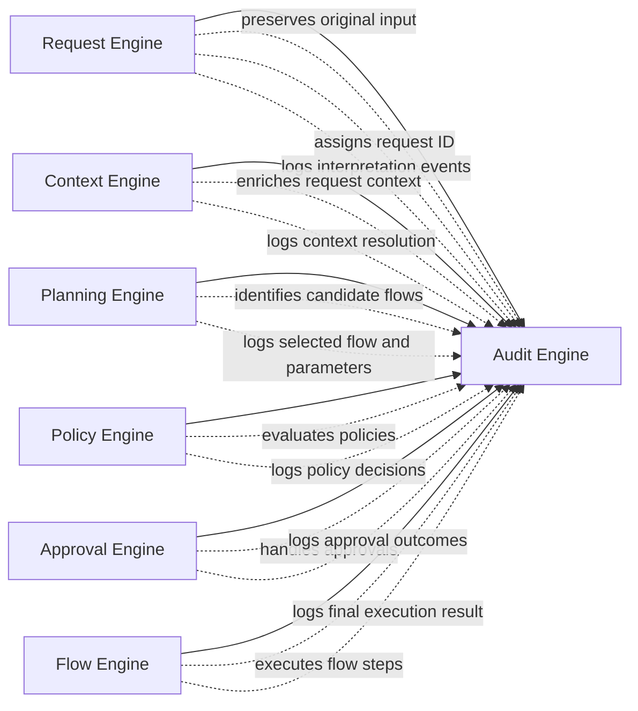

# Audit Engine

> **STATIS Intelligence Layer (SIL)**  
> **Audit Engine**

**Document:** `20_Audit_Engine.md`  
**Version:** 0.1 (Draft)  
**Status:** Core Architecture  
**Owner:** SIL Core  
**Audience:** Software architects, backend developers, plugin developers, AI engineers, future contributors

## Table of contents

- [Purpose](#purpose)
- [Responsibilities and Boundaries](#responsibilities-and-boundaries)
- [Processing Model](#processing-model)
- [Audit Record Definition](#audit-record-definition)
- [Behavioural Rules](#behavioural-rules)
- [Examples](#examples)
- [Architecture Decisions](#architecture-decisions)
- [Future Evolution and Related Documents](#future-evolution-and-related-documents)

## Purpose

The Audit Engine is the final component in the SIL processing pipeline, responsible for capturing and persisting a complete, immutable trail of all actions, decisions, and data that occur during the handling of a Request. Its role is to ensure **complete auditability** of the platform, supporting explainability, accountability, and forensic review of every request under SIL governance.  

Every Request that enters SIL (see the [Request Engine](10_Request_Engine.md)) and passes through the Context, Planning, Policy, Approval, and Flow engines will generate audit events. The Audit Engine collects these events, normalizes them into a consistent audit log, and stores them for later analysis.  

By design, the Audit Engine does not influence or modify the request processing. It strictly observes and records information. This separation ensures that logging does not affect execution determinism or business logic.  

The existence of the Audit Engine fulfills SIL's architectural principle of *complete auditability*, which mandates that every request and decision can be reviewed in hindsight. It provides transparency into SIL's operation and supports compliance with governance and security requirements.  

## Responsibilities and Boundaries

**Audit Logging:** The Audit Engine is responsible for recording an *audit record* for each significant event in the lifecycle of a Request. This includes user input, context enrichment, flow selection, policy decisions, approval outcomes, and flow execution results. Each audit record is associated with the canonical **Request ID** and timestamped, enabling reconstruction of the entire request execution path.  

**Data Persistence:** The Audit Engine persists audit records in an immutable and append-only store (for example, a secure database or log system). The storage is durable and tamper-evident so that once an audit record is written, it cannot be altered or deleted.  

**Non-Interference:** The Audit Engine does *not* take part in decision-making or execution. It does not alter the Request, Execution Plan, or any context. It does not trigger any execution flows or influence approvals. Instead, it passively receives events from other components.  

**Event Normalization:** The Audit Engine standardizes audit events into a consistent format. Because SIL events may originate in different formats (e.g. JSON, YAML) across engines, the Audit Engine ensures all audit data conforms to the defined schema for audit logs.  

**Boundaries:** The Audit Engine sits outside the user-facing request pipeline. It does not interact directly with applications, personas, or plugins, except to the extent that it ingests events those components generated via the upstream engines. It does not execute any business logic; business decisions belong to applications or other SIL engines. It also does not implement privacy filtering; upstream components must redact sensitive data before it reaches SIL if needed.  

In summary, the Audit Engine’s responsibility is **solely** to assemble an end-to-end audit trail of each request under SIL control, satisfying audit, compliance, and explainability requirements, while remaining orthogonal to actual request processing.

## Processing Model

The Audit Engine receives audit events from each layer of the SIL pipeline. Figure 1 illustrates this flow of audit data:



1. **Event Emission:** As each engine completes its processing, it emits audit events. For example, the Request Engine emits the original user input and the new request ID; the Context Engine emits any context variables retrieved; the Planning Engine emits the chosen flow and its parameters; and so on.  

2. **Event Aggregation:** The Audit Engine listens for or receives these events. This can be implemented via a message bus, event stream, or direct API calls, depending on the SIL implementation.  

3. **Normalization and Storage:** Upon receiving each event, the Audit Engine normalizes it into the internal **audit record** schema (see below) and writes it to the audit store. Events are persisted immediately to ensure that an audit trail is available even if later processing fails.  

4. **Immutability:** The audit storage layer enforces immutability and sequencing. Each audit record includes a timestamp and a sequence number for ordering. Once written, records cannot be altered.  

If an error or interruption occurs in downstream processing (for example, a flow step fails or is canceled), the Audit Engine still records a final event indicating the failure, along with any error codes or messages. This ensures that the audit trail accurately reflects partial or aborted executions.  

## Audit Record Definition

An **audit record** (or audit event) is a structured log entry representing a single notable occurrence in the request lifecycle. Each audit record includes at minimum:  

- **Request ID:** A unique identifier for the request, inherited from the Request Engine. This links all audit records for the same request.  
- **Timestamp:** The precise time (in ISO 8601 format) when the event occurred.  
- **Stage:** The SIL component or engine where the event originated (e.g. "Request Engine", "Context Engine").  
- **Event Type:** A categorical name or code for the event (for example, `RequestCreated`, `ContextEnriched`, `PolicyViolated`, `FlowStepExecuted`). This indicates what kind of action or decision happened.  
- **Details:** A map of key/value data specific to the event. For example, user input text, resolved entities, chosen flow name, policy rules evaluated, approval response, or execution result details. This field may contain nested structures in YAML/JSON.  

Optionally, an audit record may include:  

- **Actor or Persona:** If the event involves a specific user or agent (for example, who approved a request), this identity can be recorded.  
- **Outcome or Status:** For events like flow execution or policy evaluation, record the outcome (such as `approved`, `denied`, `completed`, `failed`) and any relevant status code.  

Each audit record is typically stored in a human-readable format (JSON or YAML) to satisfy explainability. Applications writing to the Audit Engine must adhere to this schema. A minimal example is shown below.  

```yaml
audit:
  request_id: "req-12345"
  timestamp: "2026-06-30T14:15:16Z"
  stage: "Flow Engine"
  event_type: "FlowCompleted"
  details:
    flow_id: "run_job_workflow"
    status: "success"
    steps_executed: 3
    result_summary: "Job ran successfully with no errors."
```

## Behavioural Rules

* Audit events **must be recorded for every significant step** of the request lifecycle, from initial user input through final execution results. No approved or executed action should ever occur without a corresponding log entry.  
* The **request ID** must be propagated and logged at each stage, ensuring that the complete trail of events can be correlated back to the original request.  
* Audit logging **should not block** or slow down the main processing pipeline. Engines should publish events asynchronously if possible, but must ensure reliability. If an asynchronous failure occurs, the engine must retry or log an error event.  
* The Audit Engine’s storage is **append-only**. Once an audit record is written, it shall not be modified or deleted. This supports tamper-evidence and compliance.  
* Sensitive information that must not be stored (for example, plaintext passwords or personal identifiers beyond policy) must be filtered or hashed **before** emitting events to the Audit Engine. SIL assumes that privacy and security controls are applied upstream.  
* Audit records should be **human-readable** and contain enough context to understand what happened. Free-text fields (like user commands or error messages) should be clearly labeled.  
* When a request is canceled, denied, or otherwise does not fully execute, the Audit Engine should still receive and log a final event indicating that outcome, including any reasons. This ensures the audit trail reflects partial or aborted requests.  
* The Audit Engine should integrate with existing SIEM or monitoring infrastructure if available, so that audit logs can be searched and alerting can be configured.  

## Examples

Example: A user says: *"Approve quarterly financial report."* The SIL pipeline processes the request, and each engine emits audit events. The Audit Engine might record entries like:  

- **Request created:** Capturing the normalized request with a new Request ID.  
- **Context enrichment:** Logging that a `finance_department` context variable was added.  
- **Planning result:** Logging the selection of the `generate_report_flow`.  
- **Policy decision:** Logging that a `finance-report-access` policy passed because the user has the `Finance Manager` role.  
- **Approval outcome:** Logging that the request was auto-approved (if policy allowed) or approved by user `alice@example.com`.  
- **Flow execution:** Logging the summary of steps, such as "Generated report file ID: RPT-9876."  

These events would be combined into the audit log for `request_id: req-12345`.  

YAML-formatted example of a single audit event in that sequence:  

```yaml
audit:
  request_id: "req-12345"
  timestamp: "2026-06-30T14:16:10Z"
  stage: "Policy Engine"
  event_type: "PolicyApproved"
  details:
    policy_id: "finance-report-access"
    decision: "allowed"
    evaluated_entities:
      - "Finance Manager"
    explanation: "User has role Finance Manager, policy conditions met."
```

## Architecture Decisions

### AD-2001

The Audit Engine collects events from every engine in the SIL pipeline to construct an authoritative, end-to-end record of each request's processing. Each audit record is tied to the canonical Request ID and timestamped to preserve ordering. The audit log is strictly append-only and cannot influence or alter any processing logic.  

### AD-2002

All significant actions (request creation, context enrichment, flow execution, policy decisions, approval outcomes, etc.) must generate audit events. The platform guarantees **explainability by design** by recording these events in a standardized schema. Audit data is human-readable and stored securely for compliance.  

## Future Evolution and Related Documents

- **Long-term storage:** In future, older audit records may be archived or summarized to optimize storage, while ensuring retrieval for compliance.  
- **Analytics and Reporting:** Integration with analytics tools or SIEM may be added to allow querying of audit data (for example, detecting patterns in policy denials or suspicious activity).  
- **Real-time monitoring:** An event-streaming approach (e.g. Kafka) could support real-time feeds from the Audit Engine to dashboards or alerting systems.  

### Related documents

- [Request Engine](10_Request_Engine.md)  
- [Context Engine](11_Context_Engine.md)  
- [Policy Engine](13_Policy_Engine.md)  
- [Approval Engine](14_Approval_Engine.md)  
- [Flow Engine](15_Flow_Engine.md)  
- [Architecture](02_Architecture.md)  

- **Security considerations:** The design assumes that sensitive data is not logged in plaintext. Future enhancements might include configurable redaction or encryption of audit logs.