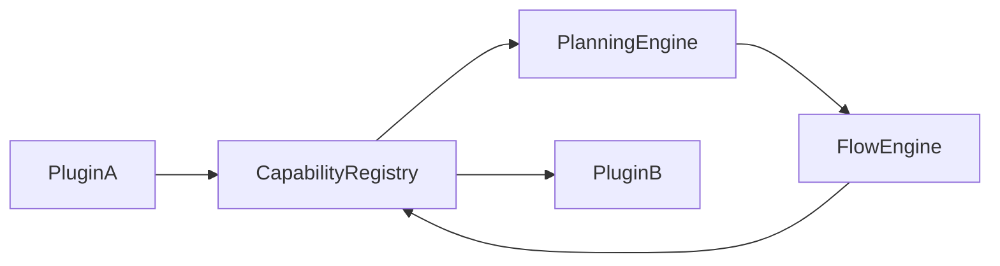
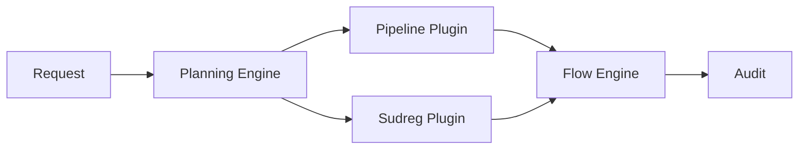
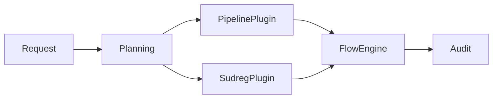

# Plugin Model

> **STATIS Intelligence Layer (SIL)**
> **Plugin Model**

**Document:** `30_Plugin_Model.md`  
**Version:** 0.2 (Draft)  
**Status:** Core Architecture  
**Owner:** SIL Core  
**Audience:** Software architects, backend developers, plugin developers, AI engineers, future contributors

---

# Purpose

The Plugin Model defines how applications integrate with the STATIS Intelligence Layer (SIL).

Rather than treating Plugins as optional extensions, SIL considers Plugins to be first-class architectural building blocks.

Every business application that participates in the SIL ecosystem does so through a Plugin.

A Plugin represents the complete architectural boundary between an application and the SIL Core.

It contributes metadata, integration definitions and implementation adapters that allow SIL to understand what an application can do without becoming coupled to how the application is implemented.

The Plugin Model therefore enables SIL to remain application-independent while allowing each application to evolve independently.

Plugins extend the platform.

# Plugin Discovery

SIL intentionally separates Plugin discovery from Plugin execution.

The platform must always know **which Plugins exist** before it attempts to process a Request.

Plugin discovery is therefore a platform responsibility rather than a runtime concern.

The discovery mechanism itself is implementation-independent.

A deployment may choose one or more discovery strategies without changing the architectural model.

Typical discovery mechanisms include:

- local plugin directories
- enterprise Plugin repositories
- OCI registries
- Git repositories
- package managers
- cloud-based Plugin registries

Regardless of how Plugins are discovered, every Plugin enters the same validation and registration pipeline.

The Flow Engine, Planning Engine and other runtime components never perform Plugin discovery themselves.

---

# Plugin Packaging

A Plugin is distributed as a self-contained package.

The package contains everything required for SIL to understand and integrate the application.

A typical Plugin package may be organized as follows.

```text
pipeline-plugin/

├── plugin.yaml
├── capabilities/
├── flows/
├── tools/
├── context/
├── policies/
├── approvals/
├── personas/
├── agents/
├── assets/
└── README.md
```

Every Plugin package contains exactly one manifest.

The manifest represents the entry point into the Plugin.

Everything else is discovered through the manifest.

The package should be immutable after publication.

Updating a Plugin creates a new Plugin version rather than modifying an existing one.

This simplifies auditing, reproducibility and rollback.

---

# Plugin Namespace Strategy

One of the primary goals of the Plugin Model is to prevent identifier collisions.

Every resource contributed by a Plugin belongs to a globally unique namespace.

Typical examples include:

```text
pipeline.job.run

pipeline.job.logs.read

pipeline.job.promote

pipeline.git.commit

sudreg.company.search

sudreg.company.read

catalog.dataset.search

catalog.dataset.lineage
```

Namespaces provide several important architectural benefits.

They:

- prevent naming conflicts;
- reveal application ownership;
- simplify discovery;
- improve readability;
- enable deterministic resolution;
- allow future Plugin composition.

Namespaces should remain stable across Plugin versions whenever possible.

Changing identifiers should be treated as a breaking change.

---

# Plugin Ownership Model

Every architectural resource belongs to exactly one Plugin.

Ownership is exclusive.

Examples include:

| Resource | Owner |
|----------|-------|
| `pipeline.job.run` | Pipeline Plugin |
| `pipeline.job.logs` | Pipeline Plugin |
| `sudreg.company.read` | Sudreg Plugin |
| `catalog.dataset.search` | Catalogue Plugin |

This ownership model ensures that responsibility remains unambiguous.

No Plugin should redefine another Plugin's Capability.

No Plugin should replace another Plugin's Flow.

No Plugin should modify another Plugin's Policies.

Plugins may collaborate.

They never own each other's assets.

---

# Plugin Isolation

Plugins are intentionally isolated.

The objective is to eliminate hidden dependencies between applications.

A Plugin cannot directly invoke another Plugin.

Instead, every interaction must occur through SIL.

Conceptually:



This architecture ensures that:

- Plugin implementations remain independent;
- applications do not become tightly coupled;
- orchestration remains visible;
- auditing remains complete;
- execution remains deterministic.

Plugin-to-Plugin communication is therefore mediated by the SIL runtime rather than implemented through direct dependencies.

---

# Plugin Dependency Model

Some Plugins naturally depend on other Plugins.

For example:

- an enterprise reporting Plugin may require the Catalogue Plugin;
- an analytics Plugin may require Pipeline metadata;
- an administration Plugin may require authentication capabilities.

Dependencies must always be declared explicitly.

Hidden dependencies are not allowed.

Dependencies may be:

| Type | Description |
|------|-------------|
| Required | Plugin cannot load without dependency |
| Optional | Additional functionality becomes available if dependency exists |
| Versioned | Minimum compatible version required |
| Incompatible | Plugin versions that must not coexist |

Circular dependencies should be rejected during validation.

Dependency resolution occurs before registration.

The runtime assumes that every enabled Plugin already satisfies all declared dependencies.

---

# Plugin Loading Pipeline

Plugin loading follows a deterministic sequence.

```mermaid
flowchart LR

Package

--> Manifest

--> Validation

--> Dependency Resolution

--> Registration

--> Reference Resolution

--> Enable

--> Runtime
```

Each stage has a clearly defined responsibility.

## Manifest Loading

The Plugin manifest is parsed.

Basic metadata becomes available.

---

## Validation

The platform verifies:

- schema validity;
- required fields;
- identifier uniqueness;
- version compatibility;
- contribution consistency.

Invalid Plugins never reach the runtime.

---

## Dependency Resolution

Required Plugins are located.

Compatibility is verified.

Missing dependencies prevent registration.

---

## Registration

Resources are inserted into the corresponding registries.

Registration is transactional.

Either all contributions become visible or none do.

---

## Reference Resolution

Cross-references between Flows, Capabilities and Tools are verified.

Examples include:

- Flow references existing Capability;
- Tool implements declared Capability;
- Policy identifiers exist;
- Approval definitions are available.

Broken references invalidate the entire Plugin.

---

## Enable

After successful registration the Plugin becomes available for Request planning.

At this point the Plugin is indistinguishable from built-in platform resources.

The runtime no longer distinguishes whether a Capability originated from SIL Core or from a Plugin.

Only the Audit subsystem retains Plugin provenance for traceability.

# Plugin Contract

Every Plugin accepted by SIL implicitly agrees to a common architectural contract.

The contract guarantees that every Plugin behaves predictably and integrates consistently with the platform.

The purpose of the contract is not to constrain Plugin developers.

Its purpose is to preserve deterministic behaviour across the entire platform.

Every Plugin therefore guarantees the following properties.

---

## Deterministic Behaviour

Given identical inputs and identical application state, a Plugin must expose identical behaviour.

Plugins must never introduce randomness into orchestration.

Randomness, heuristics or AI reasoning may exist inside external applications or AI Agents, but never inside Plugin orchestration.

---

## Explicit Metadata

Every contributed resource must be declared.

There are no implicit Flows.

There are no hidden Capabilities.

There are no dynamically generated Tools.

Everything visible to SIL must first appear in Plugin metadata.

This allows complete explainability.

---

## Stable Identity

Every resource contributed by a Plugin has a globally unique identifier.

Identifiers should remain stable across Plugin versions.

Changing an identifier should be treated as a breaking change.

Stable identifiers allow:

- deterministic planning
- reproducible execution
- reliable auditing
- backwards compatibility

---

## Complete Traceability

Every execution performed through a Plugin must remain traceable.

Audit records should always identify:

- Plugin
- Plugin Version
- Capability
- Tool
- Flow
- Application
- Request

This information enables complete reconstruction of every execution.

---

## Platform Compliance

Plugins become part of SIL.

Consequently they must comply with all platform principles.

This includes:

- deterministic execution
- explainability
- auditability
- Policy evaluation
- Approval processing
- Flow orchestration

A Plugin cannot selectively ignore platform rules.

---

# Behavioural Rules

The following architectural rules always apply.

## Plugins are passive

Plugins never initiate execution.

They contribute knowledge.

The runtime performs execution.

---

## Plugins never own Requests

Requests belong exclusively to SIL.

Plugins receive execution only after Planning has completed.

---

## Plugins never perform Planning

Selecting Flows is the responsibility of the Planning Engine.

Plugins merely provide candidate Flows.

---

## Plugins never bypass Policies

Every Plugin operation passes through Policy evaluation.

There are no privileged Plugins.

Core Plugins and third-party Plugins are treated identically.

---

## Plugins never bypass Approval

Approval decisions belong exclusively to the Approval Engine.

Plugins cannot force execution.

They cannot suppress approval requirements.

---

## Plugins never invoke each other directly

Cross-application execution always passes through SIL.

This preserves visibility.

Example:

```text
Incorrect

Pipeline Plugin

↓

Sudreg Plugin


Correct

Pipeline Plugin

↓

Capability Registry

↓

Planning Engine

↓

Flow Engine

↓

Capability Registry

↓

Sudreg Plugin
```

---

## Plugins are immutable during Request execution

Plugin loading occurs between Requests.

A Request always executes against a stable Plugin landscape.

The runtime never loads, unloads or upgrades Plugins while a Request is executing.

This guarantees deterministic behaviour.

---

## Plugins own only their own resources

A Plugin may reference another Plugin's Capability through SIL.

It may never redefine it.

Ownership is exclusive.

---

## Plugins contribute metadata

Plugins describe:

- what exists
- what can be executed
- how execution is performed

They never decide:

- when execution occurs
- why execution occurs
- whether execution is allowed

These responsibilities remain inside SIL Core.

---

# Plugin Composition

Although Plugins remain isolated, they may participate in the same Execution Plan.

This enables cross-application orchestration without creating architectural coupling.

Consider the following example.

A user asks:

> Explain why yesterday's production deployment failed and identify the affected companies.

The resulting Execution Plan may involve multiple Plugins.



Neither Plugin communicates directly.

Instead, both participate in a common orchestration coordinated by SIL.

This model enables enterprise workflows spanning multiple applications while preserving application independence.

---

# Plugin Evolution

Plugins are expected to evolve independently.

Typical evolution includes:

- new Capabilities;
- new Flows;
- additional Context Providers;
- new Tool implementations;
- updated Policies;
- improved Personas.

The architectural contract remains stable.

Plugin evolution should therefore occur through additive changes whenever possible.

Breaking changes should be introduced only through major Plugin versions.

This minimizes disruption to existing Flows and Execution Plans.

---

# Plugin Compatibility

Every Plugin declares compatibility with a particular SIL Core version.

Compatibility is evaluated before registration.

Typical compatibility checks include:

- SIL version;
- required registries;
- supported manifest version;
- dependency versions;
- required runtime features.

Plugins failing compatibility validation are rejected before becoming available.

The runtime never attempts partial compatibility.

Either a Plugin is compatible...

or it is not loaded.

---

# Plugin Security Model

Plugins extend the platform.

They do not weaken it.

Consequently every Plugin operates within the same security boundaries.

Plugins never receive unrestricted platform access.

Instead they interact with SIL through explicit extension points.

Examples include:

- Capability registration
- Tool registration
- Context Providers
- Flow definitions
- Policy definitions
- Approval rules

Every execution still follows the normal Request pipeline.

No architectural shortcuts exist for Plugins.

This guarantees that introducing a new Plugin cannot silently bypass platform governance.


# Examples

The following examples illustrate how the Plugin Model behaves in realistic enterprise scenarios.

---

## Example 1 — Pipeline Plugin

The Pipeline Plugin contributes everything required to expose the STATIS Pipeline application to SIL.

```yaml
plugin:
  id: pipeline
  version: 1.0

  capabilities:
    - pipeline.job.run
    - pipeline.job.read
    - pipeline.job.logs

  flows:
    - pipeline.job.run_and_summarize
    - pipeline.job.diagnose_failure

  tools:
    - pipeline.job.run.rest
    - pipeline.job.logs.rest

  context:
    - pipeline.workspace
    - pipeline.environment

  policies:
    - pipeline.execution

  approvals:
    - production_execution

  personas:
    - pipeline_operator
```

After registration, every contribution becomes available through its corresponding registry.

The Planning Engine may subsequently use these resources exactly as it would use native SIL resources.

No special execution path exists for Plugin-provided functionality.

---

## Example 2 — Sudreg Plugin

The Sudreg Plugin contributes business capabilities related to the Croatian Court Register.

```yaml
plugin:
  id: sudreg
  version: 1.0

  capabilities:
    - sudreg.company.search
    - sudreg.company.read
    - sudreg.company.ownership

  flows:
    - sudreg.company.explain

  tools:
    - sudreg.company.rest

  context:
    - user_permissions

  personas:
    - legal_analyst
```

Although completely unrelated to Pipeline, the Plugin integrates using exactly the same architectural model.

This demonstrates that SIL remains application-independent.

---

## Example 3 — Cross-Application Request

A user submits the following Request:

> Compare yesterday's failed Pipeline deployment with the ownership structure of the affected companies.

This Request spans multiple applications.

The Planning Engine constructs an Execution Plan involving multiple Plugins.



Neither Plugin communicates with the other.

The orchestration belongs exclusively to SIL.

---

## Example 4 — Plugin Upgrade

Suppose version 2.0 of the Pipeline Plugin becomes available.

The platform performs the following sequence.

```text
Install Plugin

↓

Validate Manifest

↓

Check Compatibility

↓

Resolve Dependencies

↓

Register Resources

↓

Enable Plugin

↓

Requests may now use v2
```

Existing Requests continue using the version against which they were planned.

Future Requests use the newly enabled Plugin.

This behaviour guarantees deterministic execution and reproducibility.

---

# Architecture Decisions

## AD-3001

**Applications integrate with SIL exclusively through Plugins.**

Every application participating in the SIL ecosystem must expose its architectural assets through a Plugin.

No direct integration with SIL Core is permitted.

---

## AD-3002

**Plugins define architectural boundaries.**

A Plugin represents the complete architectural integration of a business application.

All Capabilities, Flows, Tools, Policies and Context Providers belonging to that application are owned by the Plugin.

---

## AD-3003

**Plugins are declarative.**

Plugins describe available architectural assets.

They never determine runtime behaviour.

Planning, execution and governance remain responsibilities of SIL Core.

---

## AD-3004

**Plugin ownership is exclusive.**

Every architectural resource belongs to exactly one Plugin.

Ownership ambiguity is prohibited.

---

## AD-3005

**Plugin loading is deterministic.**

Plugin discovery, validation and registration occur before Request processing begins.

Runtime Plugin mutation is not permitted.

---

## AD-3006

**Plugin registration is atomic.**

Either every declared contribution is successfully registered...

or the Plugin is rejected.

Partial registration is forbidden.

---

## AD-3007

**Plugins are isolated.**

Plugins never invoke one another directly.

Cross-application collaboration always occurs through SIL orchestration.

---

## AD-3008

**Namespaces are globally unique.**

Every Capability, Tool, Flow and Policy contributed by a Plugin must have a globally unique identifier.

Namespaces form part of the public architectural contract.

---

## AD-3009

**Plugin compatibility is validated before registration.**

Version conflicts, missing dependencies and incompatible manifests prevent Plugin activation.

Compatibility problems never appear during Request execution.

---

## AD-3010

**Plugins cannot bypass governance.**

Every Plugin participates in the same Request lifecycle.

No Plugin may bypass:

- Request Engine
- Planning Engine
- Policy Engine
- Approval Engine
- Flow Engine
- Audit Engine

Core Plugins and third-party Plugins are governed identically.

---

## AD-3011

**Plugins contribute capabilities, not intelligence.**

Reasoning belongs to AI.

Planning belongs to SIL.

Business logic belongs to Applications.

Plugins expose integration points between these layers.

---

## AD-3012

**Plugin evolution must preserve architectural stability.**

New Plugin versions should introduce additive functionality whenever possible.

Breaking changes should be minimized and explicitly versioned.

---

# Future Evolution

The Plugin architecture has been intentionally designed to support future expansion without changing the core execution model.

Possible future enhancements include:

## Enterprise Plugin Repository

A centralized repository allowing organizations to publish, version and distribute approved Plugins.

---

## Plugin Marketplace

An ecosystem where internal teams can discover reusable integrations.

---

## Digital Plugin Signatures

Cryptographic signing of Plugin packages to ensure integrity and authenticity.

---

## Plugin Sandboxing

Execution isolation for Plugin-provided adapters and helper libraries.

---

## Hot Deployment

Controlled Plugin deployment without restarting SIL Core.

This feature must preserve deterministic execution and therefore requires careful architectural validation.

---

## Plugin Telemetry

Platform-level monitoring of:

- Plugin usage
- execution frequency
- performance
- failures
- dependency graphs

This information supports governance and operational planning.

---

## Plugin Certification

Organizations may introduce certification workflows before Plugins become available in production.

Certification may verify:

- naming conventions;
- documentation completeness;
- compatibility;
- security;
- governance compliance.

---

## Cross-Organization Plugin Sharing

Future SIL deployments may exchange Plugins between independent organizations while preserving local governance policies.

---

# Related Documents

The Plugin Model should be read together with the following architecture documents.

Foundation

- 00_Principles
- 01_Vision
- 02_Architecture
- 03_Core_Concepts

Runtime

- 10_Request_Engine
- 11_Context_Engine
- 12_Planning_Engine
- 13_Policy_Engine
- 14_Approval_Engine
- 15_Flow_Engine

Platform

- 16_Flow_DSL
- 17_Capability_Registry
- 18_Tool_Registry
- 19_Agent_Registry

Implementation

- 40_MVP
- 41_Roadmap

---

# Closing Statement

The Plugin Model is one of the foundational architectural mechanisms of the STATIS Intelligence Layer.

It enables independent business applications to participate in a common AI-driven execution platform without sacrificing ownership, governance or architectural integrity.

By treating Plugins as architectural boundaries rather than software extensions, SIL achieves a platform that is simultaneously extensible, deterministic and application-independent.

Every new Plugin strengthens the platform without requiring changes to SIL Core.

This property is fundamental to the long-term vision of SIL as the common intelligence layer for the entire STATIS ecosystem.

They never modify it.

---

# Table of Contents

1. Why Plugins Exist
2. Plugin Philosophy
3. Plugin Responsibilities and Boundaries
4. Plugin Lifecycle
5. Plugin Discovery
6. Plugin Packaging
7. Plugin Loading Pipeline
8. Plugin Definition Model
9. Plugin Isolation
10. Plugin Dependencies
11. Plugin Contracts
12. Behavioural Rules
13. Examples
14. Architecture Decisions
15. Future Evolution
16. Related Documents

---

# Why Plugins Exist

One of the fundamental goals of SIL is to become the common intelligence layer for every STATIS application.

This immediately raises an architectural question:

> How can new applications become part of SIL without requiring modifications to SIL Core?

The answer is the Plugin Model.

Applications evolve continuously.

New applications appear.

Existing applications change.

Technologies become obsolete.

Communication protocols evolve.

None of these events should require changes inside SIL Core.

Instead, SIL delegates every application-specific concern to Plugins.

The Plugin becomes the architectural contract between the platform and an application.

Instead of embedding Pipeline knowledge inside SIL...

SIL loads the Pipeline Plugin.

Instead of embedding Sudreg knowledge...

SIL loads the Sudreg Plugin.

Instead of embedding Data Catalogue knowledge...

SIL loads the corresponding Plugin.

This approach keeps the platform stable while allowing the application landscape to evolve.

---

# Plugin Philosophy

Plugins should not be viewed as software extensions.

They should be viewed as **bounded architectural contexts**.

Each Plugin owns a complete business integration.

For example, the Pipeline Plugin owns:

- Pipeline Capabilities
- Pipeline Flows
- Pipeline Tools
- Pipeline Policies
- Pipeline Context Providers
- Pipeline Approval Rules
- Pipeline Personas

Likewise, the Sudreg Plugin owns all architectural assets related to Sudreg.

This ownership model prevents architectural leakage between applications.

Every business concept has exactly one owner.

The Plugin therefore becomes the natural extension unit of the platform.

---

# Plugin Responsibilities and Boundaries

A Plugin has four primary responsibilities.

## 1. Describe application capabilities

The Plugin declares which business operations are available.

Examples include:

- Run Job
- Explain Job
- Search Company
- Read Company
- Read Dataset Metadata

Capabilities always describe business functionality.

Never implementation.

---

## 2. Provide implementation adapters

Capabilities are implemented through Tools.

A Plugin supplies the Tool implementations required to execute its Capabilities.

The Tool may internally communicate using:

- REST
- MCP
- SDK
- database services
- message queues
- local libraries

These implementation choices remain invisible to SIL.

---

## 3. Contribute orchestration assets

A Plugin may register:

- Flows
- Context Providers
- Policies
- Approval Rules
- Agents
- Personas

These assets become available to the platform through their corresponding registries.

---

## 4. Preserve application ownership

Business rules remain inside the application.

The Plugin exposes them.

SIL orchestrates them.

Neither SIL nor another Plugin should duplicate or reinterpret application business logic.

---

# What a Plugin Never Does

Understanding what Plugins do **not** do is just as important.

Plugins never:

- execute Requests directly;
- perform planning;
- evaluate Policies;
- bypass Approval;
- orchestrate other Plugins;
- invoke applications outside registered Tools;
- expose hidden capabilities;
- modify SIL Core.

Architecturally, Plugins contribute knowledge.

The SIL runtime remains responsible for execution.

---

# Plugin Lifecycle

Plugins follow a deterministic lifecycle.


Each lifecycle stage has a specific architectural meaning.

## Installed

The Plugin package becomes available to SIL.

At this stage it has not yet been trusted.

No contribution is visible.

---

## Validated

SIL validates:

- manifest
- identifiers
- versions
- dependencies
- contribution definitions

Only fully valid Plugins continue.

---

## Registered

Every declared contribution is inserted into the corresponding registry.

Examples:

- Capability Registry
- Tool Registry
- Flow Registry
- Agent Registry

Registration is atomic.

Either the Plugin becomes fully registered...

or nothing is registered.

Partial registration is forbidden.

---

## Enabled

The Plugin becomes eligible for Request planning.

Planning Engine may now reference its Flows and Capabilities.

---

## Available

The Plugin participates in normal Request processing.

Its contributions are treated exactly like native SIL resources.

---

## Deprecated

The Plugin remains available but signals planned removal.

Future Requests should gradually migrate elsewhere.

---

## Disabled

The Plugin remains installed but contributes no executable resources.

Existing Requests continue only if already planned.

New Requests cannot depend on disabled Plugins.

---

## Removed

All contributed resources disappear from the registries.

Execution Plans referencing removed resources become invalid.

This fail-fast behaviour preserves deterministic execution.
